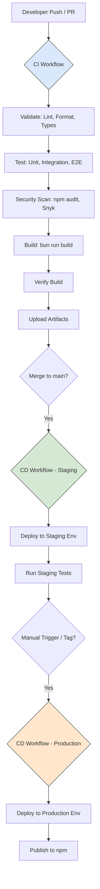

# SwissKnife CI/CD System

This document provides comprehensive information about the Continuous Integration and Continuous Deployment (CI/CD) system used in the SwissKnife project.

## Overview

The SwissKnife CI/CD system automates building, testing, and deploying the SwissKnife application across different environments. It ensures code quality, performs comprehensive testing, and provides reliable deployment automation.



## CI Workflow

The CI workflow (`ci.yml`) runs on every push to main/develop branches and on pull requests. It ensures code quality and produces verified builds.

### CI Jobs (`ci.yml`)

1. **Validate & Lint**:
   - `pnpm run format:check`: Checks code formatting using Prettier.
   - `pnpm run lint`: Runs ESLint to check for code style and potential errors.
   - `pnpm run typecheck`: Runs TypeScript compiler (`tsc --noEmit`) to verify type safety.
   *(Documentation generation might be manual or part of release process)*
2. **Test**:
   - `pnpm test`: Executes the full test suite (unit, integration, e2e) using Jest.
   - Generates code coverage reports.
   *(Specialized tests are typically included within the main test suites)*
3. **Security Scan**:
   - `pnpm audit`: Checks for known vulnerabilities in dependencies.
   - Snyk Scan (if integrated): Performs deeper security analysis.
4. **Build**:
   - `bun run build`: Creates the production-ready executable using Bun (as defined in `package.json`). Requires Bun installation.
   - `pnpm run test:verify-build`: Runs basic smoke tests against the built artifact (`dist/cli.mjs`).
   - Uploads `dist/` directory as a build artifact.
5. **Benchmark** (Optional, e.g., on `main` branch push):
   - `pnpm run benchmark`: Runs performance benchmarks defined in `benchmark/`.
   - May compare results against a baseline.

## CD Workflow

The CD workflow (`cd.yml`) handles deployment to different environments.

### CD Jobs (`cd.yml`)

1. **Deploy to Staging** (Triggered on merge to `main`):
   - Downloads build artifact from CI run.
   - Configures environment variables/secrets for Staging.
   - Executes deployment script (`node scripts/deploy.js staging`) targeting the staging environment (e.g., specific server, cloud service).
   - Runs post-deployment verification tests (potentially using `jest.staging.config.js`).
   - Sends deployment status notification (e.g., Slack).
2. **Deploy to Production & Publish** (Triggered manually, e.g., on creating a GitHub Release/Tag):
   - Downloads build artifact.
   - Configures environment variables/secrets for Production.
   - Executes deployment script (`node scripts/deploy.js production`) targeting the production environment.
   - Publishes the package to npm using `npm publish` (requires `NPM_TOKEN` secret).
   - Creates GitHub Release notes (potentially automated).
   - Sends deployment status notification.

## Environment Configuration

The system supports two environments:

1. **Staging**
   - Used for testing before production
   - Has debug mode enabled
   - Experimental features enabled
   - Uses staging API endpoints

2. **Production**
   - Production-ready configuration
   - Debug mode disabled
   - Only stable features
   - Uses production API endpoints

## Required Secrets

The following GitHub Actions secrets need to be configured:

| Secret Name | Description | Used In |
|-------------|-------------|---------|
| `STAGING_API_URL` | Staging API endpoint URL | Staging deployment |
| `STAGING_API_KEY` | API key for staging | Staging deployment |
| `STAGING_DEPLOY_TOKEN` | Deployment token for staging | Staging deployment |
| `PRODUCTION_API_URL` | Production API endpoint URL | Production deployment |
| `PRODUCTION_API_KEY` | API key for production | Production deployment |
| `PRODUCTION_DEPLOY_TOKEN` | Deployment token for production | Production deployment |
| `NPM_TOKEN` | npm authentication token | npm publishing |
| `SLACK_WEBHOOK_URL` | Slack webhook for notifications | Both workflows |
| `SNYK_TOKEN` | Snyk API token for security scanning | CI workflow |

## Scripts

The CI/CD system uses several custom scripts:

1. **configure.js**
   - Sets up environment-specific configuration
   - Creates .env file with correct variables
   - Usage: `node scripts/configure.js [staging|production]`

2. **deploy.js**
   - Handles deployment to different environments
   - Creates deployment packages
   - Simulates/performs deployment operations
   - Usage: `node scripts/deploy.js [staging|production]`

3. **verify-build.js**
   - Verifies the build output is functional
   - Runs smoke tests on the built CLI
   - Usage: `node test/verify-build.js`

4. **run.js (benchmarks)**
   - Runs performance benchmarks
   - Compares with previous benchmark results
   - Usage: `node benchmark/run.js`

## Testing Configuration

The project uses Jest for testing with separate configurations:

1. **`jest.config.cjs`**: Main Jest configuration used for local development and standard CI test runs (`pnpm test`). Covers unit, integration, and potentially E2E tests depending on setup.
2. **`jest.staging.config.js`** (if used): A separate Jest configuration potentially used specifically for running tests against a deployed *staging* environment during the CD workflow. This might involve different setup, timeouts, or test suites focused on verifying the deployed application.

## Using the CI/CD System

### Running Locally

Simulate CI/CD steps locally:

```bash
# Run CI checks (use pnpm or npm)
pnpm run format:check
pnpm run lint
pnpm run typecheck
pnpm test # Runs all tests

# Build the application (requires Bun)
bun run build

# Verify the build
pnpm run test:verify-build

# Simulate Staging Deployment (Dry Run)
# Ensure staging config/env vars are set appropriately if needed by deploy script
NODE_ENV=staging STAGING_DEPLOY_TOKEN=test-token node scripts/deploy.js staging --dry-run

# Simulate Production Deployment (Dry Run)
# Ensure production config/env vars are set appropriately if needed by deploy script
NODE_ENV=production PRODUCTION_DEPLOY_TOKEN=test-token node scripts/deploy.js production --dry-run
```
*(Note: Actual deployment simulation might require specific environment setup or secrets not available locally)*.

### Triggering Deployments

#### Automatic Deployments
- Merges to the `main` branch typically trigger an automatic deployment to the **Staging** environment.
- Creating a GitHub Release (tagging a commit, e.g., `v1.2.3`) typically triggers the **Production** deployment and subsequent **npm publish**.

#### Manual Deployments
1. Go to the Actions tab in GitHub
2. Select "SwissKnife CD (Deployment)"
3. Click "Run workflow"
4. Select branch, environment, and optional version
5. Click "Run workflow"

## Setting Up GitHub Actions Secrets

To set up the required secrets:

1. Go to your GitHub repository
2. Click on "Settings"
3. Select "Secrets and variables" → "Actions"
4. Click "New repository secret"
5. Add each of the secrets listed in the "Required Secrets" section

## Troubleshooting

### Common Issues

1. **Build Failures**:
   - Check CI logs for specific errors from `bun run build`.
   - Ensure all dependencies are installed (`pnpm install`).
   - Verify TypeScript checks pass (`pnpm run typecheck`).
   - Look for bundling issues mentioned in `BUILD_PROCESS.md`.
2. **Test Failures**:
   - Examine CI logs for failed Jest tests.
   - Run the specific failing test file locally (`npx jest <path/to/test.ts>`).
   - Debug the test logic or the source code. Check mock setups.
   - For E2E tests, check if the built application (`dist/cli.mjs`) runs correctly.
3. **Deployment Failures**:
   - Verify required GitHub Actions secrets (`STAGING_DEPLOY_TOKEN`, `PRODUCTION_DEPLOY_TOKEN`, `NPM_TOKEN`, etc.) are correctly configured in repository settings.
   - Check deployment script logs (`scripts/deploy.js`) for errors related to target environment access, authentication, or configuration.
   - Ensure the target deployment environment (server, service) is available and accessible.
4. **Module Resolution Errors in CI/Tests**:
    - As noted in the Developer Guide, ensure `tsconfig.json` and `jest.config.cjs` are correctly configured for ES Modules and path aliases used in the project. This is a common source of CI failures if local setup differs slightly.

### Getting Help

If you encounter issues with the CI/CD system:

1. Check the workflow run logs for detailed error messages
2. Review this documentation for correct usage
3. Contact the DevOps team for assistance with persistent problems
