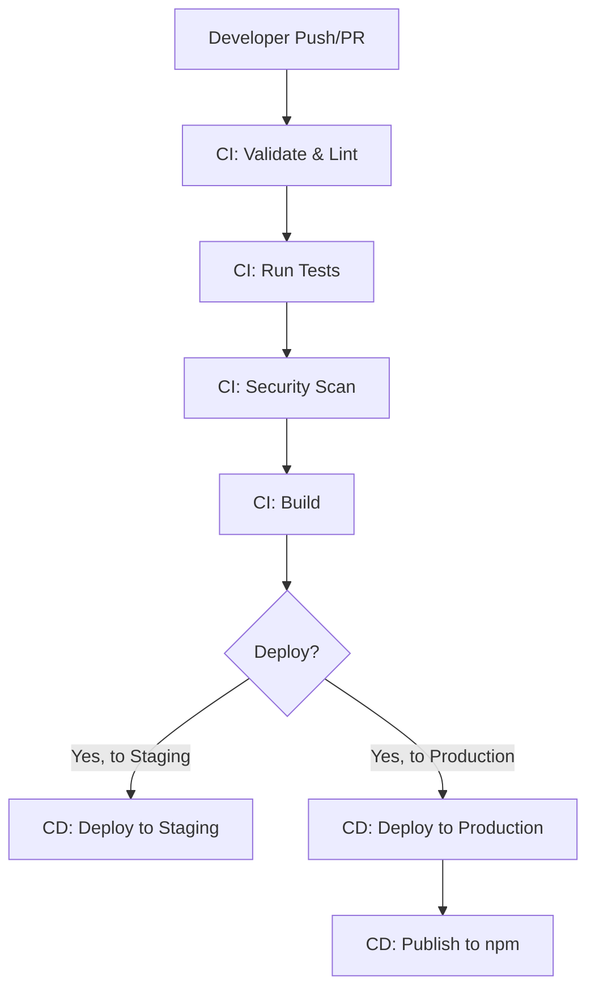

# SwissKnife CI/CD System

This document provides comprehensive information about the Continuous Integration and Continuous Deployment (CI/CD) system used in the SwissKnife project.

## Overview

The SwissKnife CI/CD system automates building, testing, and deploying the SwissKnife application across different environments. It ensures code quality, performs comprehensive testing, and provides reliable deployment automation.



## CI Workflow

The CI workflow (`ci.yml`) runs on every push to main/develop branches and on pull requests. It ensures code quality and produces verified builds.

### CI Jobs

1. **Validate & Lint**
   - Checks code formatting
   - Performs linting
   - Type checking
   - Generates documentation

2. **Test**
   - Runs unit tests
   - Runs integration tests
   - Runs end-to-end tests
   - Runs specialized tests for critical components (Graph-of-Thought, Fibonacci Heap)
   - Generates coverage reports

3. **Security Scan**
   - Runs npm audit
   - Performs Snyk security scanning

4. **Build**
   - Creates production build
   - Verifies build functionality
   - Uploads build artifacts

5. **Benchmark** (on push to main/develop only)
   - Runs performance benchmarks
   - Compares with previous results

## CD Workflow

The CD workflow (`cd.yml`) handles deployment to different environments.

### CD Jobs

1. **Prepare Deployment**
   - Determines environment and version

2. **Deploy to Staging**
   - Runs when targeting staging environment
   - Configures for staging
   - Deploys to staging server
   - Runs post-deployment tests
   - Sends notifications

3. **Deploy to Production**
   - Runs when targeting production environment
   - Configures for production
   - Deploys to production server
   - Creates deployment record
   - Sends notifications

4. **Publish to npm**
   - Runs after successful production deployment
   - Publishes package to npm registry

## Environment Configuration

The system supports two environments:

1. **Staging**
   - Used for testing before production
   - Has debug mode enabled
   - Experimental features enabled
   - Uses staging API endpoints

2. **Production**
   - Production-ready configuration
   - Debug mode disabled
   - Only stable features
   - Uses production API endpoints

## Required Secrets

The following GitHub Actions secrets need to be configured:

| Secret Name | Description | Used In |
|-------------|-------------|---------|
| `STAGING_API_URL` | Staging API endpoint URL | Staging deployment |
| `STAGING_API_KEY` | API key for staging | Staging deployment |
| `STAGING_DEPLOY_TOKEN` | Deployment token for staging | Staging deployment |
| `PRODUCTION_API_URL` | Production API endpoint URL | Production deployment |
| `PRODUCTION_API_KEY` | API key for production | Production deployment |
| `PRODUCTION_DEPLOY_TOKEN` | Deployment token for production | Production deployment |
| `NPM_TOKEN` | npm authentication token | npm publishing |
| `SLACK_WEBHOOK_URL` | Slack webhook for notifications | Both workflows |
| `SNYK_TOKEN` | Snyk API token for security scanning | CI workflow |

## Scripts

The CI/CD system uses several custom scripts:

1. **configure.js**
   - Sets up environment-specific configuration
   - Creates .env file with correct variables
   - Usage: `node scripts/configure.js [staging|production]`

2. **deploy.js**
   - Handles deployment to different environments
   - Creates deployment packages
   - Simulates/performs deployment operations
   - Usage: `node scripts/deploy.js [staging|production]`

3. **verify-build.js**
   - Verifies the build output is functional
   - Runs smoke tests on the built CLI
   - Usage: `node test/verify-build.js`

4. **run.js (benchmarks)**
   - Runs performance benchmarks
   - Compares with previous benchmark results
   - Usage: `node benchmark/run.js`

## Testing Configuration

The project uses Jest for testing with separate configurations:

1. **jest.config.js**
   - Main Jest configuration for all tests

2. **jest.staging.config.js**
   - Configuration for staging environment tests
   - Used during post-deployment testing

## Using the CI/CD System

### Running Locally

To run CI/CD jobs locally for testing:

```bash
# Run CI checks
npm run format:check
npm run lint
npm run typecheck
npm run test:unit
npm run test:integration
npm run test:e2e
npm run build
npm run test:verify-build

# Configure and deploy to staging
npm run config:staging
npm run deploy:staging

# Configure and deploy to production
npm run config:production
npm run deploy:production
```

### Triggering Deployments

#### Automatic Deployments
- Merges to `main` branch automatically deploy to staging
- Release publications automatically deploy to production

#### Manual Deployments
1. Go to the Actions tab in GitHub
2. Select "SwissKnife CD (Deployment)"
3. Click "Run workflow"
4. Select branch, environment, and optional version
5. Click "Run workflow"

## Setting Up GitHub Actions Secrets

To set up the required secrets:

1. Go to your GitHub repository
2. Click on "Settings"
3. Select "Secrets and variables" → "Actions"
4. Click "New repository secret"
5. Add each of the secrets listed in the "Required Secrets" section

## Troubleshooting

### Common Issues

1. **Build Failures**
   - Check the build logs for specific errors
   - Verify that all dependencies are installed
   - Ensure code passes linting and type checking

2. **Test Failures**
   - Review test logs for failed tests
   - Run tests locally to reproduce issues
   - Check if tests are environment-specific

3. **Deployment Failures**
   - Verify environment secrets are correctly set
   - Check network access to deployment servers
   - Validate authentication tokens

### Getting Help

If you encounter issues with the CI/CD system:

1. Check the workflow run logs for detailed error messages
2. Review this documentation for correct usage
3. Contact the DevOps team for assistance with persistent problems