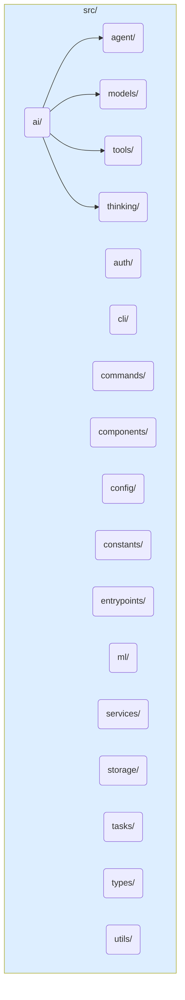

# Clean Room TypeScript Implementation Strategy

## Overview

SwissKnife employs a **Clean Room TypeScript Implementation** strategy for all core features and components within its unified codebase. This means functionality inspired by previous projects (like Goose or IPFS Accelerate) is reimplemented independently in TypeScript based on understanding the *requirements* and *intended behavior*, rather than directly translating or reusing code from other languages (like Rust). This document outlines the methodology and benefits of this approach.

## What is Clean Room TypeScript Implementation?

In this context, it means developing all core logic natively in TypeScript within a single, unified project structure. This approach avoids cross-language bindings (like Rust-to-JS bridges) and direct code porting, aiming for:
- An idiomatic TypeScript codebase.
- Reduced complexity from managing multiple language toolchains and build processes.
- Avoidance of potential IP or licensing contamination from original codebases.
- A cohesive system where components interact directly via TypeScript interfaces.

## The SwissKnife Unified Approach

SwissKnife embodies this strategy through:

1. **Unified TypeScript Codebase**: All core logic (AI Agent, TaskNet, ML Engine, Storage VFS, CLI) resides in the `src/` directory as TypeScript code.
2. **Domain-Driven Organization**: Code is structured by functional domain (e.g., `src/ai/`, `src/tasks/`) rather than by original project source.
3. **TypeScript-First Design**: The architecture leverages TypeScript's strong typing, modern features (async/await), and the rich Node.js ecosystem.
4. **API-Based External Integration**: The only significant external component, the IPFS Kit MCP Server (Python), is interacted with via a dedicated TypeScript client (`src/storage/ipfs/ipfs-client.ts` or similar) using standard network APIs (HTTP). No direct language bridge is used.
5. **Single Project Structure**: All components are part of the same `package.json`, build process, and testing framework, simplifying development and CI/CD.

## Implementation Strategy

Our implementation strategy follows these key principles:

### 1. Feature Organization by Domain

- Organize functionality by domain (AI, CLI, ML, Tasks, Storage)
- Create clear boundaries between domains with well-defined interfaces
- Ensure domains can be developed and tested independently
- Establish consistent patterns across all domains

### 2. TypeScript Architecture Design

- Design robust TypeScript patterns for each feature
- Create comprehensive type definitions and interfaces
- Establish cross-domain communication through direct imports
- Define consistent error handling and recovery mechanisms

### 3. API-Based Integration

- Integrate with the IPFS Kit MCP Server through a well-defined API
- Implement REST and WebSocket clients for different operation types
- Create a caching layer for improved performance
- Handle synchronous and asynchronous operations consistently

### 4. Comprehensive Testing

- Create unit tests for individual components
- Build integration tests for cross-domain functionality
- Develop end-to-end tests for complete workflows
- Ensure proper test coverage across all domains

## Benefits of the Unified Approach

- **Simplified Architecture**: Direct TypeScript integration reduces complexity
- **Improved Maintainability**: Single language with consistent patterns
- **Enhanced Performance**: Reduced serialization and communication overhead
- **Better Developer Experience**: Consistent tooling and development workflow
- **Type Safety**: Full TypeScript type checking across all components

## Unified Directory Structure Example

This domain-driven structure facilitates the clean room approach:

*(Refer to [PROJECT_STRUCTURE.md](./PROJECT_STRUCTURE.md) for more details)*. Each domain contains TypeScript code implementing its specific responsibilities.

## Conclusion

The Clean Room TypeScript Implementation strategy is central to SwissKnife's architecture. It ensures a modern, maintainable, and performant codebase built entirely within the TypeScript/Node.js ecosystem, while still allowing integration with necessary external services like the IPFS Kit MCP Server via standard APIs. This approach maximizes developer productivity and leverages the strengths of TypeScript for building a complex, reliable CLI application.
