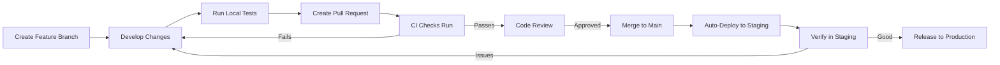

# Developer Guide: Working with SwissKnife CI/CD

This guide helps developers understand the development workflow, project structure, testing strategy, and CI/CD system for the SwissKnife project.

## Development Workflow



## Project Architecture Overview

SwissKnife is built on a unified TypeScript architecture, integrating AI capabilities, advanced task management (TaskNet with GoT), ML acceleration, and a virtual filesystem with IPFS support. Key principles include clean-room implementation and a domain-driven structure.

For detailed architecture, see:
- [Unified Architecture](./UNIFIED_ARCHITECTURE.md)
- [Project Structure](./PROJECT_STRUCTURE.md)
- Phase-specific documentation:
    - [Phase 1: Analysis & Planning](./phase1/)
    - [Phase 2: Core Implementation](./phase2/)
    - [Phase 3: TaskNet Enhancement](./phase3/)
    - [Phase 4: CLI Integration](./phase4/)
    - [Phase 5: Optimization & Finalization](./phase5/)

## Getting Started

### Prerequisites

- Node.js (v18 or higher recommended)
- npm or pnpm (pnpm is recommended for managing dependencies via `pnpm-lock.yaml`)
- Git
- Bun (required for the build process: `npm install -g bun`)

### Setting Up Your Development Environment

1. Clone the repository:
   ```bash
   git clone https://github.com/endomorphosis/swissknife.git
   cd swissknife
   ```

2. Install dependencies:
   ```bash
   # Using pnpm (recommended)
   pnpm install

   # Using npm (may require --legacy-peer-deps depending on conflicts)
   npm install --legacy-peer-deps
   # or simply 'npm install' if no peer dependency issues
   ```

3. Setup pre-commit hooks (optional but recommended):
   ```bash
   npx husky install
   ```

## Daily Development Workflow

### 1. Creating a Feature Branch

Always work in a feature branch, never directly on `main` or `develop`:

```bash
git checkout main
git pull
git checkout -b feature/your-feature-name
```

### 2. Developing Changes

As you develop, follow these practices:

- Follow the code style guidelines
- Write tests for your changes
- Keep commits focused and with clear messages
- Run tests regularly (`npm test` or `pnpm test`)
- Keep up-to-date with the `main` branch (`git pull origin main` frequently)

### 3. Local Testing

Before creating a pull request, run these checks locally:

```bash
# Format code
npm run format

# Lint check
npm run lint

# Type check
npm run typecheck

# Run tests
npm run test # Runs all tests (unit, integration, e2e)

# Build (Requires Bun)
bun run build

# Verify build
npm run test:verify-build
```

### 4. Creating a Pull Request

When your changes are ready:

1. Push your branch:
   ```bash
   git push -u origin feature/your-feature-name
   ```

2. Create a pull request on GitHub:
   - Use a clear title describing your changes
   - Fill out the PR template with details of your changes
   - Link to any related issues

### 5. CI Checks and Code Review

After creating a PR:

1. CI checks will run automatically
2. Address any CI failures by pushing fixes to your branch
3. Request reviews from team members
4. Address feedback from reviewers with additional commits

### 6. Merging and Deployment

When your PR is approved:

1. Merge your PR via GitHub (select "Squash and merge" if many small commits)
2. CI will automatically build and deploy to staging
3. Verify your changes work correctly in staging
4. For production deployment, follow the [release process](#release-process)

## Working with Tests

The project uses **Jest** as the test runner.

### Test Structure

Tests are organized mirroring the `src/` structure within the `test/` directory:

- **`test/unit/`**: Tests for individual modules/classes in isolation. Dependencies should be mocked using `jest.mock()`.
- **`test/integration/`**: Tests interactions between multiple internal components/services. External dependencies (APIs, network) should be mocked.
- **`test/e2e/`**: Tests complete user workflows by running the built CLI application (`dist/cli.mjs`) as a child process. Assert on stdout, stderr, exit codes, and file system side effects.
- **`test/helpers/`**: Reusable test utilities (e.g., creating temp dirs, mocking env vars, capturing console output).
- **`test/mocks/`**: Reusable mock implementations for complex dependencies.
- **`test/fixtures/`**: Static data or functions to generate data for tests.
- **`test/plans/`**: Detailed test plans (like [Phase 3 Test Plan](./test/plans/phase3_tasknet_test_plan.md)).

### Running Tests

Use npm or pnpm scripts:

```bash
# Run all tests (unit, integration, e2e) defined in package.json "test" script
npm test
pnpm test

# Run tests in watch mode during development
npm run test:watch
pnpm test:watch

# Run specific test file(s)
npx jest test/unit/ai/agent.test.ts
pnpm test test/unit/ai/agent.test.ts

# Run tests with coverage report
npm run test:coverage
pnpm test:coverage
```
*(Note: Specific scripts like `test:unit`, `test:integration`, `test:e2e` might exist or can be added to `package.json`)*

### Writing Tests

- Use TypeScript (`.test.ts`, `.test.tsx`).
- Use `describe`, `it` (or `test`), `beforeEach`, `afterEach`, `beforeAll`, `afterAll` blocks.
- Use Jest's assertion library (`expect`).
- Use `jest.mock()` for mocking dependencies.
- Follow Arrange-Act-Assert structure within tests.
- Use helpers and fixtures from `test/helpers/` and `test/fixtures/` to keep tests clean.

Example Unit Test Structure:

```typescript
// test/unit/utils/some-util.test.ts
import { someUtilFunction } from '@/utils/some-util.js'; // Use .js extension

// Mock dependencies if needed
jest.mock('@/config/manager.js', () => ({ /* ... mock ... */ }));

describe('someUtilFunction', () => {
  beforeEach(() => {
    // Reset mocks
    jest.clearAllMocks();
  });

  it('should handle valid input correctly', () => {
    // Arrange
    const input = 'test';
    const expectedOutput = 'TEST';

    // Act
    const result = someUtilFunction(input);

    // Assert
    expect(result).toBe(expectedOutput);
  });

  it('should throw an error for invalid input', () => {
    // Arrange
    const invalidInput = null;

    // Act & Assert
    expect(() => someUtilFunction(invalidInput as any)).toThrow('Invalid input');
  });
});
```

## Running CI/CD Locally

You can simulate CI/CD jobs locally:

### Running CI Checks

```bash
# Validation
npm run format:check
npm run lint
npm run typecheck

# Testing
npm run test:unit
npm run test:integration
npm run test:e2e

# Building
npm run build
npm run test:verify-build

# Benchmarking (if configured)
npm run benchmark
pnpm benchmark
```

### Testing Deployments Locally

```bash
# Configure for staging
npm run config:staging

# Test staging deployment (won't actually deploy)
NODE_ENV=staging STAGING_DEPLOY_TOKEN=test-token node scripts/deploy.js staging --dry-run

# Configure for production
npm run config:production

# Test production deployment (won't actually deploy)
NODE_ENV=production PRODUCTION_DEPLOY_TOKEN=test-token node scripts/deploy.js production --dry-run
```

## Release Process

### Creating a Release

1. Ensure all changes for the release are merged to `main`
2. Verify the code works correctly in staging
3. Create a new release via GitHub:
   - Go to "Releases" and click "Draft a new release"
   - Create a new tag with the version (e.g., `v1.2.3`)
   - Use semantic versioning format (`vMAJOR.MINOR.PATCH`)
   - Write release notes detailing the changes
   - Publish release

4. The CD workflow will automatically:
   - Deploy to production
   - Publish to npm

### Hotfix Process

For urgent fixes to production:

1. Create a hotfix branch from `main`:
   ```bash
   git checkout main
   git pull
   git checkout -b hotfix/issue-description
   ```

2. Make minimal changes to fix the issue
3. Run tests to ensure nothing is broken
4. Create a PR and mark it as a hotfix
5. After approval and merge, create a new release with patch version increase

## Troubleshooting CI/CD Issues

### Common CI Failures

1. **Linting/Formatting Errors**:
   - Run `pnpm run format:check` and `pnpm run lint` locally.
   - Fix automatically with `pnpm run format`.
2. **Type Errors**:
   - Run `pnpm run typecheck` locally.
   - Resolve TypeScript errors in the code.
3. **Test Failures**:
   - Check the CI logs for details on failing tests.
   - Run the specific failing test file locally using Jest (e.g., `npx jest test/unit/some.test.ts`).
   - Debug the test or the code being tested.
4. **Build Failures**:
   - Check for TypeScript errors (`pnpm run typecheck`).
   - Ensure all dependencies are installed correctly (`pnpm install`).
   - Try a clean build: `pnpm run clean && bun run build`.
5. **Module Resolution Errors (in Tests)**:
   - As noted during refactoring, persistent errors like "Cannot find module" in `.ts` test files likely indicate a project configuration issue (`tsconfig.json` or `jest.config.cjs`) related to ES Module resolution or path aliases.
   - **Solution**: This requires a developer to investigate and correct the Jest/TypeScript configuration to properly handle `.js` extensions in imports and path mappings. Ensure `moduleResolution` in `tsconfig.json` and Jest's `moduleNameMapper` and `transform` settings are correctly configured for ESM.

### Getting Help

If you're stuck with CI/CD issues:

1. Check the detailed CI/CD documentation in `/docs/CICD.md`
2. Look through previous similar issues in GitHub
3. Ask for help in the team's development channel

## Best Practices

### Commit Messages

Follow this format for consistent commit messages:

```
type(scope): brief description

longer description if needed
```

Types:
- `feat`: A new feature
- `fix`: A bug fix
- `docs`: Documentation changes
- `style`: Code style changes (formatting, etc.)
- `refactor`: Code changes that neither fix bugs nor add features
- `test`: Adding or improving tests
- `chore`: Changes to the build process or auxiliary tools

Example:
```
feat(auth): add password reset functionality

- Adds API endpoint for requesting password reset
- Sends email with reset token
- Adds form for creating new password
```

### Pull Request Best Practices

1. **Keep PRs Small**: Aim for focused PRs that do one thing well
2. **Descriptive Title**: Clear title that describes the change
3. **Link Issues**: Reference related issues with `#issue-number`
4. **Screenshots/Videos**: Include for UI changes
5. **Self-Review**: Review your own code before requesting reviews
6. **Tests**: Include tests for new functionality or bug fixes
7. **Documentation**: Update docs for API or behavior changes

### Handling Flaky Tests

If you encounter intermittently failing tests:

1. Mark the test as flaky with a comment explaining why
2. Create an issue to fix the flaky test
3. Don't disable tests without a tracking issue

Example:
```javascript
// TODO(username): This test is flaky due to timing issues - Issue #123
test.retry(3)('should handle concurrent operations', () => {
  // Test code
});
```

## Advanced Topics

### Adding a New Environment

To add a new environment (e.g., "develop"):

1. Create a new environment configuration:
   ```javascript
   // config/develop.json
   {
     "apiUrl": "https://api.develop.example.com",
     "debug": true,
     "featureFlags": {
       // Environment-specific flags
     }
   }
   ```

2. Update the configuration script to handle the new environment
3. Add a new deployment job in the CD workflow

### Modifying CI/CD Workflows

If you need to modify the CI/CD workflows:

1. Make changes to workflow files in `.github/workflows/`
2. Test the changes locally first
3. Create a separate PR for workflow changes
4. Thoroughly document changes in the PR description
5. Be cautious about modifying production deployment steps
