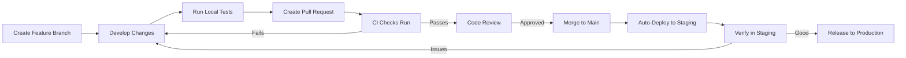

# Developer Guide: Working with SwissKnife CI/CD

This guide helps developers understand how to work effectively with the SwissKnife CI/CD system in day-to-day development workflows.

## Development Workflow



## Getting Started

### Prerequisites

- Node.js (v18.x or 20.x)
- npm 
- Git

### Setting Up Your Development Environment

1. Clone the repository:
   ```bash
   git clone https://github.com/endomorphosis/swissknife.git
   cd swissknife
   ```

2. Install dependencies:
   ```bash
   npm ci
   ```

3. Setup pre-commit hooks (optional but recommended):
   ```bash
   npx husky install
   ```

## Daily Development Workflow

### 1. Creating a Feature Branch

Always work in a feature branch, never directly on `main` or `develop`:

```bash
git checkout main
git pull
git checkout -b feature/your-feature-name
```

### 2. Developing Changes

As you develop, follow these practices:

- Follow the code style guidelines
- Write tests for your changes
- Keep commits focused and with clear messages
- Run tests regularly

### 3. Local Testing

Before creating a pull request, run these checks locally:

```bash
# Format code
npm run format

# Lint check
npm run lint

# Type check
npm run typecheck

# Run tests
npm run test

# Build 
npm run build

# Verify build
npm run test:verify-build
```

### 4. Creating a Pull Request

When your changes are ready:

1. Push your branch:
   ```bash
   git push -u origin feature/your-feature-name
   ```

2. Create a pull request on GitHub:
   - Use a clear title describing your changes
   - Fill out the PR template with details of your changes
   - Link to any related issues

### 5. CI Checks and Code Review

After creating a PR:

1. CI checks will run automatically
2. Address any CI failures by pushing fixes to your branch
3. Request reviews from team members
4. Address feedback from reviewers with additional commits

### 6. Merging and Deployment

When your PR is approved:

1. Merge your PR via GitHub (select "Squash and merge" if many small commits)
2. CI will automatically build and deploy to staging
3. Verify your changes work correctly in staging
4. For production deployment, follow the [release process](#release-process)

## Working with Tests

### Running Different Types of Tests

```bash
# Run all tests
npm test

# Run only unit tests
npm run test:unit

# Run only integration tests  
npm run test:integration

# Run only end-to-end tests
npm run test:e2e

# Run tests in watch mode (for development)
npm run test:watch
```

### Writing Tests

Place tests in the appropriate directories:

- Unit tests: `test/unit/`
- Integration tests: `test/integration/`
- End-to-end tests: `test/e2e/`

Use the test utilities and mocks provided in:
- `test/utils/`
- `test/mocks/`
- `test/fixtures/`

Example of a good test:

```javascript
// test/unit/example.test.js
const { someFunction } = require('../../src/example');
const { createTestHelper } = require('../utils/test-helpers');

describe('someFunction', () => {
  beforeEach(() => {
    // Setup
  });

  test('should handle valid input correctly', () => {
    // Arrange
    const input = { /* test data */ };
    
    // Act
    const result = someFunction(input);
    
    // Assert
    expect(result).toEqual(/* expected output */);
  });

  test('should handle errors properly', () => {
    // Arrange
    const invalidInput = { /* invalid test data */ };
    
    // Act & Assert
    expect(() => someFunction(invalidInput)).toThrow();
  });
});
```

## Running CI/CD Locally

You can simulate CI/CD jobs locally:

### Running CI Checks

```bash
# Validation
npm run format:check
npm run lint
npm run typecheck

# Testing
npm run test:unit
npm run test:integration
npm run test:e2e

# Building
npm run build
npm run test:verify-build

# Benchmarking
npm run benchmark
```

### Testing Deployments Locally

```bash
# Configure for staging
npm run config:staging

# Test staging deployment (won't actually deploy)
NODE_ENV=staging STAGING_DEPLOY_TOKEN=test-token node scripts/deploy.js staging --dry-run

# Configure for production
npm run config:production

# Test production deployment (won't actually deploy)
NODE_ENV=production PRODUCTION_DEPLOY_TOKEN=test-token node scripts/deploy.js production --dry-run
```

## Release Process

### Creating a Release

1. Ensure all changes for the release are merged to `main`
2. Verify the code works correctly in staging
3. Create a new release via GitHub:
   - Go to "Releases" and click "Draft a new release"
   - Create a new tag with the version (e.g., `v1.2.3`)
   - Use semantic versioning format (`vMAJOR.MINOR.PATCH`)
   - Write release notes detailing the changes
   - Publish release

4. The CD workflow will automatically:
   - Deploy to production
   - Publish to npm

### Hotfix Process

For urgent fixes to production:

1. Create a hotfix branch from `main`:
   ```bash
   git checkout main
   git pull
   git checkout -b hotfix/issue-description
   ```

2. Make minimal changes to fix the issue
3. Run tests to ensure nothing is broken
4. Create a PR and mark it as a hotfix
5. After approval and merge, create a new release with patch version increase

## Troubleshooting CI/CD Issues

### Common CI Failures

1. **Linting Errors**
   - Run `npm run lint` locally to see detailed errors
   - Fix style issues with `npm run format`

2. **Test Failures**
   - Check the CI logs for which tests failed
   - Run the specific failing test locally
   - Fix the issues and push changes

3. **Build Failures**
   - Check for TypeScript errors: `npm run typecheck`
   - Verify dependencies are correctly installed: `npm ci`
   - Try cleaning node_modules: `rm -rf node_modules && npm ci`

### Getting Help

If you're stuck with CI/CD issues:

1. Check the detailed CI/CD documentation in `/docs/CICD.md`
2. Look through previous similar issues in GitHub
3. Ask for help in the team's development channel

## Best Practices

### Commit Messages

Follow this format for consistent commit messages:

```
type(scope): brief description

longer description if needed
```

Types:
- `feat`: A new feature
- `fix`: A bug fix
- `docs`: Documentation changes
- `style`: Code style changes (formatting, etc.)
- `refactor`: Code changes that neither fix bugs nor add features
- `test`: Adding or improving tests
- `chore`: Changes to the build process or auxiliary tools

Example:
```
feat(auth): add password reset functionality

- Adds API endpoint for requesting password reset
- Sends email with reset token
- Adds form for creating new password
```

### Pull Request Best Practices

1. **Keep PRs Small**: Aim for focused PRs that do one thing well
2. **Descriptive Title**: Clear title that describes the change
3. **Link Issues**: Reference related issues with `#issue-number`
4. **Screenshots/Videos**: Include for UI changes
5. **Self-Review**: Review your own code before requesting reviews
6. **Tests**: Include tests for new functionality or bug fixes
7. **Documentation**: Update docs for API or behavior changes

### Handling Flaky Tests

If you encounter intermittently failing tests:

1. Mark the test as flaky with a comment explaining why
2. Create an issue to fix the flaky test
3. Don't disable tests without a tracking issue

Example:
```javascript
// TODO(username): This test is flaky due to timing issues - Issue #123
test.retry(3)('should handle concurrent operations', () => {
  // Test code
});
```

## Advanced Topics

### Adding a New Environment

To add a new environment (e.g., "develop"):

1. Create a new environment configuration:
   ```javascript
   // config/develop.json
   {
     "apiUrl": "https://api.develop.example.com",
     "debug": true,
     "featureFlags": {
       // Environment-specific flags
     }
   }
   ```

2. Update the configuration script to handle the new environment
3. Add a new deployment job in the CD workflow

### Modifying CI/CD Workflows

If you need to modify the CI/CD workflows:

1. Make changes to workflow files in `.github/workflows/`
2. Test the changes locally first
3. Create a separate PR for workflow changes
4. Thoroughly document changes in the PR description
5. Be cautious about modifying production deployment steps