# SwissKnife Unified Project Structure

This document outlines the domain-driven project structure of SwissKnife, organized as a single unified TypeScript codebase with clear domain boundaries.

## Directory Structure

```mermaid
graph TD
    subgraph Root
        A(src/) --> B(ai/);
        A --> C(auth/);
        A --> D(cli/);
        A --> E(commands/);
        A --> F(components/);
        A --> G(config/);
        A --> H(constants/);
        A --> I(entrypoints/);
        A --> J(ml/);
        A --> K(services/);
        A --> L(storage/);
        A --> M(tasks/);
        A --> N(types/);
        A --> O(utils/);
        P(test/) --> Q(unit/);
        P --> R(integration/);
        P --> S(e2e/);
        P --> T(helpers/);
        P --> U(mocks/);
        P --> V(fixtures/);
        P --> W(plans/);
        X(docs/) --> Y(phase1/);
        X --> Z(phase2/);
        X --> AA(phase3/);
        X --> AB(phase4/);
        X --> AC(phase5/);
        X --> AD(architecture/);
        X --> AE(guides/);
        AF(scripts/);
        AG(package.json);
        AH(tsconfig.json);
        AI(jest.config.cjs);
        AJ(README.md);
    end

    subgraph src/ai
        B --> B1(agent/);
        B --> B2(models/);
        B --> B3(tools/);
        B --> B4(thinking/);
    end

    subgraph src/cli
        D --> D1(parser.ts);
        D --> D2(registry.ts);
        D --> D3(executor.ts);
        D --> D4(context.ts);
        D --> D5(help.ts);
        D --> D6(formatter.ts);
    end

     subgraph src/commands
        E --> E1(agent.ts);
        E --> E2(config.ts);
        E --> E3(mcp.ts);
        E --> E4(task.ts);
        E --> E5(ipfs.ts);
        E --> E6(file.ts);
    end

    subgraph src/tasks
        M --> M1(manager.ts);
        M --> M2(scheduler/);
        M --> M3(execution/);
        M --> M4(workers/);
        M --> M5(coordination/);
        M --> M6(decomposition/);
        M --> M7(synthesis/);
        M --> M8(graph/);
        M --> M9(dependencies/);
    end

     subgraph src/storage
        L --> L1(operations.ts);
        L --> L2(registry.ts);
        L --> L3(path-resolver.ts);
        L --> L4(backend.ts);
        L --> L5(backends/);
        L --> L6(ipfs/);
        L --> L7(cache.ts);
    end

    subgraph src/storage/backends
        L5 --> L5a(filesystem.ts);
        L5 --> L5b(ipfs.ts);
        L5 --> L5c(memory.ts);
    end

    style A fill:#def
    style P fill:#def
    style X fill:#def
    style AF fill:#def
```


*(Note: This is a simplified representation. Refer to the actual filesystem or `CLAUDE.md` for precise file names and nesting.)*

## Core Domains

The project is organized into the following functional domains, all implemented within a single TypeScript codebase:

### AI Domain (`src/ai/`)

Handles core artificial intelligence capabilities:
- **Agent (`agent/`)**: Manages conversation flow, state, memory, and orchestrates interactions between models and tools.
- **Models (`models/`)**: Defines model interfaces (`ModelProvider`), manages model registration (`ModelRegistry`), handles model selection (`ModelSelector`), and executes model calls (`ModelExecutionService`). Includes provider implementations (OpenAI, Anthropic, local via ML Engine).
- **Tools (`tools/`)**: Defines the `Tool` interface, manages tool registration and execution (`ToolExecutor`), and includes implementations for various capabilities (shell, filesystem, web search).
- **Thinking (`thinking/`)**: Implements advanced reasoning patterns, primarily the Graph-of-Thought (GoT) engine and associated structures.

### CLI Domain (`src/cli/`, `src/commands/`, `src/components/`)

Manages all aspects of the command-line interface:
- **Core (`cli/`)**: Handles command parsing (`parser.ts`), registration (`registry.ts`), execution (`executor.ts`), context (`context.ts`), help generation (`help.ts`), and output formatting (`formatter.ts`).
- **Command Implementations (`commands/`)**: Contains the logic for each user-facing command (e.g., `agent`, `config`, `task`, `mcp`). Often utilizes Ink/React for rendering interactive UI elements.
- **UI Components (`components/`)**: Reusable React components built for the Ink terminal UI framework (e.g., custom selectors, message displays, progress indicators).

### ML Domain (`src/ml/`)

Focuses on local machine learning model execution and acceleration within the Node.js environment:
- **Engine (`inference/engine.ts`)**: Orchestrates model loading and inference execution.
- **Loader (`loader.ts`)**: Handles loading models (e.g., ONNX format) from storage.
- **Hardware (`hardware.ts`)**: Detects available hardware capabilities (CPU features, GPU via bindings) for acceleration.
- **Bindings (`onnx/`, `tensorflow/`)**: Wrappers or integrations for Node.js ML runtimes (e.g., `onnxruntime-node`, `tensorflow.js-node`).
- **Tensor Ops (`tensor/`)**: Utilities for working with tensor data if needed beyond runtime libraries.

### Tasks Domain (`src/tasks/`)

Implements the enhanced TaskNet system for complex workflow management:
- **Manager (`manager.ts`)**: Central service for creating, tracking, and retrieving task status and results.
- **Scheduler (`scheduler/`)**: High-performance task prioritization using a Fibonacci Heap implementation. Includes dynamic priority calculation logic.
- **Execution (`execution/`)**: `TaskExecutor` responsible for running tasks (locally via worker pool or potentially delegating).
- **Workers (`workers/`)**: Manages a pool of Node.js `worker_threads` for local parallel task execution.
- **Coordination (`coordination/`)**: Implements Merkle Clocks and Hamming Distance logic for potential future distributed task delegation.
- **Decomposition (`decomposition/`)**: Strategies and engine for breaking down complex tasks.
- **Synthesis (`synthesis/`)**: Strategies and engine for aggregating results from subtasks.
- **Graph (`graph/`)**: Contains the Graph-of-Thought implementation (`GoTEngine`, `ThoughtGraph`, `ThoughtNode`, etc.).
- **Dependencies (`dependencies/`)**: Manages the dependency relationships between tasks.

### Storage Domain (`src/storage/`)

Provides a Virtual Filesystem (VFS) abstraction over different storage backends:
- **Operations (`operations.ts`)**: High-level unified API (`readFile`, `writeFile`, `list`, `copy`, etc.).
- **Registry (`registry.ts`)**: Manages backend instances and mount points (e.g., `/local`, `/ipfs`).
- **Path Resolver (`path-resolver.ts`)**: Maps virtual paths to the correct backend and relative path.
- **Backend Interface (`backend.ts`)**: Defines the common contract for all storage implementations.
- **Backends (`backends/`)**: Concrete implementations (e.g., `filesystem.ts`, `ipfs.ts` using the IPFS client).
- **IPFS Client (`ipfs/`)**: Client for interacting with an IPFS node API (e.g., IPFS Kit MCP Server).
- **Caching (`cache.ts`)**: Optional caching layer for storage operations.

### Support Domains

Provide cross-cutting concerns and utilities:
- **Auth (`auth/`)**: Handles API key management, potentially user authentication/authorization (UCANs).
- **Config (`config/`)**: Manages loading, saving, and accessing hierarchical configuration.
- **Services (`services/`)**: Higher-level services coordinating multiple domains (e.g., `mcpClient.ts`).
- **Utils (`utils/`)**: Common helper functions (logging, encryption, async utilities, etc.).
- **Types (`types/`)**: Shared TypeScript interfaces and type definitions used across domains.
- **Constants (`constants/`)**: Application-wide constants, product information.
- **Entrypoints (`entrypoints/`)**: Main CLI entry (`cli.ts`) and secondary ones (`mcp.ts`).

## Key Implementation Principles

### 1. Single Unified Codebase

All functionality is implemented directly in TypeScript within a single coherent codebase:

- No separation between components originally from different sources
- Consistent coding patterns and style throughout
- Unified build and testing process
- Shared type system across all domains

### 2. Domain-Driven Design

Code organization focuses on functional domains rather than source origins:

- Clear separation of concerns between domains
- Well-defined interfaces for cross-domain communication
- Domain-specific testing and documentation
- Logical, self-contained modules within each domain

### 3. Clean Room Implementation

All functionality is independently implemented following clean room methodology:

- Features inspired by original designs but coded from scratch
- No direct porting of code from Rust or other sources
- Optimized for TypeScript and Node.js environment
- Enhanced with TypeScript-specific improvements

### 4. IPFS / MCP Integration

- SwissKnife acts as a **client** to an external IPFS node, typically accessed via its HTTP API (like Kubo or the IPFS Kit MCP Server).
- The `IPFSKitClient` (or a similar generic IPFS client) within `src/storage/ipfs/` handles communication.
- SwissKnife can also **act as an MCP server** itself (via `src/entrypoints/mcp.ts`), exposing its own tools (like filesystem access, command execution) to MCP clients (e.g., the Claude extension).

## Cross-Domain Integration

Domains interact through well-defined TypeScript interfaces:

```typescript
// Example: Agent using StorageOperations (via ExecutionContext)
// src/ai/agent/agent.ts
import { StorageOperations } from '../../storage/operations.js'; // Adjust path
import type { ExecutionContext } from '../../types/cli.js'; // Adjust path

export class Agent {
  // Agent likely gets storageOps via its own context or constructor
  private storageOps: StorageOperations;

  // ... constructor ...

  async someAgentMethod(context: ExecutionContext, dataToStore: string, virtualPath: string) {
    // Get storage operations from the context provided by the command executor
    const storage = context.getService('storage'); // Assuming service locator pattern

    // Use storage operations
    await storage.writeFile(virtualPath, dataToStore);
    console.log(`Agent stored data at ${virtualPath}`);
  }
}
```

```typescript
// Example: GoT Engine using StorageOperations
// src/tasks/graph/persistence.ts (Conceptual)
import { StorageOperations } from '../../storage/operations.js'; // Adjust path
// Assume CID type is available or use string

export class GraphPersistence {
  constructor(private storageOps: StorageOperations) {}

  async saveGraph(graphData: any, graphId: string): Promise<string> { // Returns CID string
    const virtualPath = `/graphs/${graphId}.json`; // Example path in VFS
    const { cid } = await this.storageOps.writeFile(virtualPath, JSON.stringify(graphData));
    console.log(`Graph ${graphId} saved to ${virtualPath} (CID: ${cid})`);
    return cid;
  }

  async loadGraph(cid: string): Promise<any> {
    // Reading directly via CID might bypass VFS path resolution,
    // depending on IPFS client capabilities exposed via StorageOperations
    // or requiring direct client usage.
    // This example assumes reading via a known virtual path if mapped.
    // const virtualPath = await this.findPathForCid(cid); // Needs reverse lookup
    // const buffer = await this.storageOps.readFile(virtualPath);
    // return JSON.parse(buffer.toString());

    // Simpler: Assume we read via CID if possible through storageOps or client
    const buffer = await this.storageOps.readFile(`/ipfs/${cid}`); // Example read via CID path
    return JSON.parse(buffer.toString());
  }
}
```

## Testing Approach

Tests follow the same domain-driven organization:

- **Unit Tests**: Test individual components within domains
- **Integration Tests**: Test interactions between domains
- **End-to-End Tests**: Test complete workflows across the system
- **Mock Implementations**: Provide test doubles for external dependencies

## Conclusion

The SwissKnife unified project structure creates a cohesive, maintainable system with clear domain boundaries and strong typing. By organizing code by functional domain rather than by original source, we create a more intuitive and maintainable codebase while ensuring all functionality works seamlessly together.
