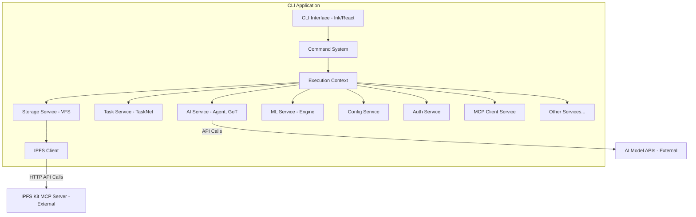

# SwissKnife Unified Architecture

This document outlines the reconceptualized architecture of SwissKnife as a single, unified TypeScript codebase that directly integrates all functionality, with the Python-based IPFS Kit MCP Server as the only external component.

## 1. Architectural Vision

The SwissKnife architecture combines all features into a cohesive, modular system with clear domain boundaries and direct TypeScript integration.

### 1.1 Core Principles

- **Unified TypeScript Codebase**: All core application logic resides within a single, cohesive TypeScript project.
- **Domain-Driven Design**: Code is organized into distinct functional domains (AI, Tasks, Storage, CLI, etc.) with clear boundaries and interfaces.
- **Clean Room Implementation**: Functionality inspired by previous projects (Goose, IPFS Accelerate) is reimplemented independently in TypeScript, not directly translated. See [CLEAN_ROOM_IMPLEMENTATION.md](./CLEAN_ROOM_IMPLEMENTATION.md).
- **API-Based External Integration**: External services, primarily the IPFS Kit MCP Server (Python), are interacted with via well-defined client APIs (e.g., HTTP), ensuring loose coupling.
- **Node.js Native**: Designed specifically for the Node.js runtime environment, leveraging its capabilities for CLI applications.
- **Type Safety**: Utilizes TypeScript's static typing for robustness and maintainability.

### 1.2 High-Level Architecture Diagram



*   The core application is a single TypeScript/Node.js process.
*   Functionality is divided into services/domains accessed via an `ExecutionContext`.
*   External dependencies like the IPFS Kit MCP Server and AI Model APIs are accessed via dedicated clients using network protocols (primarily HTTP).

## 2. Domain Organization

The codebase is organized into focused domains that contain related functionality.

### 2.1 Project Structure Diagram

```mermaid
graph TD
    subgraph "Project Structure"
        srcDir("src/") --> aiDir("ai/");
        srcDir --> authDir("auth/");
        srcDir --> cliDir("cli/");
        srcDir --> commandsDir("commands/");
        srcDir --> componentsDir("components/");
        srcDir --> configDir("config/");
        srcDir --> constantsDir("constants/");
        srcDir --> entrypointsDir("entrypoints/");
        srcDir --> mlDir("ml/");
        srcDir --> servicesDir("services/");
        srcDir --> storageDir("storage/");
        srcDir --> tasksDir("tasks/");
        srcDir --> typesDir("types/");
        srcDir --> utilsDir("utils/");
        testDir("test/") --> unitDir("unit/");
        testDir --> integrationDir("integration/");
        testDir --> e2eDir("e2e/");
        testDir --> helpersDir("helpers/");
        testDir --> mocksDir("mocks/");
        testDir --> fixturesDir("fixtures/");
        testDir --> plansDir("plans/");
        docsDir("docs/") --> phase1Dir("phase1/");
        docsDir --> phase2Dir("phase2/");
        docsDir --> phase3Dir("phase3/");
        docsDir --> phase4Dir("phase4/");
        docsDir --> phase5Dir("phase5/");
        docsDir --> architectureDir("architecture/");
        docsDir --> guidesDir("guides/");
        scriptsDir("scripts/");
        packageJson["package.json"];
        tsconfigJson["tsconfig.json"];
        jestConfig["jest.config.cjs"];
        readmeMd["README.md"];
    end
```



*(Refer to [PROJECT_STRUCTURE.md](./PROJECT_STRUCTURE.md) for a detailed file/directory breakdown)*.

## 3. Core Systems

### 3.1 AI Domain (`src/ai/`)

Provides agent functionality, tool execution, model interaction, and advanced reasoning (GoT):

```typescript
// src/ai/agent/agent.ts
import { Tool } from '../tools/tool';
import { Model } from '../models/model';
import { ToolExecutor } from '../tools/executor';
import { ThinkingManager } from '../thinking/manager';

export interface AgentOptions {
  model: Model;
  tools?: Tool[];
  maxTokens?: number;
  temperature?: number;
}

export class Agent {
  private model: Model;
  private tools: Map<string, Tool> = new Map();
  private toolExecutor: ToolExecutor;
  private thinkingManager: ThinkingManager;
  
  constructor(options: AgentOptions) {
    this.model = options.model;
    // Internal instances managed by the Agent
    this.toolExecutor = new ToolExecutor(/* ... */);
    this.thinkingManager = new ThinkingManager(/* ... */);
    this.memory = new MessageMemory(/* ... */);

    options.tools?.forEach(tool => this.registerTool(tool));
  }

  registerTool(tool: Tool): void {
    // Delegate registration to ToolExecutor
    this.toolExecutor.registerTool(tool);
  }

  async processMessage(message: string): Promise<AgentMessage> { // Returns AgentMessage
    // 1. Add message to memory
    // 2. Create/Update GoT graph via ThinkingManager
    // 3. Process graph (may involve model calls via ThinkingManager/Model)
    // 4. Identify needed tools via ThinkingManager
    // 5. Execute tools via ToolExecutor
    // 6. Process graph again with tool results
    // 7. Generate final response via ThinkingManager
    // 8. Add response to memory
    // 9. Return final AgentMessage
    const finalResponse: AgentMessage = { role: 'assistant', content: "Mocked Response" }; // Placeholder
    return finalResponse;
  }
}
```

### 3.2 ML Domain (`src/ml/`)

Provides local machine learning model execution capabilities using Node.js bindings:

```typescript
// src/ml/engine.ts (Conceptual)
import type { Model } from '@/types/ai.js'; // Use shared type
// Assume Tensor type and HardwareInfo type exist

export class MLEngine {
  private hardwareInfo: HardwareInfo | null = null;
  private loadedModels: Map<string, LoadedModel>; // Map modelId to loaded instance
  
  constructor() {
    this._detectHardware();
    this.loadedModels = new Map();
  }

  private async _detectHardware(): Promise<void> {
    // Use Node.js specific methods to detect CPU/GPU capabilities
    this.hardwareInfo = { /* ... detected info ... */ };
  }

  async loadModel(modelId: string, modelPath: string): Promise<LoadedModel> {
    // Load model from path using appropriate Node.js runtime (ONNX, TFJS)
    // Configure execution providers based on hardwareInfo
    const loadedModel = { /* ... runtime session ... */ };
    this.loadedModels.set(modelId, loadedModel);
    return loadedModel;
  }

  async runInference(modelId: string, input: InputTensors): Promise<OutputTensors> {
    const model = this.loadedModels.get(modelId);
    if (!model) throw new Error(`Model ${modelId} not loaded.`);
    // Execute inference using the loaded model runtime
    const output = { /* ... results ... */ };
    return output;
  }
}
```

### 3.3 TaskNet System (`src/tasks/`)

Implements advanced task processing, scheduling, and coordination:

```typescript
// src/tasks/scheduler/scheduler.ts (Conceptual)
import { FibonacciHeap } from './fibonacci-heap.js';
import { GoTEngine } from '../graph/graph-of-thought.js'; // Conceptual import
import type { Task } from '@/types/tasks.js'; // Use shared type

export class TaskScheduler {
  private taskHeap: FibonacciHeap<Task>;
  // ... other dependencies like DependencyManager

  constructor() {
    this.taskHeap = new FibonacciHeap<Task>();
  }

  scheduleTask(task: Task): void {
    const priority = this._calculatePriority(task);
    this.taskHeap.insert(priority, task);
  }

  getNextTask(): Task | null {
    return this.taskHeap.extractMin();
  }

  private _calculatePriority(task: Task): number {
    // Implementation
  }
  
  extractMin(): T | null {
    // Implementation
    return null;
  }
}

// src/tasks/manager.ts (Conceptual)
import { TaskScheduler } from './scheduler/scheduler.js';
import { TaskExecutor } from './execution/executor.js';
import { DependencyManager } from './dependencies/manager.js';
import type { Task, TaskResult, TaskCreationOptions } from '@/types/tasks.js';

export class TaskManager {
  constructor(
    private scheduler: TaskScheduler,
    private executor: TaskExecutor,
    private dependencyManager: DependencyManager,
    // ... other dependencies like StorageOperations
  ) {}

  async createTask(options: TaskCreationOptions): Promise<Task> {
    // 1. Create Task object
    // 2. Register dependencies with DependencyManager
    // 3. Schedule task with TaskScheduler if ready, otherwise mark pending
    const task: Task = { id: 'task-id', ...options, status: 'Pending' }; // Placeholder
    return task;
  }

  async getTask(taskId: string): Promise<Task | undefined> {
    // Retrieve task state
    return undefined;
  }

  async getTaskResult(taskId: string): Promise<any> {
    // Retrieve task result (potentially from storage)
    return null;
  }

  // Methods to update task status, handle completion/failure etc.
}
```

### 3.4 Storage System (`src/storage/`) & IPFS Client

Provides a Virtual Filesystem (VFS) abstraction over backends like local disk and IPFS. The IPFS backend uses a client to communicate with an external IPFS node/server (like IPFS Kit MCP Server).
  
  constructor() {
    this.taskHeap = new FibonacciHeap<Task>();
    this.graphManager = new GraphOfThought();
  }
  
  async createTask(description: string, priority: number = 5): Promise<string> {
    // Implementation of task creation
    return "task-id";
  }
  
  async decomposeTask(taskId: string): Promise<string[]> {
    // Implementation of task decomposition
    return ["subtask-1", "subtask-2"];
  }
}
```

```typescript
// src/storage/ipfs/ipfs-client.ts (Conceptual - replaces mcp-client.ts example)
import axios, { AxiosInstance } from 'axios'; // Use specific types
import type { StorageOperations } from '../operations.js'; // Example dependency

export interface IPFSClientOptions {
  apiUrl: string; // e.g., http://127.0.0.1:5001
  timeout?: number;
  // Add auth if needed
}

// This client interacts with a standard IPFS Kubo HTTP API
export class IPFSClient {
  private options: Required<IPFSClientOptions>;
  private httpClient: AxiosInstance;
  
  constructor(options: IPFSClientOptions) {
    this.options = {
      timeout: 30000, // 30 seconds default
      ...options,
    };
    if (!this.options.apiUrl) throw new Error("IPFS API URL is required.");
    
    this.httpClient = axios.create({
      baseURL: this.options.apiUrl,
      timeout: this.options.timeout,
    });
  }
  // Note: Standard IPFS API usually doesn't require auth headers like Bearer tokens
  
  // Example: Add content using IPFS API
  async add(content: Buffer | string): Promise<{ cid: string }> {
    const formData = new FormData();
    const blob = content instanceof Blob ? content : new Blob([Buffer.from(content)]);
    formData.append('file', blob);

    const response = await this.httpClient.post('/api/v0/add', formData, {
        headers: { 'Content-Type': 'multipart/form-data' }
    });
    return { cid: response.data.Hash };
  }

  // Example: Get content using IPFS API
  async cat(cid: string): Promise<Buffer> {
     const response = await this.httpClient.post(`/api/v0/cat?arg=${cid}`, null, {
        responseType: 'arraybuffer',
     });
     return Buffer.from(response.data);
  }
  // ... other IPFS API methods (pin, ls, dag, etc.)
}
```

## 4. Integration Approach

### 4.1 Internal Integration (TypeScript)

Core components within the `src/` directory communicate directly through TypeScript imports and well-defined interfaces, managed via the `ExecutionContext` where appropriate. This allows for tight coupling and efficient in-process communication.

```typescript
// Example: CLI command using ModelRegistry service via context
// src/commands/model.ts (Conceptual)
import type { Command, CommandContext } from '@/types/cli.js'; // Adjust path
import { ModelRegistry } from '@/ai/models/registry.js'; // Adjust path

const listModelsCommand: Command = {
    name: 'list',
    description: 'List available AI models',
    async handler(context: CommandContext) {
        const modelRegistry = context.getService(ModelRegistry); // Get service via context
        const models = modelRegistry.getAvailableModels();
        context.formatter.table(models, ['id', 'name', 'provider']); // Use formatter
        return 0;
    }
};

// Registration would happen elsewhere, e.g., in src/commands.ts
// commandRegistry.registerCommand({ name: 'model', subcommands: [listModelsCommand] });
```

### 4.2 External Integration (IPFS Kit MCP Server)

The external Python-based IPFS Kit MCP Server is accessed via its HTTP API using the `IPFSClient` (or similar) within the Storage domain. This maintains loose coupling.

```typescript
// src/storage/backends/ipfs.ts (Conceptual)
import type { StorageBackend } from '../backend.js';
import type { IPFSClient } from '../ipfs/ipfs-client.js'; // The client interacting via HTTP
import type { MappingStore } from './mapping-store.js'; // Assumed interface/class

export class IPFSBackend implements StorageBackend {
    readonly id = 'ipfs';
    readonly name = 'IPFS Storage';
    readonly isReadOnly = false;

    constructor(
        private ipfsClient: IPFSClient,
        private mappingStore: MappingStore
    ) {}

    async readFile(relativePath: string): Promise<Buffer> {
        const mapping = await this.mappingStore.get(relativePath);
        if (!mapping?.cid) throw new Error(`Path not found in IPFS mapping: ${relativePath}`);
        return this.ipfsClient.cat(mapping.cid); // Delegate to HTTP client
    }

    async writeFile(relativePath: string, data: Buffer | string): Promise<void> {
        const { cid } = await this.ipfsClient.add(data); // Delegate to HTTP client
        await this.mappingStore.set(relativePath, { cid }); // Update mapping
    }

    // ... other methods using ipfsClient and mappingStore ...
}
```

## 5. Implementation Strategy

### 5.1 Implementation Phases Summary

The project follows a phased approach (details in `docs/phaseX/` directories):

1.  **Phase 1: Analysis & Planning**: Define architecture, map components, plan integration.
2.  **Phase 2: Core Implementation**: Build foundational TypeScript services (AI, ML, Task, Storage, CLI).
3.  **Phase 3: TaskNet Enhancement**: Implement advanced GoT, scheduling, coordination, decomposition/synthesis.
4.  **Phase 4: CLI Integration**: Develop comprehensive CLI commands and workflows.
5.  **Phase 5: Optimization & Finalization**: Performance tuning, caching, testing, documentation polish, release prep.

### 5.2 Testing Strategy Overview

Testing is crucial and follows a multi-layered approach using Jest:

1.  **Unit Tests (`test/unit/`)**: Isolate and test individual classes/functions using mocks.
2.  **Integration Tests (`test/integration/`)**: Test interactions between related internal services, mocking external boundaries (APIs, network).
3.  **End-to-End Tests (`test/e2e/`)**: Test full CLI workflows by executing the application as a user would.

*(See [DEVELOPER_GUIDE.md](./DEVELOPER_GUIDE.md) and [Phase 3 Test Plan](TESTING_BEST_PRACTICES.md) for more details)*.

## 6. Benefits of this Architecture

This unified TypeScript architecture provides several advantages:

1. **Maintainability**: A single language and consistent structure make the codebase easier to understand, modify, and debug.
2. **Type Safety**: TypeScript catches many errors at compile time, reducing runtime bugs.
3. **Performance**: Direct in-process communication between core TypeScript components is generally faster than cross-process or cross-language communication (like bridges).
4. **Developer Experience**: Developers only need expertise in TypeScript/Node.js for most tasks. Unified tooling (build, test, lint) simplifies the workflow.
5. **Modularity**: Domain-driven design promotes separation of concerns and allows domains to evolve independently.
6. **Testability**: Clear interfaces and dependency injection (via context) facilitate unit and integration testing.

## 7. Conclusion

The unified SwissKnife architecture provides a robust, maintainable, and performant foundation by leveraging TypeScript and Node.js for core functionality while interacting with external services like the IPFS Kit MCP Server via standard API clients. Organizing the codebase by domain ensures modularity and scalability. This approach simplifies development compared to managing multiple codebases or complex language bridges.
