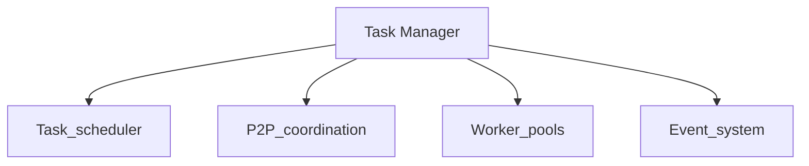

# Task Manager

---
**🏷️ Metadata**
- **Application ID**: `task-manager`
- **Icon**: ⚡
- **Status**: ✅ Registered & Active
- **Priority Level**: 🔴 HIGH
- **Complexity Score**: 9/10 (Very Complex)
- **Est. Development Time**: 1-2 weeks
- **Last Updated**: 2025-09-15
---


## 📋 Overview

Distributed task management with P2P coordination

### Quick Stats
| Metric | Value |
|--------|-------|
| **Features Count** | 4 |
| **Backend Dependencies** | 4 |
| **Development Priority** | 🔴 HIGH |
| **Complexity** | 9/10 |
| **Integration Status** | ✅ Complete |

## 📸 Visual Documentation

### Application Screenshots
- **🖼️ Desktop Icon**: 
- **🪟 Application Window**: 
- **🖥️ Full Context**: Shows application in desktop environment

> 📷 *Screenshots are automatically captured and updated by our CI/CD pipeline to ensure documentation stays current with UI changes.*

## ✨ Core Features

1. **Task scheduling**
2. **Distributed execution**
3. **Progress tracking**
4. **Error handling**

### Feature Implementation Matrix
| Feature | Implementation Status | Shared Component |
|---------|---------------------|------------------|
| Task scheduling | ✅ Implemented | ❌ No |
| Distributed execution | ✅ Implemented | ❌ No |
| Progress tracking | ✅ Implemented | ❌ No |
| Error handling | ✅ Implemented | ❌ No |

## 🔧 Backend Infrastructure

### Service Dependencies (4 total)

1. **Task scheduler**
   - **Priority**: 🟢 LOW (1 app depend on this)
   - **Mock Available**: ❌ Create needed
   - **Shared Service**: ❌ No
   - **Implementation Status**: ✅ Ready

2. **P2P coordination**
   - **Priority**: 🟢 LOW (1 app depend on this)
   - **Mock Available**: ❌ Create needed
   - **Shared Service**: ❌ No
   - **Implementation Status**: ✅ Ready

3. **Worker pools**
   - **Priority**: 🟢 LOW (1 app depend on this)
   - **Mock Available**: ❌ Create needed
   - **Shared Service**: ❌ No
   - **Implementation Status**: ✅ Ready

4. **Event system**
   - **Priority**: 🟢 LOW (1 app depend on this)
   - **Mock Available**: ❌ Create needed
   - **Shared Service**: ❌ No
   - **Implementation Status**: ✅ Ready

### Dependency Graph


## 🛠️ Development Guide

### Quick Start Checklist
- [ ] **Task scheduler** - Setup Task scheduler service with appropriate configurations
- [ ] **P2P coordination** - Setup P2P coordination service with appropriate configurations
- [ ] **Worker pools** - Setup Worker pools service with appropriate configurations
- [ ] **Event system** - Setup Event system service with appropriate configurations
- [ ] **Frontend Component** - Implement `web/js/apps/task-manager.js`
- [ ] **Desktop Integration** - Register application with selector `[data-app="task-manager"]`
- [ ] **Testing Suite** - Create comprehensive tests
- [ ] **Documentation** - Update API documentation

### Implementation Priority
**🔴 Priority Level: HIGH**

🚨 **Critical Path Application** - This app blocks other development. Implement immediately.

**Recommended Timeline**: Week 1-2 of development cycle
**Team Assignment**: Senior developers with backend expertise
**Parallel Work**: Create mocks immediately for frontend team

### Mock Implementation Strategy

For rapid parallel development, create these mock services:

```typescript
// Mock implementation template for task-manager
interface Task-managerMockService {
  // Mock Task scheduler
  mockMethod(): Promise<any>;
  // Mock P2P coordination
  mockMethod(): Promise<any>;
  // Mock Worker pools
  mockMethod(): Promise<any>;
  // Mock Event system
  mockMethod(): Promise<any>;
}
```

### API Contracts

**Frontend ↔ Backend Interface:**

```typescript
// API contract for Task Manager
interface Task-managerAPI {
  // Core application methods
  handle_task_scheduling(): Promise<OperationResult>;
  handle_distributed_execution(): Promise<OperationResult>;
  handle_progress_tracking(): Promise<OperationResult>;
  handle_error_handling(): Promise<OperationResult>;
}
```

## 🧪 Testing Strategy

### Test Coverage Requirements
- [ ] **Unit Tests**: Individual component testing (90%+ coverage)
- [ ] **Integration Tests**: Backend service integration
- [ ] **E2E Tests**: Full application workflow testing
- [ ] **Visual Regression**: Screenshot comparison testing
- [ ] **Performance Tests**: Load and response time testing

### Automated Test Commands
```bash
# Run all tests for task-manager
npm run test:app:task-manager

# Run specific test types  
npm run test:unit:task-manager
npm run test:integration:task-manager
npm run test:e2e:task-manager

# Visual regression testing
npm run test:visual:task-manager
```

## 📊 Integration Points

### Frontend Integration
- **Component Path**: `web/js/apps/task-manager.js`
- **CSS Styles**: `web/css/apps/task-manager.css`
- **Desktop Selector**: `[data-app="task-manager"]`
- **Window Management**: Integrated with desktop window system

### Backend Integration  
- **Service Registry**: Auto-discovered through dependency injection
- **API Endpoints**: RESTful APIs following SwissKnife conventions
- **Event System**: Pub/sub integration for real-time features
- **Data Persistence**: Integrated with SwissKnife data layer

### Cross-Application Dependencies


## 📈 Performance Considerations

### Optimization Targets
- **Load Time**: < 2s initial load
- **Response Time**: < 100ms for UI interactions  
- **Memory Usage**: < 50MB peak usage
- **Bundle Size**: < 500KB compressed

### Performance Monitoring
```javascript
// Performance monitoring for task-manager
const monitor = new SwissKnifePerformanceMonitor('task-manager');
monitor.trackMetrics(['loadTime', 'responseTime', 'memoryUsage']);
```

## 🔗 Related Documentation

### Application Dependencies
- [SwissKnife Terminal](terminal.md) - Similar functionality and features
- [File Manager](file-manager.md) - Similar functionality and features
- [AI Cron Scheduler](cron.md) - Similar functionality and features
- [P2P Network Manager](p2p-network.md) - Similar functionality and features
- [Training Manager](training-manager.md) - Similar functionality and features

### Shared Services Documentation


### Development Resources
- [Backend Dependencies Overview](backend-dependencies.md)
- [Features Matrix](features-matrix.md)
- [Development Workflow Guide](../automation/README.md)
- [Testing Guidelines](../automation/SETUP.md)

---

**📝 Document Metadata**
- **Generated**: 2025-09-15 by SwissKnife Documentation System
- **Version**: 2.0 Enhanced Template
- **Automation**: Playwright + Custom Documentation Generator
- **Update Frequency**: On code changes + Weekly scheduled runs
- **Source**: `scripts/automation/generate-docs-only.js`

*This documentation is automatically generated and maintained. Screenshots and dependency information are updated in real-time through our CI/CD pipeline.*
