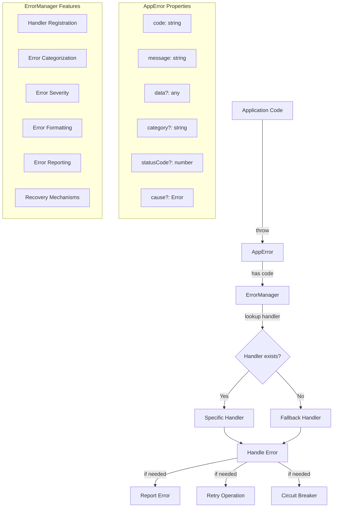

# SwissKnife Error Handling Flow

The diagram above illustrates the flow of the SwissKnife error handling system, showing how errors propagate through the system and how the ErrorManager processes them.

## Flow Description

1. Application code throws an AppError with a specific code and message
2. ErrorManager receives the error
3. ErrorManager looks up a handler for the error code
4. If a specific handler exists, it's executed
5. If no handler exists, the fallback handler is executed
6. Additional actions may be taken:
   - Reporting the error to a monitoring service
   - Retrying operations for transient failures
   - Using circuit breakers to prevent cascading failures

## Key Components

### AppError

The AppError class provides rich context for errors:
- **code**: String identifier for the error type
- **message**: Human-readable error description
- **data**: Additional context information
- **category**: Classification of the error
- **statusCode**: HTTP status code for API responses
- **cause**: Reference to the original error

### ErrorManager

The ErrorManager provides centralized error handling:
- **Handler Registration**: Associates error codes with handler functions
- **Error Categorization**: Groups errors by type
- **Error Severity**: Determines error impact level
- **Error Formatting**: Creates consistent error messages
- **Error Reporting**: Reports errors to monitoring systems
- **Recovery Mechanisms**: Implements retry and circuit breaker patterns
