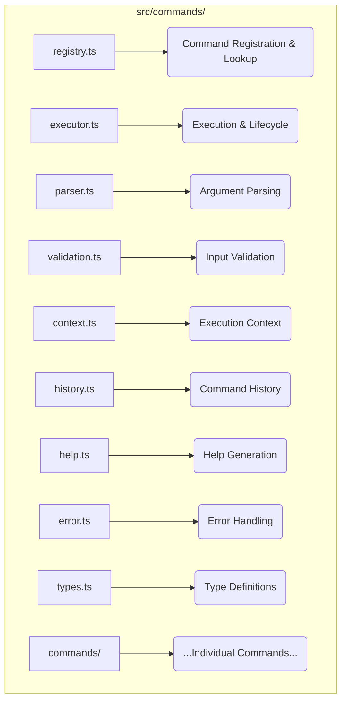

# Command System Analysis

This document provides an in-depth analysis of the Command System component from `swissknife_old`, assessing its architecture, dependencies, integration challenges, and adaptation requirements for the CLI-first environment.

## 1. Component Overview

### 1.1 Purpose and Functionality

The Command System provides the core framework for defining, registering, executing, and managing CLI commands. It serves as the primary interface between users and the application's functionality, handling command parsing, validation, execution, and output formatting.

### 1.2 Source Repository Information

| Attribute | Value |
|-----------|-------|
| Source Repository | swissknife_old |
| Source Path | src/commands/ |
| Primary Files | registry.ts, executor.ts, parser.ts, context.ts, help.ts |
| Lines of Code | ~3,200 |
| Last Major Update | 2022-11-15 |

### 1.3 Current Usage

In the `swissknife_old` repository, the Command System:
- Provides ~35 built-in commands
- Supports command registration by plugins
- Handles command-line argument parsing
- Manages command execution flow
- Generates help documentation
- Provides command history and suggestions

## 2. Technical Architecture

### 2.1 Component Structure


*   **registry.ts:** Central store for command definitions.
*   **executor.ts:** Orchestrates command execution, including middleware and error handling.
*   **parser.ts:** Handles parsing of raw command-line arguments based on command definitions.
*   **validation.ts:** Contains logic for validating parsed arguments against expected types, choices, etc.
*   **context.ts:** Defines and potentially creates the `CommandContext` passed to handlers.
*   **history.ts:** Manages persistent command history for the interactive shell.
*   **help.ts:** Generates formatted help messages based on command definitions.
*   **error.ts:** Defines custom error types specific to command execution.
*   **types.ts:** Shared TypeScript interfaces and types for the command system.
*   **commands/:** Directory containing implementations for each specific command (e.g., `config`, `agent`, `ipfs`).

### 2.2 Key Classes and Interfaces

#### CommandRegistry

```typescript
/**
 * Manages the registration and lookup of commands.
 */
class CommandRegistry {
  // Stores command definitions, keyed by primary command name.
  private commands: Map<string, Command>;
  // Maps alias names to primary command names.
  private aliases: Map<string, string>;
  
  /** Registers a new command definition. */
  register(command: Command): void;
  /** Removes a command definition. */
  unregister(commandName: string): void;
  /** Retrieves a command definition by name or alias. */
  getCommand(name: string): Command | undefined;
  /** Gets all registered commands. */
  getCommands(): Command[];
  /** Gets commands matching a filter. */
  getFilteredCommands(filter: (command: Command) => boolean): Command[];
  /** Checks if a command or alias exists. */
  hasCommand(name: string): boolean;
  /** Registers an alias for an existing command. */
  registerAlias(alias: string, commandName: string): void;
}
```

#### Command Interface

```typescript
/**
 * Defines the structure required for any command registered with the system.
 */
interface Command {
  /** The primary name used to invoke the command. */
  readonly name: string;
  /** A brief description shown in help messages. */
  readonly description: string;
  /** Array defining the options and arguments the command accepts. */
  readonly options: CommandOption[]; // Assumes CommandOption interface exists
  /** Flag to enable/disable the command. */
  readonly isEnabled: boolean;
  /** Flag to hide the command from general help listings. */
  readonly isHidden: boolean;
  
  /** The core logic of the command. Receives parsed args and context. */
  execute(args: ParsedArgs, context: CommandContext): Promise<CommandResult>; // Assumes ParsedArgs and CommandResult types exist
  /** Generates specific help text for this command. */
  generateHelp(): string;
  /** Returns the name displayed to the user (might differ from internal name). */
  userFacingName(): string;
}
```

#### CommandExecutor

```typescript
/**
 * Responsible for orchestrating the execution of a resolved command.
 */
class CommandExecutor {
  constructor(private registry: CommandRegistry);

  /**
   * Executes a command by name with given arguments and context.
   * Handles middleware, execution, and error handling.
   */
  
  async executeCommand(
    commandName: string,
    args: ParsedArgs, // Expects parsed args now
    context: CommandContext
  ): Promise<CommandResult>;

  /** Applies registered middleware functions before command execution. */
  
  private applyMiddleware(
    command: Command,
    args: ParsedArgs,
    context: CommandContext
  ): Promise<void>; // Assumes CommandMiddleware type exists

  /** Handles errors thrown during command execution or middleware. */
  
  private handleCommandError(
    command: Command, 
    error: Error, 
    context: CommandContext
  ): CommandResult;
}
```

#### CommandParser

```typescript
/**
 * Parses raw command-line input strings into command names and structured arguments.
 */
class CommandParser {
  /** Parses the initial command line string (e.g., from argv or REPL input). */
  parseCommandLine(input: string): { commandPath: string[], rawArgs: string[] };
  /** Parses the raw arguments based on a command's defined options. */
  parseArguments(rawArgs: string[], options: CommandOption[]): ParsedArgs;
  /** Helper to parse a single argument string against option definitions. */
  private parseOption(arg: string, options: CommandOption[]): ParsedOption | null; // Assumes ParsedOption type
  /** Validates that all required options are present in the parsed arguments. */
  private validateRequiredOptions(parsed: ParsedArgs, options: CommandOption[]): void;
}
```

#### CommandContext

```typescript
/**
 * Provides execution context and dependencies to command handlers.
 * This is similar to the ExecutionContext in the target architecture.
 */
interface CommandContext {
  /** Current working directory. */
  cwd: string;
  /** Environment variables. */
  env: Record<string, string>;
  /** Access to the configuration system. */
  config: ConfigManager; // Assumes ConfigManager type
  /** Information about the current user (if authenticated). */
  user?: UserInfo; // Assumes UserInfo type
  /** Writable stream for standard output. */
  stdout: Writable; // From 'stream'
  /** Writable stream for standard error. */
  stderr: Writable;
  /** Readable stream for standard input. */
  stdin: Readable; // From 'stream'
  /** Flag indicating verbose output mode. */
  verbose: boolean;
  /** Flag indicating silent output mode. */
  silent: boolean;
  /** Flag indicating if running in an interactive terminal session. */
  interactive: boolean;
  /** Array of middleware functions to apply. */
  middleware: CommandMiddleware[];
}
```

### 2.3 Workflow and Control Flow

1. **Command Registration**: Commands register with the `CommandRegistry` at startup
2. **Command Line Parsing**: `CommandParser` converts raw input to command name and arguments
3. **Command Lookup**: `CommandRegistry` resolves the command by name or alias
4. **Context Creation**: `CommandContext` is created with environment information
5. **Validation**: Command arguments are validated against command options
6. **Middleware Execution**: Pre-execution middleware functions are called
7. **Command Execution**: The command's `execute` method is called with parsed arguments
8. **Result Handling**: Output is formatted and returned to the user
9. **History Recording**: Successfully executed commands are recorded in history

### 2.4 Workflow Diagram (Simplified)

```mermaid
graph TD
    A[User Input (CLI args / REPL)] --> B(CommandParser: Parse Input);
    B -- Command Path & Raw Args --> C(CommandRegistry: Find Command);
    C -- Command Definition --> D(CommandParser: Parse & Validate Args);
    D -- Parsed Args --> E(CommandExecutor: Create Context);
    E --> F(CommandExecutor: Apply Middleware);
    F --> G(CommandExecutor: Invoke Handler);
    G -- Uses Context --> H[Command Handler Logic];
    H -- Results/Errors --> I(Output Formatter);
    I --> J[Display Output (stdout/stderr)];
    G -- Success --> K(Command History: Record);

    style H fill:#ccf,stroke:#333,stroke-width:2px
```

## 3. Dependencies Analysis

### 3.1 Internal Dependencies

| Dependency | Usage | Criticality | Notes |
|------------|-------|-------------|-------|
| Configuration System | Accessing command settings, API keys, default behaviors. | High | Essential for configurable command behavior and accessing credentials for other systems. |
| Logging System | Outputting informational messages, warnings, errors during execution. | High | Crucial for user feedback and debugging. Needs integration with the new `OutputFormatter`. |
| Tool System | Some commands directly invoke tools or manage tool registration/listing. | Medium | Required for commands that wrap specific tool functionalities. |
| Model System | Commands related to listing, selecting, or configuring AI models. | Medium | Required for `agent` commands and potentially others interacting with AI. |
| Storage System | Persisting command history, potentially caching results or storing large outputs. | Medium | Primarily needed for history persistence and potential performance optimizations. |
| Authentication | Checking user credentials before executing restricted commands. | Low | Only needed if specific commands require authentication/authorization. |

### 3.2 External Dependencies

| Dependency | Version | Purpose | Node.js Compatible? | Alternatives |
|------------|---------|---------|---------------------|--------------|
| commander | 9.x | Command definition and parsing | Yes | yargs, meow, cac |
| chalk | 5.x | Colorized output | Yes | kleur, ansi-colors |
| inquirer | 8.x | Interactive prompts | Yes | prompts, enquirer |
| string-argv | 0.3.x | Argument parsing | Yes | Shell quote libraries |
| strip-ansi | 7.x | Clean terminal output | Yes | Built-in functions |

### 3.3 Dependency Graph (Conceptual)

```mermaid
graph TD
    CmdSys[Command System] --> Dep_Commander(commander);
    CmdSys --> Dep_Chalk(chalk);
    CmdSys --> Dep_Inquirer(inquirer);
    CmdSys --> CfgSys(Configuration System);
    CmdSys --> LogSys(Logging System / Output Formatter);
    CmdSys --> ToolSys(Tool System);
    CmdSys --> ModelSys(Model System);
    CmdSys --> StoreSys(Storage System);
    CmdSys --> AuthSys(Authentication System);

    Dep_Commander --> Dep_Chalk; # Commander uses Chalk internally
    LogSys --> Dep_Chalk; # Logging uses Chalk

    style Dep_Commander fill:#eee,stroke:#333
    style Dep_Chalk fill:#eee,stroke:#333
    style Dep_Inquirer fill:#eee,stroke:#333
```
*Note: This shows high-level dependencies. Actual implementation might involve more granular interactions.*

## 4. Node.js Compatibility Assessment

### 4.1 Compatibility Overview

| Aspect | Compatibility | Notes |
|--------|---------------|-------|
| Runtime API Usage | High | Uses Node.js-compatible APIs |
| Dependencies | High | All dependencies have Node.js versions |
| Filesystem Access | High | Already uses Node.js fs module |
| Async Patterns | High | Uses promises and async/await |
| Platform Specifics | Medium | Some Windows-specific paths need handling |

### 4.2 Compatibility Issues

1. **Terminal Capability Detection**: Reliance on ANSI escape codes for colors/styles might fail on older Windows terminals or non-standard environments.
   - **Solution**: Use libraries like `chalk` (which internally uses `supports-color`) to automatically detect and adapt to terminal capabilities, disabling colors/styles when not supported.
2. **Path Separators**: Inconsistent use of `/` vs `\` can cause issues on Windows.
   - **Solution**: Consistently use Node.js `path.join()`, `path.resolve()`, `path.sep` for constructing and manipulating filesystem paths.
3. **Signal Handling (Ctrl+C)**: Graceful shutdown on `SIGINT` (Ctrl+C) might need specific handling on Windows.
   - **Solution**: Ensure proper listeners are attached using `process.on('SIGINT', ...)`, potentially adding specific checks or alternative mechanisms for Windows if needed (though Node.js generally handles basic Ctrl+C well).
4. **Shell Interaction**: Commands that execute shell scripts or rely on specific shell features (like piping complex commands) might behave differently across platforms (bash vs. zsh vs. cmd vs. PowerShell).
   - **Solution**: Avoid complex shell-specific commands where possible. If necessary, use libraries like `cross-spawn` for more reliable cross-platform command execution or implement platform-specific logic branches.

### 4.3 Performance Considerations

| Operation | Performance Characteristic | Optimization Opportunities |
|-----------|---------------------------|----------------------------|
| Command Parsing | Fast, minimal overhead | Caching parsed commands |
| Command Execution | Varies by command | Lazy loading command modules |
| Help Generation | Moderate CPU/memory usage | Caching help text |
| History Management | I/O bound | Async loading, batched writes |
| Autocompletion | Can be CPU intensive | Precomputed completion trees |

## 5. CLI Adaptation Requirements

### 5.1 Interface Modifications

Current command interfaces are already CLI-focused and require minimal adaptation:

| Interface Element | Current Implementation | Required Changes |
|-------------------|------------------------|------------------|
| Command Definition | Uses command objects | Add Commander integration |
| Option Parsing | Custom parser | Use Commander parser |
| Help Text | Text generation | Enhance with examples |
| Output Formatting | Basic colorization | Add structured output options |
| Error Handling | Standard errors | Enhance with error codes |

### 5.2 Command Additions

New commands needed for CLI-focused implementation:

1. **Autocomplete Setup**: Command to set up shell autocompletion
   ```bash
   swissknife completion install [--bash|--zsh|--fish]
   ```

2. **Command Documentation**: Command to generate documentation
   ```bash
   swissknife docs generate --format [markdown|man|html]
   ```

3. **Update Notification**: Command to check for updates
   ```bash
   swissknife update check
   ```

### 5.3 Command Modifications

Existing commands requiring modifications:

| Command | Required Modifications | Priority |
|---------|------------------------|----------|
| help | Enhanced formatting, examples | High |
| config | Support hierarchical config | High |
| version | Add update checking | Medium |
| model list | Add local model support | Medium |
| run | Support background execution | Medium |

### 5.4 Terminal UI Considerations

The Command System requires these terminal UI enhancements:

1. **Progress Indicators**: Integrate libraries like `ora` for spinners and `cli-progress` for bars via the `OutputFormatter` service to provide feedback during long-running operations.
   ```typescript
   // Example usage within a command handler via context.formatter
   const spinner = context.formatter.spinner('Processing data...').start();
   try {
     await longRunningOperation();
     spinner.succeed('Data processed successfully.');
   } catch (error) {
     spinner.fail('Processing failed.');
     // Handle error...
   }
   ```

2. **Tables and Structured Output**: Utilize libraries like `cli-table3` within the `OutputFormatter` to present lists of data (e.g., `ipfs ls`, `task list`) in a readable format. Support alternative outputs like JSON/YAML via flags (`--output json`).
   ```typescript
   // Example usage within a command handler via context.formatter
   const data = [ { name: 'file1', size: 1024 }, { name: 'file2', size: 2048 } ];
   context.formatter.table(data, ['Name', 'Size (bytes)']);
   // Or: context.formatter.json(data);
   ```

3. **Interactive Selection/Prompts**: Use libraries like `inquirer` for complex prompts (multiple choice, confirmation) when commands require interactive user input beyond simple arguments.
   ```typescript
   // Example usage within a command handler
   import inquirer from 'inquirer'; // Direct use or via a formatter method

   const { choice } = await inquirer.prompt([{
     type: 'list',
     name: 'choice',
     message: 'Select target environment:',
     choices: ['development', 'staging', 'production']
   }]);
   context.logger.info(`You selected: ${choice}`);
   ```
   
   const spinner = ora('Processing...').start();
   // Command execution
   spinner.succeed('Command completed successfully');
   ```

2. **Tables and Structured Output**: Enhance data display
   ```typescript
   import Table from 'cli-table3';
   
   const table = new Table({
     head: ['Name', 'Type', 'Size']
   });
   
   table.push(
     ['file1.txt', 'text', '10KB'],
     ['file2.jpg', 'image', '1.2MB']
   );
   
   console.log(table.toString());
   ```

3. **Interactive Selection**: Improve user input
   ```typescript
   import inquirer from 'inquirer';
   
   const { option } = await inquirer.prompt([{
     type: 'list',
     name: 'option',
     message: 'Select an option:',
     choices: ['Option 1', 'Option 2', 'Option 3']
   }]);
   ```

## 6. Integration Challenges

### 6.1 Identified Challenges

1. **Command Namespace Conflicts**: Integrating commands from `swissknife_old` and `ipfs_accelerate_js` might lead to name collisions (e.g., both might have a `config` command).
   - **Impact**: High. User confusion, unpredictable behavior depending on registration order.
   - **Solution**: Define clear namespaces (e.g., `agent config`, `ipfs config`, `task config`). Where direct conflicts exist for top-level commands, choose one primary implementation and potentially alias or deprecate the other, providing clear migration paths in documentation.
2. **Context Propagation**: Ensuring that the correct configuration, authentication state, and service instances are available to every command handler, regardless of how deep it's nested or if it's called programmatically.
   - **Impact**: Medium. Commands might fail or use incorrect settings if context is not managed properly.
   - **Solution**: Rely on the centrally created `ExecutionContext` passed down through the `CommandExecutor`. Ensure services obtained via `getService` are singletons or appropriately scoped. Avoid global state.
3. **Command Composition**: Allowing one command's implementation to programmatically invoke another command (e.g., a workflow command calling `ipfs add` then `task create`).
   - **Impact**: Medium. Limits the ability to create higher-level workflow commands easily.
   - **Solution**: Expose a method via `CommandExecutor` or a dedicated service (`CommandService`) that allows invoking commands by name with arguments, bypassing the CLI parsing layer but still using the standard execution flow (middleware, context, handler).
4. **Error Handling Consistency**: Different commands or underlying services might throw errors in different formats or with varying levels of detail.
   - **Impact**: Medium. Confusing for users trying to diagnose issues; difficult for scripts to parse errors reliably.
   - **Solution**: Implement standardized custom error classes (e.g., `CliError`, `ValidationError`, `NetworkError`) with consistent properties (e.g., `code`, `message`, `details`). Centralize error formatting in the `OutputFormatter`.
5. **Command Discovery & Help**: Ensuring users can easily find commands and understand how to use them, especially with nested subcommands.
   - **Impact**: Medium. Reduces usability if commands are hard to find or understand.
   - **Solution**: Implement comprehensive, auto-generated help using the command definitions. Use command categories/namespaces in help output. Provide good examples. Implement shell autocompletion.

### 6.2 Technical Debt

| Area | Technical Debt | Recommended Action |
|------|---------------|-------------------|
| Command Registration | Manual registration in multiple places | Implement auto-discovery |
| Option Validation | Duplicated validation code | Create reusable validators |
| Help Text | Repetitive help format code | Template-based help system |
| Error Messages | Inconsistent formatting | Centralized error system |
| Command Loading | Eager loading of all commands | Implement lazy loading |

### 6.3 Integration Risks

| Risk | Probability | Impact | Mitigation |
|------|------------|--------|------------|
| Breaking existing commands | Medium | High | Comprehensive testing, backward compatibility layer |
| Performance regression | Low | Medium | Benchmark key commands, performance gates in CI |
| Incomplete help documentation | High | Medium | Automated help text validation |
| Inconsistent UX across commands | Medium | Medium | Style guide enforcement, linting |
| Platform-specific failures | Medium | High | Cross-platform testing matrix |

## 7. Testing Requirements

### 7.1 Test Coverage Needs

| Component | Current Coverage | Target Coverage | Critical Path Tests |
|-----------|-----------------|-----------------|---------------------|
| Command Registry | 75% | 90% | Command resolution, alias handling |
| Command Parser | 60% | 95% | Complex argument parsing, validation |
| Command Executor | 70% | 90% | Execution flow, error handling |
| Help Generator | 50% | 80% | Help formatting, examples |
| Context Management | 65% | 85% | Context creation, propagation |

### 7.2 Test Implementation Strategy

1. **Unit Tests**: For core classes and utility functions
   ```typescript
   describe('CommandRegistry', () => {
     it('should register commands', () => {
       const registry = new CommandRegistry();
       const command = createMockCommand('test');
       registry.register(command);
       expect(registry.hasCommand('test')).toBe(true);
     });
     
     it('should resolve aliases', () => {
       const registry = new CommandRegistry();
       const command = createMockCommand('original');
       registry.register(command);
       registry.registerAlias('alias', 'original');
       expect(registry.getCommand('alias')).toBe(command);
     });
   });
   ```

2. **Integration Tests**: For command interaction
   ```typescript
   describe('Command Integration', () => {
     it('should execute command with dependencies', async () => {
       const executor = new CommandExecutor(registry);
       const context = createCommandContext();
       const result = await executor.executeCommand('complex', ['--option'], context);
       expect(result.success).toBe(true);
       expect(dependencyMock.method).toHaveBeenCalled();
     });
   });
   ```

3. **End-to-End Tests**: For CLI user flows
   ```typescript
   describe('CLI End-to-End', () => {
     it('should process complete user workflow', async () => {
       const { stdout, stderr, exitCode } = await runCommandSequence([
         'swissknife login',
         'swissknife config set key value',
         'swissknife run task'
       ]);
       
       expect(exitCode).toBe(0);
       expect(stdout).toContain('task completed');
     });
   });
   ```

### 7.3 Test Environment Needs

- Node.js runtime environment
- Mock filesystem for history testing
- Terminal emulator for output formatting tests
- Platform matrix (Linux, macOS, Windows)
- Environment variable controls

## 8. Documentation Requirements

### 8.1 User Documentation

1. **Command Reference**: Complete documentation for all commands
   ```markdown
   ## swissknife config
   
   Manage SwissKnife configuration.
   
   ### Usage
   
   ```
   swissknife config get <key>
   swissknife config set <key> <value>
   swissknife config list
   swissknife config import <file>
   swissknife config export <file>
   ```
   
   ### Options
   
   | Option | Description |
   |--------|-------------|
   | --scope [global\|local] | Configuration scope to operate on |
   | --format [json\|yaml] | Output format for list/export |
   
   ### Examples
   
   ```
   # Get a configuration value
   swissknife config get model.default
   
   # Set a configuration value
   swissknife config set model.default gpt-4
   
   # List all configuration values
   swissknife config list --format json
   ```
   ```

2. **User Guide Sections**: How to use the command system
   - Command basics
   - Option handling
   - I/O redirection
   - Command composition
   - Customization

### 8.2 Developer Documentation

1. **Command Creation Guide**: How to create new commands
   ```markdown
   ## Creating New Commands
   
   To create a new command:
   
   1. Create a new file in `src/commands/commands/`
   2. Define your command class:
   
   ```typescript
   import { Command, CommandContext, CommandResult } from '../types';
   
   export class MyCommand implements Command {
     name = 'my-command';
     description = 'My awesome command';
     options = [
       { name: 'option', type: 'string', description: 'An option' }
     ];
     isEnabled = true;
     isHidden = false;
     
     async execute(args: string[], context: CommandContext): Promise<CommandResult> {
       // Implementation
       return { success: true, data: 'result' };
     }
     
     userFacingName(): string {
       return 'my-command';
     }
   }
   ```
   
   3. Register your command in the registry:
   
   ```typescript
   import { CommandRegistry } from '../registry';
   import { MyCommand } from './my-command';
   
   export function registerCommands(registry: CommandRegistry): void {
     registry.register(new MyCommand());
   }
   ```
   ```

2. **Architecture Documentation**: How the command system works
   - Component interactions
   - Lifecycle hooks
   - Context propagation
   - Error handling
   - Extension points

## 9. Integration Recommendations

### 9.1 Integration Approach

1. **Phase 1: Core Infrastructure**
   - Implement `CommandRegistry` with existing features
   - Create Command interface compatible with both old and new systems
   - Implement basic `CommandExecutor` with error handling

2. **Phase 2: Parser Enhancement**
   - Integrate Commander for argument parsing
   - Implement option validation
   - Create help text generation

3. **Phase 3: Context and Output**
   - Implement enhanced `CommandContext`
   - Create output formatting system
   - Add progress reporting

4. **Phase 4: Advanced Features**
   - Implement command composition
   - Add autocompletion
   - Create middleware system

### 9.2 Recommended Modifications

1. **Command Definition Enhancement**
   ```typescript
   // Current approach
   class MyCommand implements Command {
     name = 'my-command';
     // other properties...
   }
   
   // Recommended approach
   function defineCommand(program: Command): void {
     program
       .command('my-command')
       .description('My awesome command')
       .option('--option <value>', 'An option')
       .action(async (options) => {
         // Implementation
       });
   }
   ```

2. **Help System Enhancement**
   ```typescript
   // Add examples and enhanced help
   program
     .command('my-command')
     .description('My awesome command')
     .addHelpText('after', `
       Examples:
         $ swissknife my-command --option value
         $ swissknife my-command --help
     `)
   ```

3. **Error Handling Enhancement**
   ```typescript
   try {
     // Command implementation
   } catch (error) {
     if (error instanceof ValidationError) {
       return formatError('VALIDATION_ERROR', error.message);
     } else if (error instanceof NetworkError) {
       return formatError('NETWORK_ERROR', error.message);
     } else {
       return formatError('UNEXPECTED_ERROR', error.message);
     }
   }
   ```

### 9.3 Integration Sequence

1. Create the core Command interfaces
2. Implement CommandRegistry with backward compatibility
3. Create CommandExecutor with error handling
4. Integrate Commander for command definition and parsing
5. Implement context management
6. Create output formatting utilities
7. Implement command middleware system
8. Add command history and suggestions
9. Implement help system with examples
10. Add autocompletion support

## 10. Conclusion

### 10.1 Key Findings

1. The Command System is already well-adapted to a CLI-first environment
2. Most changes involve enhancing existing functionality rather than rewriting
3. Major areas for improvement are help documentation, output formatting, and error handling
4. Integration with Commander will improve argument parsing and help generation
5. Cross-platform compatibility requires additional attention

### 10.2 Recommendations Summary

1. **Adopt Commander (or similar like `yargs`, `cac`):** Leverage a mature library for parsing, option definition, and help generation. Rationale: Avoids reinventing complex CLI parsing logic, ensures compatibility with standard conventions (POSIX options, etc.), simplifies help generation.
2. **Centralize Output Formatting:** Use the `OutputFormatter` service for all user-facing output (text, tables, progress, errors) to ensure consistency and support different output modes (`--output json`, etc.). Rationale: Decouples command logic from presentation, allows global control over output style.
3. **Implement Structured Error Handling:** Define custom error classes and use a centralized handler in the `CommandExecutor` and `OutputFormatter`. Rationale: Provides consistent, informative error messages for users and predictable exit codes for scripting.
4. **Auto-Generate Help & Docs:** Leverage the command definitions (from Commander/yargs) to automatically generate help text and potentially Markdown documentation. Rationale: Reduces manual effort, ensures documentation stays synchronized with implementation.
5. **Ensure Cross-Platform Compatibility:** Use Node.js `path` module, test signal handling, use `cross-spawn` if needed, and rely on libraries like `chalk` that handle terminal differences. Rationale: Provides a consistent experience for users on Linux, macOS, and Windows.

### 10.3 Next Steps

1. Begin implementation of enhanced CommandRegistry
2. Create Commander integration layer
3. Develop output formatting utilities
4. Establish error handling conventions
5. Create templates for command documentation
