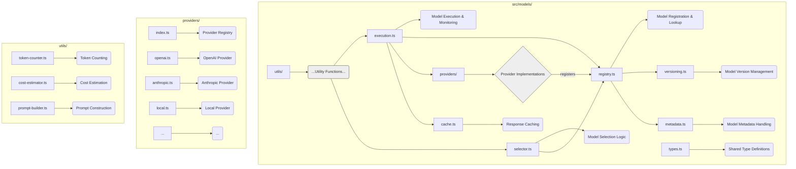
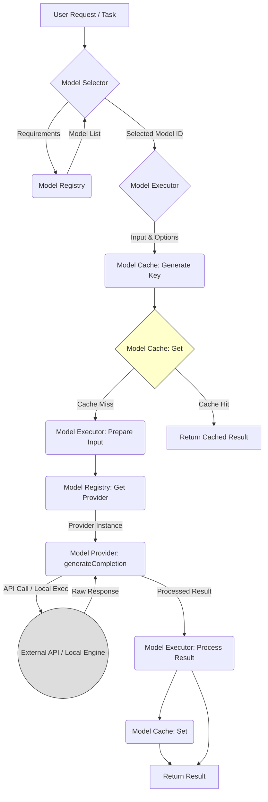

# Model System Analysis

This document provides a detailed analysis of the Model System component from `swissknife_old` and related components from `ipfs_accelerate_js`, assessing their architecture, dependencies, integration challenges, and adaptation requirements for the CLI-first environment.

## 1. Component Overview

### 1.1 Purpose and Functionality

The Model System manages AI models and their interactions within the application. It provides model registration, selection, loading, and execution capabilities, abstracting away the complexities of different model providers and implementations. This system enables users to interact with various AI models through a consistent interface.

### 1.2 Source Repository Information

| Attribute | Value |
|-----------|-------|
| Primary Source Repository | swissknife_old |
| Secondary Source Repository | ipfs_accelerate_js |
| Source Paths | swissknife_old/src/models/, ipfs_accelerate_js/src/ai/models/ |
| Primary Files | registry.ts, provider.ts, selector.ts, execution.ts, cache.ts |
| Lines of Code | ~4,500 (combined) |
| Last Major Update | 2022-12-03 (swissknife_old), 2023-02-15 (ipfs_accelerate_js) |

### 1.3 Current Usage

In the source repositories, the Model System:
- Provides unified access to 10+ model types from different providers
- Handles model selection based on task requirements
- Manages API keys and authentication
- Optimizes token usage and costs
- Caches responses for efficiency
- Provides fallback mechanisms for unavailable models

## 2. Technical Architecture

### 2.1 Component Structure


*   **registry.ts:** Central hub for discovering available models and their providers.
*   **providers/:** Contains specific implementations for interacting with different model APIs (OpenAI, Anthropic) or local execution engines.
*   **selector.ts:** Logic to choose the best model based on requirements (capabilities, cost, context window).
*   **execution.ts:** Handles the actual execution flow, including calling the provider, managing retries, and potentially caching.
*   **cache.ts:** Implements caching strategies for model responses to reduce latency and cost.
*   **versioning.ts/metadata.ts:** Manages information about model versions, capabilities, costs, etc.
*   **types.ts:** Common TypeScript interfaces (e.g., `ModelInfo`, `ModelProvider`).
*   **utils/:** Helper functions for tasks like token counting, cost estimation, and prompt formatting.

### 2.2 Key Classes and Interfaces

#### ModelRegistry

```typescript
/**
 * Manages registration and lookup of AI models and their providers.
 */
class ModelRegistry {
  // Stores detailed information about each registered model, keyed by model ID.
  private models: Map<string, ModelInfo>;
  // Stores instances of model providers, keyed by provider ID (e.g., 'openai').
  private providers: Map<string, ModelProvider>;
  
  /** Registers metadata for a specific model. */
  registerModel(model: ModelInfo): void;
  /** Registers a provider instance capable of interacting with models. */
  registerProvider(provider: ModelProvider): void;
  /** Retrieves metadata for a specific model ID. */
  getModel(modelId: string): ModelInfo | undefined;
  /** Retrieves the provider instance responsible for a given provider ID. */
  getProvider(providerId: string): ModelProvider | undefined;
  /** Gets a list of registered models, optionally filtered. */
  getModels(filter?: ModelFilter): ModelInfo[]; // Assumes ModelFilter type exists
  /** Gets models that are currently available/usable (e.g., provider configured). */
  getAvailableModels(): ModelInfo[];
}
```

#### ModelInfo Interface

```typescript
/**
 * Represents the metadata and characteristics of a specific AI model.
 */
interface ModelInfo {
  /** Unique identifier for the model (e.g., 'gpt-4-turbo'). */
  id: string;
  /** Human-readable name (e.g., 'GPT-4 Turbo'). */
  name: string;
  /** Identifier of the provider (e.g., 'openai', 'anthropic', 'local'). */
  provider: string;
  /** Declared capabilities of the model. */
  capabilities: ModelCapabilities;
  /** Maximum context window size in tokens. */
  contextWindow: number;
  /** Optional: Date when the model's training data cuts off. */
  trainingCutoff?: string; // ISO 8601 format
  /** Optional: Maximum number of tokens the model can generate in one response. */
  maxOutputTokens?: number;
  /** Cost per 1000 input tokens (e.g., in USD). */
  inputCostPer1000Tokens: number;
  /** Cost per 1000 output tokens (e.g., in USD). */
  outputCostPer1000Tokens: number;
  /** Optional: Estimated base latency per request in milliseconds. */
  requestOverheadMs?: number;
  /** Optional: Estimated generation speed in tokens per second. */
  tokensPerSecond?: number;
  /** Optional: Any other relevant metadata. */
  metadata?: Record<string, any>;
}

/** Defines the functional capabilities of a model. */
interface ModelCapabilities {
  /** Supports chat-based interaction (e.g., using message arrays). */
  chat: boolean;
  /** Supports simple text completion. */
  completion: boolean;
  /** Can generate text embeddings. */
  embedding: boolean;
  /** Can process image inputs. */
  vision: boolean;
  /** Supports function/tool calling. */
  functionCalling: boolean;
  /** Supports streaming responses. */
  streaming: boolean;
}
```

#### ModelProvider Interface

```typescript
/**
 * Interface for interacting with a specific model provider (API or local).
 */
interface ModelProvider {
  /** Unique identifier for the provider (e.g., 'openai'). */
  id: string;
  /** Human-readable name (e.g., 'OpenAI'). */
  name: string;
  
  /** Fetches available models supported by this provider. */
  getModels(): Promise<ModelInfo[]>;
  /** Fetches detailed info for a specific model ID from this provider. */
  getModel(modelId: string): Promise<ModelInfo | undefined>;
  
  /** Generates a completion (chat or text) for a given prompt. */
  generateCompletion(
    modelId: string,
    prompt: string | ChatMessage[], // Supports both simple text and chat messages
    options?: CompletionOptions // e.g., temperature, maxTokens, stopSequences
  ): Promise<CompletionResult>; // Contains output text, usage stats, etc.
  
  /** Generates a completion as an asynchronous stream of chunks. */
  generateCompletionStream(
    modelId: string,
    prompt: string | ChatMessage[],
    options?: CompletionOptions
  ): AsyncGenerator<CompletionChunk>; // Stream yields chunks of the response
  
  /** Generates embeddings for input text(s). */
  generateEmbedding(
    modelId: string,
    text: string | string[] // Can be single text or batch
  ): Promise<EmbeddingResult>; // Contains the embedding vectors
  
  /** Counts the number of tokens for a given text or chat messages, specific to the model's tokenizer. */
  countTokens(
    modelId: string,
    text: string | ChatMessage[]
  ): Promise<number>;
}
// Assumes ChatMessage, CompletionOptions, CompletionResult, CompletionChunk, EmbeddingResult types exist
```

#### ModelSelector

```typescript
/**
 * Selects the most appropriate model based on given requirements.
 */
class ModelSelector {
  constructor(private registry: ModelRegistry);

  /** Selects the best available model matching the requirements. */
  
  selectModel(requirements: ModelRequirements): ModelInfo | undefined; // Can return undefined if no match

  /** Helper to find the single best model from a list based on criteria. */
  
  getBestModel(models: ModelInfo[], requirements: ModelRequirements): ModelInfo | undefined;

  /** Gets the configured default model for a specific task type. */
  
  getDefaultModel(type: 'chat' | 'completion' | 'embedding'): ModelInfo | undefined;

  /** Ranks a list of models based on how well they meet requirements (e.g., cost, speed, capabilities). */
  
  rankModels(models: ModelInfo[], requirements: ModelRequirements): ModelInfo[];
}

/** Defines criteria for selecting a model. */
interface ModelRequirements {
  /** Required capabilities (e.g., must support vision). */
  capabilities?: Partial<ModelCapabilities>;
  /** Minimum required context window size. */
  minContextWindow?: number;
  /** Optional: Maximum acceptable cost per 1000 tokens (input or output). */
  maxCost?: number; // Could be more granular (maxInputCost, maxOutputCost)
  /** Optional: Preferred provider ID. */
  preferredProvider?: string;
  /** Optional: Preferred specific model ID. */
  preferredModel?: string;
  // Could add criteria like minimum speed (tokens/sec)
}
```

#### ModelExecutor

```typescript
/**
 * Handles the execution of model tasks, including selection, provider interaction, caching, and error handling.
 */
class ModelExecutor {
  constructor(
    private registry: ModelRegistry,
    private selector: ModelSelector,
    private cache?: ModelCache // Optional cache dependency
  );

  /** Executes a task (completion, embedding) using an appropriately selected model. */
  
  async execute<T>(
    task: ModelTask<T>, // Defines the task type, input, and requirements
    options?: ExecutionOptions // e.g., retries, fallback preferences, cache control
  ): Promise<T>; // Returns the specific result type for the task

  /** Executes a task that supports streaming, yielding chunks via callback. */
  
  async streamExecution<T>(
    task: ModelTask<T>,
    callback: (chunk: any) => void, // Callback for each received chunk
    options?: ExecutionOptions
  ): Promise<T>; // Returns the final aggregated result

  /** Retrieves the provider instance for a given model ID. */
  
  private getProvider(modelId: string): ModelProvider; // Might throw if provider not found

  /** Handles errors during execution, potentially triggering retries or fallbacks. */
  
  private handleExecutionError(
    error: Error,
    task: ModelTask<any>,
    attempt: number,
    options: ExecutionOptions
  ): Promise<any>;
}
```

#### ModelCache

```typescript
/**
 * Caches model responses to improve performance and reduce costs.
 */
class ModelCache {
  // Storage can be in-memory (e.g., LRUCache) or persistent (e.g., filesystem, database)
  constructor(private storage: CacheStorageInterface); // Assumes CacheStorageInterface

  /** Retrieves a cached result based on a generated key. */
  
  async get(key: string): Promise<any | null>; // Return type depends on stored data

  /** Stores a result in the cache with optional metadata (e.g., TTL). */
  
  async set(key: string, result: any, metadata?: CacheMetadata): Promise<void>; // Assumes CacheMetadata

  /** Generates a unique cache key based on model, input, and options. */
  
  generateKey(
    modelId: string,
    input: string | ChatMessage[],
    options?: CompletionOptions // Include relevant options in the key
  ): string; // Should produce a stable hash

  /** Invalidates cache entries matching a pattern (e.g., for a specific model). */
  
  invalidate(pattern: string): Promise<number>; // Returns number of invalidated entries

  /** Clears the entire cache. */
  
  clear(): Promise<void>;
}
```

### 2.3 Workflow and Control Flow

1. **Model Registration**: Providers and models are registered with the `ModelRegistry` at initialization
2. **Model Selection**: `ModelSelector` chooses appropriate model based on task requirements
3. **Input Preparation**: Prompts and parameters are prepared for the selected model
4. **Cache Check**: `ModelCache` checks if identical request has cached result
5. **Model Execution**: `ModelExecutor` sends request to appropriate provider
6. **Result Handling**: Output is parsed, validated, and returned
7. **Cache Update**: Result is cached for future use if appropriate
8. **Error Management**: Failures trigger retries or fallback models as needed

### 2.4 Data Flow Diagram (Simplified Completion Flow)



## 3. Dependencies Analysis

### 3.1 Internal Dependencies

| Dependency | Usage | Criticality | Notes |
|------------|-------|-------------|-------|
| Configuration System | Retrieving API keys, default model IDs, provider URLs, cache settings. | High | Essential for configuring providers and system behavior. Needs secure storage for keys. |
| Storage System | Storing cached model responses (if using persistent cache). Storing downloaded local models. | Medium | Required for persistent caching and local model support. Filesystem access needed. |
| Logging System | Recording API calls, errors, cache hits/misses, token usage, costs. | Medium | Important for debugging, monitoring usage, and cost analysis. |
| Authentication | (Handled via Config) Securely retrieving API keys/credentials stored by the Configuration System. | High | The Model System itself doesn't manage auth, but relies on configured credentials. |
| Task System | Potentially used for background model downloads or long-running inference tasks (uncommon for typical completions). | Low | Not a primary dependency for core completion/embedding flows. |

### 3.2 External Dependencies

| Dependency | Version | Purpose | Node.js Compatible? | Alternatives |
|------------|---------|---------|---------------------|--------------|
| @openai/api | ^4.0.0 | OpenAI API access | Yes | axios with custom client |
| @anthropic-ai/sdk | ^0.4.3 | Anthropic API access | Yes | axios with custom client |
| tiktoken | ^1.0.0 | Token counting | Yes | gpt-tokenizer |
| @huggingface/inference | ^2.3.0 | HuggingFace model access | Yes | axios with custom client |
| onnxruntime-node | ^1.14.0 | Local model execution | Yes | tensorflow.js |
| lru-cache | ^7.14.0 | In-memory caching | Yes | quick-lru, tiny-lru |

### 3.3 Dependency Graph (Conceptual)

```mermaid
graph TD
    ModelSys[Model System] --> MR(Model Registry);
    ModelSys --> MS(Model Selector);
    ModelSys --> ME(Model Executor);
    ModelSys --> MC(Model Cache);
    ModelSys --> MU(Utils);

    MR --> MP[Model Providers];
    MS --> MR;
    ME --> MR;
    ME --> MS;
    ME --> MC;
    ME --> CfgSys(Configuration System);
    MC --> StoreSys(Storage System);
    MC --> Dep_LRU(lru-cache);
    MU --> Dep_Tiktoken(tiktoken);

    MP --> ProvOpenAI(OpenAI Provider);
    MP --> ProvAnthropic(Anthropic Provider);
    MP --> ProvHF(HuggingFace Provider);
    MP --> ProvLocal(Local Provider);

    ProvOpenAI --> Dep_OpenAI(@openai/api);
    ProvAnthropic --> Dep_Anthropic(@anthropic-ai/sdk);
    ProvHF --> Dep_HF(@huggingface/inference);
    ProvLocal --> Dep_ONNX(onnxruntime-node);

    style Dep_OpenAI fill:#eee,stroke:#333
    style Dep_Anthropic fill:#eee,stroke:#333
    style Dep_HF fill:#eee,stroke:#333
    style Dep_ONNX fill:#eee,stroke:#333
    style Dep_Tiktoken fill:#eee,stroke:#333
    style Dep_LRU fill:#eee,stroke:#333
```

## 4. Node.js Compatibility Assessment

### 4.1 Compatibility Overview

| Aspect | Compatibility | Notes |
|--------|---------------|-------|
| Runtime API Usage | High | Uses Node.js-compatible APIs |
| Dependencies | High | All major dependencies have Node.js versions |
| Filesystem Access | High | Already uses Node.js fs module for local models |
| Async Patterns | High | Uses promises and async/await |
| Platform Specifics | Medium | Some model libraries have platform-specific builds |

### 4.2 Compatibility Issues

1. **Local Model Execution Dependencies**: Libraries like `onnxruntime-node` often require specific native binaries for different OS/architectures (and potentially CUDA/DirectML versions for GPU support).
   - **Solution**: Provide clear installation instructions using platform-specific optional dependencies in `package.json`. Offer pre-built binaries if possible. Ensure graceful fallback to CPU execution or API-based models if native dependencies are missing or fail to load. Document requirements clearly.
2. **Model File Paths**: Hardcoded paths or assumptions about model storage locations.
   - **Solution**: Use configurable base paths (via `ConfigurationManager`) for local models. Use Node.js `path` module for constructing paths reliably across platforms.
3. **GPU Acceleration Detection/Usage**: Browser APIs like WebGPU/WebNN are not available. Accessing GPU in Node.js requires specific native bindings.
   - **Solution**: Rely on the capabilities of the chosen execution library (e.g., `onnxruntime-node` with CUDA/DirectML execution providers). Implement detection logic based on the library's API or external tools if necessary. Make GPU usage configurable.
4. **Memory Management for Large Models**: Loading large models (multiple GBs) into memory can be challenging in Node.js default memory limits.
   - **Solution**: Increase Node.js heap size using `NODE_OPTIONS=--max-old-space-size=<MB>`. Investigate model loading strategies that use memory mapping if supported by the runtime. Implement clear error handling for out-of-memory errors. Document memory requirements.

### 4.3 Performance Considerations

| Operation | Performance Characteristic | Optimization Opportunities |
|-----------|---------------------------|----------------------------|
| Model Selection | Fast, low overhead | Cache recent selections |
| Token Counting | CPU intensive for large inputs | Worker thread offloading, caching |
| API Requests | Network bound, latency sensitive | Keepalive, connection pooling |
| Local Inference | CPU/GPU intensive | Resource limiting, stream processing |
| Caching | I/O bound for disk cache | LRU memory cache with disk backup |

## 5. CLI Adaptation Requirements

### 5.1 Interface Modifications

| Interface Element | Current Implementation | Required Changes |
|-------------------|------------------------|------------------|
| Model Configuration | Configuration objects | CLI argument mapping |
| Model Selection | Programmatic API | Command-line interface |
| Result Output | Object returns | Formatted CLI output |
| Progress Reporting | Event callbacks | Terminal progress indicators |
| Error Handling | Error objects | User-friendly CLI error messages |

### 5.2 New CLI Commands

1. **Model List Command**: List available models
   ```bash
   swissknife model list [--provider <provider>] [--capability <capability>]
   ```

2. **Model Info Command**: Show detailed model information
   ```bash
   swissknife model info <model-id>
   ```

3. **Model Test Command**: Test model connectivity
   ```bash
   swissknife model test <model-id> [--prompt <prompt>]
   ```

4. **Model Cache Command**: Manage model cache
   ```bash
   swissknife model cache [clear|stats]
   ```

5. **Model Config Command**: Configure model settings
   ```bash
   swissknife model config [get|set] <key> [<value>]
   ```

### 5.3 Terminal UI Enhancements

1. **Model Selection Interface**: Interactive model chooser
   ```typescript
   import inquirer from 'inquirer';
   
   async function selectModel(): Promise<string> {
     const models = await modelRegistry.getAvailableModels();
     const { modelId } = await inquirer.prompt([{
       type: 'list',
       name: 'modelId',
       message: 'Select a model:',
       choices: models.map(m => ({
         name: `${m.name} (${m.provider}) - ${m.contextWindow} tokens`,
         value: m.id
       }))
     }]);
     return modelId;
   }
   ```

2. **Generation Progress**: Show token generation progress
   ```typescript
   import ora from 'ora';
   
   async function generateWithProgress(prompt: string, modelId: string): Promise<string> {
     const spinner = ora('Generating response...').start();
     let tokens = 0;
     
     const result = await modelExecutor.streamExecution(
       { type: 'completion', modelId, prompt },
       (chunk) => {
         tokens += chunk.content.length;
         spinner.text = `Generating response... ${tokens} tokens`;
       }
     );
     
     spinner.succeed(`Generated ${tokens} tokens`);
     return result;
   }
   ```

3. **Cost Estimation**: Display cost information
   ```typescript
   function displayCostInfo(result: CompletionResult): void {
     const cost = result.usage.totalCost;
     console.log(chalk.dim(`Cost: $${cost.toFixed(6)}`));
   }
   ```

## 6. Integration Challenges

### 6.1 Identified Challenges

1. **API Key Management**: Storing and accessing sensitive API keys securely is paramount. Plaintext storage in config files is unacceptable.
   - **Impact**: High (Security Breach).
   - **Solution**: Integrate with OS keychain (`keytar`) or use environment variables. Implement a `CredentialManager` abstraction accessed via `ConfigurationManager` or `ExecutionContext`. Avoid logging keys.
2. **Local Model Management**: Downloading, storing, and managing potentially large local model files (GBs).
   - **Impact**: High (Disk Space, User Experience).
   - **Solution**: Implement a dedicated download manager (`swissknife model download <id>`) with progress indication. Use configurable storage paths. Provide commands to list/remove downloaded models. Clearly document disk space requirements.
3. **Cross-Provider Consistency**: Different providers have varying APIs, parameter names (e.g., `max_tokens` vs `max_tokens_to_sample`), response formats, and error handling.
   - **Impact**: Medium (Development Complexity, Inconsistent Behavior).
   - **Solution**: The `ModelProvider` interface acts as the abstraction layer. Implement adapter logic within each provider to map to a common internal representation for options and results. Standardize error types where possible.
4. **Error Handling & Fallbacks**: Network issues, API rate limits, provider outages, or local model failures.
   - **Impact**: Medium (User Experience, Reliability).
   - **Solution**: Implement robust error handling in `ModelExecutor` and providers. Include configurable retry logic (with exponential backoff) for transient errors. Implement optional fallback logic in `ModelSelector` or `ModelExecutor` to try alternative models/providers upon failure.
5. **Resource Management (Local Models)**: Local inference can consume significant CPU, GPU, and RAM. Uncontrolled usage can destabilize the user's system.
   - **Impact**: Medium (Performance, Stability).
   - **Solution**: Allow configuration of resource limits (e.g., max concurrent local inferences, GPU memory limits if controllable via bindings). Monitor resource usage during local inference if possible. Provide clear documentation on resource requirements.

### 6.2 Technical Debt

| Area | Technical Debt | Recommended Action |
|------|---------------|-------------------|
| Provider Implementations | Duplicate code across providers | Create shared provider utilities |
| Token Counting | Multiple counting implementations | Unify token counting logic |
| Error Handling | Inconsistent error formats | Create standardized error system |
| Caching | Mixed caching strategies | Implement unified caching architecture |
| Configuration | Scattered configuration logic | Centralize model configuration |

### 6.3 Integration Risks

| Risk | Probability | Impact | Mitigation |
|------|------------|--------|------------|
| API compatibility changes | Medium | High | Version pinning, adapter pattern |
| Local model compatibility | Medium | High | Comprehensive platform testing |
| Performance bottlenecks | Medium | Medium | Performance benchmarking, optimization |
| Security vulnerabilities | Low | High | Security audit, credential encryption |
| Disk space exhaustion | Medium | Medium | Configurable storage limits, cleanup utilities |

## 7. Testing Requirements

### 7.1 Test Coverage Needs

| Component | Current Coverage | Target Coverage | Critical Path Tests |
|-----------|-----------------|-----------------|---------------------|
| Model Registry | 70% | 90% | Provider registration, model lookup |
| Model Providers | 65% | 85% | API interaction, error handling |
| Model Selector | 60% | 90% | Selection logic, fallback behavior |
| Model Executor | 55% | 85% | Execution flow, error handling |
| Model Cache | 50% | 80% | Cache hits, invalidation |

### 7.2 Test Implementation Strategy

1. **Unit Tests**: For core classes and utilities
   ```typescript
   describe('ModelRegistry', () => {
     let registry: ModelRegistry;
     
     beforeEach(() => {
       registry = new ModelRegistry();
     });
     
     it('should register and retrieve models', () => {
       const model = createTestModel('test-model');
       registry.registerModel(model);
       expect(registry.getModel('test-model')).toEqual(model);
     });
     
     it('should filter models by capability', () => {
       registry.registerModel(createTestModel('model1', { chat: true }));
       registry.registerModel(createTestModel('model2', { chat: false }));
       
       const chatModels = registry.getModels({ capabilities: { chat: true } });
       expect(chatModels.length).toBe(1);
       expect(chatModels[0].id).toBe('model1');
     });
   });
   ```

2. **Integration Tests**: For provider interactions
   ```typescript
   describe('OpenAI Provider Integration', () => {
     let provider: OpenAIProvider;
     
     beforeEach(() => {
       provider = new OpenAIProvider({ apiKey: process.env.OPENAI_API_KEY });
     });
     
     it('should generate a completion', async () => {
       const result = await provider.generateCompletion(
         'gpt-3.5-turbo',
         [{ role: 'user', content: 'Hello' }]
       );
       
       expect(result.output).toBeTruthy();
       expect(result.usage).toBeDefined();
     });
   });
   ```

3. **Mock Tests**: For testing without API calls
   ```typescript
   describe('Model Execution with Mocks', () => {
     let executor: ModelExecutor;
     let mockProvider: jest.Mocked<ModelProvider>;
     
     beforeEach(() => {
       mockProvider = {
         id: 'mock',
         name: 'Mock Provider',
         getModels: jest.fn(),
         getModel: jest.fn(),
         generateCompletion: jest.fn(),
         generateCompletionStream: jest.fn(),
         generateEmbedding: jest.fn(),
         countTokens: jest.fn()
       };
       
       const registry = new ModelRegistry();
       registry.registerProvider(mockProvider);
       registry.registerModel({
         id: 'mock-model',
         provider: 'mock',
         // other model properties
       });
       
       executor = new ModelExecutor(registry, new ModelSelector(registry));
     });
     
     it('should execute a model task', async () => {
       mockProvider.generateCompletion.mockResolvedValue({
         output: 'Test response',
         usage: { promptTokens: 5, completionTokens: 2, totalTokens: 7 }
       });
       
       const result = await executor.execute({
         type: 'completion',
         modelId: 'mock-model',
         prompt: 'Test prompt'
       });
       
       expect(mockProvider.generateCompletion).toHaveBeenCalledWith(
         'mock-model',
         'Test prompt',
         expect.any(Object)
       );
       expect(result).toBe('Test response');
     });
   });
   ```

### 7.3 Test Environment Needs

- Environment variables for API keys
- Mock servers for API testing
- Offline testing capabilities
- Small test models for local model testing
- Disk space management for model storage

## 8. Documentation Requirements

### 8.1 User Documentation

1. **Model Overview**: Guide to available models
   ```markdown
   ## Available Models
   
   SwissKnife provides access to the following models:
   
   | Model | Provider | Capabilities | Context Window | Notes |
   |-------|----------|--------------|----------------|-------|
   | gpt-4 | OpenAI | Chat, Function Calling, Vision | 8,192 tokens | Best for complex tasks |
   | gpt-3.5-turbo | OpenAI | Chat, Function Calling | 4,096 tokens | Fast and cost-effective |
   | claude-3-opus | Anthropic | Chat, Vision | 200,000 tokens | Very large context window |
   | llama-2-13b | Local | Chat | 4,096 tokens | Runs locally, no API required |
   ```

2. **CLI Command Reference**: Model-related commands
   ```markdown
   ## Model Commands
   
   ### List available models
   
   ```
   swissknife model list [options]
   ```
   
   Options:
   - `--provider <provider>` - Filter by provider (openai, anthropic, etc.)
   - `--capability <capability>` - Filter by capability (chat, vision, etc.)
   - `--local` - Show only local models
   - `--format <format>` - Output format (table, json)
   
   Examples:
   ```
   # List all available models
   swissknife model list
   
   # List only OpenAI models
   swissknife model list --provider openai
   
   # List models with vision capability
   swissknife model list --capability vision
   ```
   ```

3. **Configuration Guide**: Setting up model providers
   ```markdown
   ## Model Configuration
   
   ### Setting up API Keys
   
   To use cloud-based models, you need to configure API keys:
   
   ```
   # Set OpenAI API key
   swissknife config set api.openai.key "sk-..."
   
   # Set Anthropic API key
   swissknife config set api.anthropic.key "sk-ant-..."
   ```
   
   API keys are stored securely using system keychain when available.
   
   ### Using Local Models
   
   To use local models:
   
   1. Download models using the model download command:
   
   ```
   swissknife model download llama-2-7b
   ```
   
   2. Configure model path (optional):
   
   ```
   swissknife config set models.local.path "/path/to/models"
   ```
   
   Local models require sufficient RAM and disk space.
   ```

### 8.2 Developer Documentation

1. **Provider Implementation Guide**: Adding new model providers
   ```markdown
   ## Creating a New Model Provider
   
   To add a new model provider:
   
   1. Create a new file in `src/models/providers/`
   2. Implement the `ModelProvider` interface:
   
   ```typescript
   import { ModelProvider, ModelInfo, CompletionResult, EmbeddingResult } from '../types';
   
   export class NewProvider implements ModelProvider {
     id = 'new-provider';
     name = 'New Provider';
     
     constructor(private config: NewProviderConfig) {}
     
     async getModels(): Promise<ModelInfo[]> {
       // Implementation
     }
     
     async getModel(modelId: string): Promise<ModelInfo | undefined> {
       // Implementation
     }
     
     async generateCompletion(
       modelId: string,
       prompt: string | ChatMessage[],
       options?: CompletionOptions
     ): Promise<CompletionResult> {
       // Implementation
     }
     
     // Other required methods
   }
   ```
   
   3. Register your provider in `src/models/providers/index.ts`:
   
   ```typescript
   import { NewProvider } from './new-provider';
   
   // In the registerProviders function:
   if (config.api.newProvider?.key) {
     registry.registerProvider(new NewProvider({
       apiKey: config.api.newProvider.key
     }));
   }
   ```
   ```

2. **Architecture Documentation**: Model system design
   - Detailed component interactions
   - Provider abstraction 
   - Caching mechanisms
   - Selection algorithms
   - Error handling strategies

## 9. Integration Recommendations

### 9.1 Integration Approach

1. **Phase 1: Core Infrastructure**
   - Implement `ModelRegistry` with provider abstraction
   - Create model type definitions and interfaces
   - Implement basic `ModelSelector` 

2. **Phase 2: Provider Implementation**
   - Implement OpenAI provider (most widely used)
   - Implement Anthropic provider
   - Create provider utilities for shared functionality

3. **Phase 3: Execution and Caching**
   - Implement `ModelExecutor` with error handling
   - Create caching system using filesystem storage
   - Add token counting and cost tracking

4. **Phase 4: CLI Interface**
   - Create model-related CLI commands
   - Implement formatted output for model results
   - Add interactive model selection

5. **Phase 5: Local Models (Optional)**
   - Implement local model provider
   - Add model download management
   - Create resource monitoring for local execution

### 9.2 Recommended Modifications

1. **Configuration System Adaptation**
   ```typescript
   // Current approach - direct configuration access
   const apiKey = config.get('api.openai.key');
   
   // Recommended approach - credential manager abstraction
   const apiKey = await credentialManager.getCredential('api.openai.key');
   ```

2. **Provider Abstraction Enhancement**
   ```typescript
   // Add capability check method to provider interface
   interface ModelProvider {
     // Existing methods...
     
     supportsCapability(
       modelId: string, 
       capability: keyof ModelCapabilities
     ): Promise<boolean>;
     
     supportsModelType(
       modelId: string,
       type: 'chat' | 'completion' | 'embedding'
     ): Promise<boolean>;
   }
   ```

3. **Caching System Adaptation**
   ```typescript
   // Switch from browser storage to filesystem
   class FileSystemCache implements CacheStorage {
     constructor(private basePath: string) {
       // Ensure directory exists
     }
     
     async get(key: string): Promise<any> {
       const path = this.getPath(key);
       try {
         const data = await fs.readFile(path, 'utf8');
         return JSON.parse(data);
       } catch (error) {
         return null;
       }
     }
     
     async set(key: string, value: any): Promise<void> {
       const path = this.getPath(key);
       await fs.writeFile(path, JSON.stringify(value));
     }
     
     private getPath(key: string): string {
       // Create filename-safe key
       const safeKey = Buffer.from(key).toString('base64url');
       return join(this.basePath, safeKey + '.json');
     }
   }
   ```

### 9.3 Integration Sequence

1. Create core model interfaces and types
2. Implement ModelRegistry and basic ModelProvider interface
3. Create OpenAI provider implementation
4. Implement ModelSelector with basic selection logic
5. Create filesystem-based ModelCache
6. Implement ModelExecutor with error handling
7. Add token counting and cost tracking utilities
8. Create model-related CLI commands
9. Implement additional providers (Anthropic, HuggingFace)
10. Add local model support (if needed)

## 10. Conclusion

### 10.1 Key Findings

1. The Model System is well-structured and can be adapted to CLI environment
2. Main adaptation needs are around storage, user interface, and resource management
3. API providers are already Node.js compatible with available SDKs
4. Local model execution requires platform-specific considerations
5. Secure credential storage is a critical requirement

### 10.2 Recommendations Summary

1. **Implement Secure Credential Management:** Prioritize secure storage (keychain/env vars) for API keys, accessed via an abstraction layer. Rationale: Critical for security; avoids exposing sensitive keys.
2. **Refine Provider Abstraction:** Ensure the `ModelProvider` interface effectively normalizes differences between APIs (parameters, responses, errors). Create shared utilities for common tasks (e.g., request formatting, retry logic). Rationale: Simplifies adding new providers and ensures consistent behavior in `ModelExecutor`.
3. **Adapt Caching for CLI:** Implement `ModelCache` using a filesystem backend (or potentially SQLite) suitable for Node.js, replacing any browser-specific storage logic. Rationale: Provides persistence and performance benefits in a CLI context.
4. **Design User-Friendly CLI Commands:** Create intuitive commands (`model list`, `model config`, etc.) for managing models and providers. Rationale: Makes the powerful model system accessible to users.
5. **Address Local Model Challenges:** Implement robust download management, platform-specific dependency handling, and resource monitoring/limiting for local models. Rationale: Local models offer privacy/cost benefits but require careful management for a good user experience.

### 10.3 Next Steps

1. Begin implementation of ModelRegistry and core interfaces
2. Create secure credential storage system
3. Implement OpenAI provider as reference implementation
4. Develop CLI commands for model listing and selection
5. Create filesystem-based caching system
