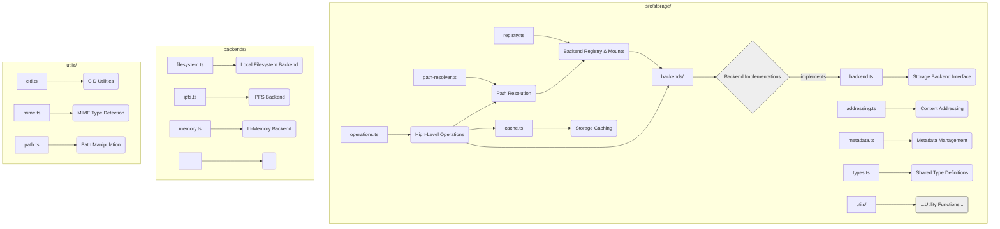

# Storage System Analysis

This document provides a detailed analysis of the Storage System components from `ipfs_accelerate_js`, assessing their architecture, dependencies, integration challenges, and adaptation requirements for the CLI-first environment.

## 1. Component Overview

### 1.1 Purpose and Functionality

The Storage System provides a unified interface for file and data storage operations across various backends. It abstracts away the complexity of different storage technologies (local filesystem, IPFS, etc.) and provides a consistent API for file operations, content addressing, and metadata management. This system enables the application to work with both local and distributed storage seamlessly.

### 1.2 Source Repository Information

| Attribute | Value |
|-----------|-------|
| Source Repository | ipfs_accelerate_js |
| Source Path | ipfs_accelerate_js/src/storage/ |
| Primary Files | backend.ts, filesystem.ts, ipfs.ts, registry.ts, path-resolver.ts, operations.ts |
| Lines of Code | ~5,200 |
| Last Major Update | 2023-01-20 |

### 1.3 Current Usage

In the `ipfs_accelerate_js` repository, the Storage System:
- Provides unified access to local and IPFS storage
- Manages file operations (read, write, list, delete)
- Handles content addressing and CID generation
- Implements path resolution across storage backends
- Manages metadata for stored content
- Provides caching and optimization for storage operations

## 2. Technical Architecture

### 2.1 Component Structure


*   **backend.ts:** Defines the common `StorageBackend` interface that all storage implementations must adhere to.
*   **backends/:** Contains concrete implementations for different storage types (local filesystem, IPFS via client, in-memory for testing).
*   **registry.ts:** Manages registered backend instances and maps virtual mount points (e.g., `/ipfs`, `/local`) to specific backend instances.
*   **path-resolver.ts:** Takes a virtual path (e.g., `/ipfs/some/file`) and determines which backend is responsible and the relative path within that backend.
*   **operations.ts:** Provides a high-level, unified API (e.g., `readFile`, `writeFile`, `copy`) that uses the `PathResolver` and delegates to the appropriate backend. This is the primary interface for other parts of the application.
*   **addressing.ts:** Utilities related to content addressing (primarily CID generation/validation for IPFS).
*   **metadata.ts:** Logic for handling metadata associated with stored content (e.g., MIME types, timestamps, potentially custom metadata).
*   **cache.ts:** Implements caching strategies specifically for storage operations (e.g., caching reads from slower backends like IPFS).
*   **types.ts:** Common TypeScript interfaces and types for the storage system.
*   **utils/:** Helper functions for CID handling, MIME type detection, path manipulation, etc.

### 2.2 Key Classes and Interfaces

#### StorageBackend Interface

```typescript
/**
 * Common interface for all storage backend implementations.
 * Defines a contract for file and directory operations.
 */
interface StorageBackend {
  /** Unique identifier for the backend type (e.g., 'filesystem', 'ipfs'). */
  readonly id: string; // Make readonly
  /** Human-readable name (e.g., 'Local Filesystem'). */
  readonly name: string; // Make readonly
  /** Flag indicating if the backend is read-only by nature or configuration. */
  readonly isReadOnly: boolean; // Make readonly
  
  // --- Basic file operations (relative path within backend) ---
  /** Reads the entire content of a file at the given relative path. */
  readFile(relativePath: string): Promise<Buffer>;
  /** Writes data to a file at the given relative path. Creates directories if needed. */
  writeFile(relativePath: string, data: Buffer | string): Promise<void>;
  /** Checks if a file or directory exists at the given relative path. */
  exists(relativePath: string): Promise<boolean>;
  /** Retrieves metadata (stats) for a file or directory at the relative path. */
  stat(relativePath: string): Promise<FileStat>;
  
  // --- Directory operations (relative path within backend) ---
  /** Reads the contents of a directory at the relative path. */
  readdir(relativePath: string): Promise<DirEntry[]>;
  /** Creates a directory at the relative path. */
  mkdir(relativePath: string, options?: { recursive?: boolean }): Promise<void>;
  
  // --- Delete operations (relative path within backend) ---
  /** Deletes a file at the relative path. */
  unlink(relativePath: string): Promise<void>;
  /** Deletes an empty directory at the relative path, or recursively if specified. */
  rmdir(relativePath: string, options?: { recursive?: boolean }): Promise<void>;
  
  // --- Optional additional operations (relative paths within backend) ---
  /** Renames or moves a file or directory within the same backend. */
  rename?(oldRelativePath: string, newRelativePath: string): Promise<void>;
  /** Copies a file within the same backend. */
  copyFile?(srcRelativePath: string, destRelativePath: string): Promise<void>;
  /** Creates a readable stream for a file at the relative path. */
  createReadStream?(relativePath: string, options?: any): Promise<NodeJS.ReadableStream>;
  /** Creates a writable stream for a file at the relative path. */
  createWriteStream?(relativePath: string, options?: any): Promise<NodeJS.WritableStream>;
  
  // --- Optional storage information ---
  /** Gets information about available space (if applicable). */
  getAvailableSpace?(): Promise<SpaceInfo>;
}

/** Represents file or directory metadata/statistics. */
interface FileStat {
  isDirectory: boolean;
  isFile: boolean;
  size: number; // Size in bytes
  createTime: Date; // Creation timestamp
  modifyTime: Date; // Last modification timestamp
  accessTime: Date; // Last access timestamp
  mode?: number; // Filesystem permissions (numeric)
  // Could add CID for IPFS entries
}

/** Represents an entry within a directory listing. */
interface DirEntry {
  name: string; // Base name of the entry
  path: string; // Full path within the backend
  isDirectory: boolean;
  isFile: boolean;
  size?: number; // Optional size
}

/** Represents information about storage space. */
interface SpaceInfo {
  total: number; // Total space in bytes
  used: number; // Used space in bytes
  available: number; // Available space in bytes
}
```

#### StorageRegistry

```typescript
/**
 * Manages registered storage backends and virtual mount points.
 * Responsible for mapping virtual paths to the correct backend instance.
 */
class StorageRegistry {
  // Stores backend instances, keyed by their unique ID (e.g., 'filesystem-default', 'ipfs-main').
  private backends: Map<string, StorageBackend>;
  // ID of the backend used for paths without an explicit mount (e.g., '/').
  private defaultBackendId: string;
  // Maps virtual mount points (e.g., '/ipfs', '/local/data') to backend IDs.
  // Mount points should be absolute paths starting with '/'.
  private mounts: Map<string, string>;
  
  /** Registers a backend instance. */
  registerBackend(backend: StorageBackend): void;
  /** Removes a backend instance. */
  unregisterBackend(backendId: string): void;
  /** Retrieves a backend instance by its ID. */
  getBackend(backendId: string): StorageBackend | undefined;
  /** Gets all registered backend instances. */
  getBackends(): StorageBackend[];
  /** Sets the default backend ID. */
  setDefaultBackend(backendId: string): void;
  /** Gets the default backend instance. */
  getDefaultBackend(): StorageBackend;
  
  /** Mounts a backend instance at a specific virtual path. */
  mount(mountPoint: string, backendId: string): void;
  /** Unmounts a virtual path. */
  unmount(mountPoint: string): void;
  /** Gets the current mount configuration. */
  getMounts(): Map<string, string>;
  /** Determines the responsible backend and calculates the relative path for a given absolute virtual path. */
  getBackendForPath(absoluteVirtualPath: string): { backend: StorageBackend; relativePath: string; mountPoint: string };
}
```

#### FilesystemBackend

```typescript
/**
 * Storage backend implementation using the local Node.js filesystem.
 */
class FilesystemBackend implements StorageBackend {
  readonly id = 'filesystem';
  readonly name = 'Local Filesystem';
  readonly isReadOnly = false; // Typically read-write
  
  // Base directory on the local filesystem where this backend operates.
  constructor(private baseDir: string) {
      // Ensure baseDir exists or create it? Needs careful consideration.
  }
  
  /** Reads a file relative to the base directory. */
  async readFile(relativePath: string): Promise<Buffer> {
    const fullPath = this._resolvePath(relativePath);
    // Add error handling for file not found, permissions etc.
    return await fs.readFile(fullPath); // Assumes fs is 'fs/promises'
  }
  
  /** Writes a file relative to the base directory. */
  async writeFile(relativePath: string, data: Buffer | string): Promise<void> {
    const fullPath = this._resolvePath(relativePath);
    // Ensure parent directory exists using recursive mkdir
    await fs.mkdir(dirname(fullPath), { recursive: true }); // dirname from 'path'
    // Add error handling for permissions etc.
    return await fs.writeFile(fullPath, data);
  }
  
  // Implement other StorageBackend methods (exists, stat, readdir, mkdir, unlink, rmdir)...
  
  /** Safely resolves a relative path within the base directory. Prevents path traversal. */
  private _resolvePath(relativePath: string): string {
    const normalizedRelative = normalize(relativePath); // normalize from 'path'
    if (normalizedRelative.startsWith('..')) {
        throw new Error(`Path traversal attempt detected: ${relativePath}`);
    }
    // Using resolve ensures the path is absolute and within baseDir (or should be checked)
    const fullPath = resolve(this.baseDir, normalizedRelative); // resolve from 'path'
    // Extra check: Ensure resolved path is still within baseDir
    if (!fullPath.startsWith(resolve(this.baseDir))) {
         throw new Error(`Resolved path is outside base directory: ${fullPath}`);
    }
    return fullPath;
  }

  // Removed ensureDir as fs.mkdir({ recursive: true }) handles it.
}
// Assumes fs, dirname, normalize, resolve imports from 'fs/promises' and 'path'
```

#### IPFSBackend

```typescript
/**
 * Storage backend implementation using an IPFS client (e.g., IPFSKitClient).
 * Requires a mechanism (mappingStore) to map virtual paths to immutable CIDs.
 */
class IPFSBackend implements StorageBackend {
  readonly id = 'ipfs';
  readonly name = 'IPFS Storage';
  // IPFS is content-addressed; writing usually means adding new content
  // and updating the path mapping. True 'overwrite' isn't standard.
  // Can be considered read-only for existing CIDs, but allows adding new content.
  readonly isReadOnly = false; // Or true depending on interpretation? Let's say false for adding.

  // Requires an IPFS client instance and a way to store path->CID mappings.
  // Requires an IPFS client instance and a way to store path->CID mappings.
  constructor(
      private ipfsClient: IPFSClient, // Assumes IPFSClient interface/class from ipfs_kit_commands.md context
      private mappingStore: MappingStore // Interface for path->CID storage
  ) {}
  
  /** Reads content by resolving the virtual path to a CID. */
  async readFile(virtualPath: string): Promise<Buffer> {
    const cid = await this._pathToCID(virtualPath);
    // Add error handling
    return await this.ipfsClient.getContent(cid); // Use IPFSKitClient method
  }
  
  /** Adds content to IPFS and updates the path mapping. */
  async writeFile(virtualPath: string, data: Buffer | string): Promise<void> {
    const { cid } = await this.ipfsClient.addContent(data); // Use IPFSKitClient method
    // Update the mapping store to point the virtual path to the new CID
    await this._mapPathToCID(virtualPath, cid);
  }

  // Implement other StorageBackend methods (exists, stat, readdir, mkdir, unlink, rmdir)...
  // These often require interacting with the mappingStore or IPFS DAG APIs.
  // For example, readdir might involve reading a directory CID and listing its links.
  // mkdir might involve creating an empty directory structure in IPFS and mapping it.
  // unlink/rmdir would typically only remove the mapping, not the IPFS data itself.
  
  // Other method implementations...
  
  /** Resolves a virtual path to its corresponding CID using the mapping store. */
  private async _pathToCID(virtualPath: string): Promise<string> {
    const mapping = await this.mappingStore.get(virtualPath);
    if (!mapping || !mapping.cid) {
      throw new Error(`IPFSBackend: No content found for path: ${virtualPath}`);
    }
    return mapping.cid;
  }

  /** Updates the mapping store to associate a virtual path with a CID. */
  
  private async _mapPathToCID(virtualPath: string, cid: string): Promise<void> {
    // Store path -> CID mapping, potentially with timestamp or versioning info
    await this.mappingStore.set(virtualPath, { cid, timestamp: Date.now() });
  }
}
// Assumes MappingStore interface exists: { get(path: string): Promise<{cid: string} | null>; set(path: string, mapping: {cid: string, timestamp: number}): Promise<void>; }
```

#### PathResolver

```typescript
/**
 * Resolves virtual paths (e.g., '/ipfs/file.txt', '/local/data.csv')
 * to the responsible backend and the relative path within that backend.
 */
class PathResolver {
  constructor(private registry: StorageRegistry) {}

  /** Resolves a full virtual path. */
  
  resolvePath(virtualPath: string): { backend: StorageBackend; relativePath: string; mountPoint: string } {
    // 1. Normalize the input path (handle ., .., slashes) using POSIX standard
    const normalizedPath = this._normalizePath(virtualPath);

    // 2. Find the longest matching mount point from the registry
    //    (e.g., for path '/ipfs/subdir/file', match '/ipfs')
    //    The registry method needs to return the backend, relative path, and mount point found.
    const { backend, relativePath, mountPoint } = this.registry.getBackendForPath(normalizedPath);

    return { backend, relativePath, mountPoint };
  }

  /** Normalizes a path (e.g., removes redundant slashes, resolves . and ..). */
  private _normalizePath(virtualPath: string): string {
    // Use Node.js path.posix module for consistent virtual path handling
    // Ensure path is absolute within the virtual filesystem
    const absolutePath = virtualPath.startsWith('/') ? virtualPath : `/${virtualPath}`;
    const normalized = posix.normalize(absolutePath); // posix from 'path'
    // Prevent escaping the root - although mount logic should handle this primarily
    if (normalized.startsWith('../')) {
        throw new Error(`Invalid path: ${virtualPath}`);
    }
    return normalized;
  }
    
    // Find appropriate backend
    const backend = this.registry.getBackendForPath(normalizedPath);
    
    // Resolve path relative to mount point
    const relativePath = this.getRelativePath(normalizedPath);
    
    return { backend, path: relativePath };
  }
  
  private normalizePath(path: string): string {
    // Handle . and .. segments
    // Convert to posix-style paths
    // Ensure proper leading slash
  }
  
  private getRelativePath(path: string): string {
    // Get path relative to mount point
  }
}
```

#### StorageOperations

```typescript
/**
 * Provides a high-level, unified API for storage operations,
 * abstracting away path resolution and backend delegation.
 */
class StorageOperations {
  constructor(
    private registry: StorageRegistry, // Needed indirectly by PathResolver
    private pathResolver: PathResolver
  ) {}

  /** Reads a file using its virtual path. */
  
  async readFile(virtualPath: string): Promise<Buffer> {
    const { backend, relativePath } = this.pathResolver.resolvePath(virtualPath);
    // Add logging/tracing here
    return await backend.readFile(relativePath);
  }

  /** Writes a file using its virtual path. */
  
  async writeFile(virtualPath: string, data: Buffer | string): Promise<void> {
    const { backend, relativePath } = this.pathResolver.resolvePath(virtualPath);
    
    // Check read-only status before attempting write
    if (backend.isReadOnly) {
      throw new Error(`Storage backend '${backend.name}' mounted at this path is read-only.`);
    }
    // Add logging/tracing here
    
    return await backend.writeFile(relativePath, data);
  }

  // Implement other high-level operations (readdir, mkdir, unlink, stat, etc.)
  // following the pattern: resolve path -> delegate to backend.
  
  // Other high-level operations...
  
  /** Copies a file or directory between potentially different backends. */
  /** Copies a file or directory between potentially different backends. */
  async copy(sourceVirtualPath: string, destVirtualPath: string, options?: { recursive?: boolean }): Promise<void> {
    // TODO: Implement recursive copy for directories.
    // This simplified version only handles files.
    const source = this.pathResolver.resolvePath(sourceVirtualPath);
    const dest = this.pathResolver.resolvePath(destVirtualPath);
    
    // Optimization: If source and destination are on the same backend,
    // try to use the backend's native copyFile if available.
    if (source.backend.id === dest.backend.id && source.backend.copyFile) {
      try {
        // Ensure backend.copyFile exists before calling
        await source.backend.copyFile(source.relativePath, dest.relativePath);
        return; // Copied using backend's optimized method
      } catch (e) {
        // Log warning, fall back to read/write copy
        console.warn(`Backend copy failed, falling back to read/write: ${e.message}`);
      }
    }

    // Standard cross-backend copy: Read from source, write to destination.
    // This needs to handle directories recursively.
    // For simplicity, showing file copy:
    // TODO: Implement recursive directory copy logic here.
    const content = await source.backend.readFile(source.relativePath);
    await dest.backend.writeFile(dest.relativePath, content);
    // Full implementation needs recursive directory handling.
    
    // Otherwise read from source and write to destination
    const content = await sourceResolved.backend.readFile(sourceResolved.path);
    await destResolved.backend.writeFile(destResolved.path, content);
  }
}
```

### 2.3 Workflow and Control Flow

1. **Backend Registration**: Storage backends register with the `StorageRegistry` at initialization
2. **Mount Point Setup**: File paths are mapped to backends via mount points
3. **Path Resolution**: `PathResolver` determines the appropriate backend for a given path
4. **Operation Execution**: Storage operations are executed on the appropriate backend
5. **Content Addressing**: CIDs are generated for content when using IPFS backend
6. **Path Mapping**: Path-to-CID mappings are maintained for IPFS content
7. **Error Handling**: Backend-specific errors are translated to application-level errors

### 2.4 Data Flow Diagram (Read Operation Example)

```mermaid
graph TD
    A[User/Service calls StorageOperations.readFile('/ipfs/file.txt')] --> B(PathResolver.resolvePath);
    B -- '/ipfs/file.txt' --> C(StorageRegistry.getBackendForPath);
    C -- Mounts Info --> B;
    B -- Returns { backend: IPFSBackend, relativePath: 'file.txt', mountPoint: '/ipfs' } --> A;
    A -- Calls backend.readFile('file.txt') --> D(IPFSBackend);
    D -- Resolves path 'file.txt' --> E(MappingStore.get('file.txt'));
    E -- Returns { cid: 'Qm...' } --> D;
    D -- Calls ipfsClient.getContent('Qm...') --> F(IPFSClient);
    F -- HTTP/WS Request --> G((IPFS Network/Server));
    G -- Raw Data --> F;
    F -- Buffer --> D;
    D -- Buffer --> A;
    A -- Returns Buffer --> H[Calling User/Service];

    style G fill:#ddd, stroke:#333
```

## 3. Dependencies Analysis

### 3.1 Internal Dependencies

| Dependency | Usage | Criticality | Notes |
|------------|-------|-------------|-------|
| Configuration System | Reading backend configurations (e.g., local `baseDir`, IPFS API URL), mount point definitions. | High | Essential for initializing and configuring the `StorageRegistry` and backends. |
| Logging System | Logging storage operations (read, write, copy), errors, cache activity. | Medium | Important for debugging, auditing, and monitoring storage interactions. |
| Error Handling | Defining and handling storage-specific errors (e.g., `FileNotFoundError`, `PermissionError`, `NetworkError`, `BackendNotMountedError`). | Medium | Needs consistent error reporting across different backends for reliable application logic. |
| IPFS Client (`IPFSKitClient`) | Used by the `IPFSBackend` to perform actual IPFS operations (`add`, `cat`, etc.). | High (if IPFS used) | Core dependency for any IPFS functionality. Assumed to be provided/configured externally. |
| Authentication | Handled via Configuration System (e.g., retrieving API keys for IPFS client or other potential cloud backends). | Low/Medium | Storage system relies on configured credentials; doesn't manage auth itself. |

### 3.2 External Dependencies

| Dependency | Version | Purpose | Node.js Compatible? | Alternatives |
|------------|---------|---------|---------------------|--------------|
| ipfs-http-client | ^56.0.0 | IPFS API client | Yes | ipfs-core, js-ipfs |
| multiformats | ^9.6.4 | CID handling | Yes | cids (older) |
| fs-extra | ^10.0.0 | Enhanced filesystem operations | Yes | Node.js fs with extra code |
| mime-types | ^2.1.35 | MIME type detection | Yes | mime, file-type |
| sanitize-filename | ^1.6.3 | Path security | Yes | path filtering utilities |
| p-queue | ^7.3.0 | Operation rate limiting | Yes | async limiter, bottleneck |

### 3.3 Dependency Graph (Conceptual)

```mermaid
graph TD
    StoreSys[Storage System] --> StoreOps(Storage Operations API);
    StoreOps --> PathRes(Path Resolver);
    StoreOps --> StoreReg(Storage Registry);
    PathRes --> StoreReg;

    StoreReg --> Backends{Backends};
    Backends --> FSBackend(Filesystem Backend);
    Backends --> IPFSBackend(IPFS Backend);
    Backends --> MemBackend(Memory Backend);

    StoreSys --> StoreCache(Storage Cache);
    StoreSys --> StoreMeta(Metadata Mgmt);
    StoreSys --> StoreAddr(Addressing Utils);

    FSBackend --> Dep_FS(fs-extra / Node fs);
    IPFSBackend --> IPFSClient(IPFS Client);
    IPFSBackend --> MappingStore(Path/CID Mapping Store);
    IPFSBackend --> Dep_Multi(multiformats);
    IPFSClient --> Dep_HTTP(HTTP Client / fetch); # IPFS Client uses HTTP

    StoreSys --> CfgSys(Configuration System); # For backend config
    StoreSys --> LogSys(Logging System); # For logging ops/errors

    style Dep_FS fill:#eee,stroke:#333
    style Dep_HTTP fill:#eee,stroke:#333
    style Dep_Multi fill:#eee,stroke:#333
    style IPFSClient fill:#ccf,stroke:#333 # External dependency via interface
    style MappingStore fill:#f9d,stroke:#333 # Important internal state for IPFSBackend
```

## 4. Node.js Compatibility Assessment

### 4.1 Compatibility Overview

| Aspect | Compatibility | Notes |
|--------|---------------|-------|
| Runtime API Usage | High | Already uses Node.js filesystem APIs |
| Dependencies | High | All major dependencies have Node.js versions |
| Filesystem Access | High | Core functionality already uses Node.js fs |
| Async Patterns | High | Uses promises and async/await |
| Platform Specifics | Medium | Some path handling needs platform adaptation |

### 4.2 Compatibility Issues

1. **Path Handling**: Ensuring consistent behavior with POSIX-style virtual paths (e.g., `/ipfs/data`) while interacting with platform-specific local filesystem paths (`C:\Users\..` or `/home/user/..`). Path traversal vulnerabilities must be prevented.
   - **Solution**: Use `path.posix` exclusively for manipulating virtual paths within the storage system's core logic (Registry, Resolver, Operations). The `FilesystemBackend` is the *only* component that translates relative virtual paths to absolute OS-specific paths using `path.resolve` and `path.join`, ensuring results stay within its configured `baseDir`. Rigorous validation in `_resolvePath` is critical.
2. **Browser Storage APIs**: The source repository (`ipfs_accelerate_js`) likely contains code using `IndexedDB` or `localStorage` for caching or the path-to-CID mapping store.
   - **Solution**: This code is incompatible with Node.js and must be entirely replaced. Implement the `MappingStore` for `IPFSBackend` using a Node.js-friendly persistent mechanism (e.g., SQLite via `better-sqlite3`, LevelDB via `level`, or even structured JSON files). Implement caching (`cache.ts`) using in-memory stores (`lru-cache`) or filesystem-based caches.
3. **IPFS Client Compatibility**: The source might use `js-ipfs` (in-browser node) or an older `ipfs-http-client`.
   - **Solution**: Standardize on using the project's dedicated `IPFSKitClient` which connects to the external IPFS Kit MCP Server via HTTP API. This ensures consistency and leverages the managed server.
4. **Concurrency/Parallelism**: Browser code might use Web Workers. Node.js has `worker_threads`.
   - **Solution**: For CPU-intensive tasks within storage (unlikely for basic ops, maybe for hashing large files), use `worker_threads`. For I/O-bound concurrency (multiple IPFS requests, parallel local reads), use `Promise.all` combined with rate-limiting libraries like `p-queue` within backends to avoid overwhelming resources or hitting API limits.

### 4.3 Performance Considerations

| Operation | Performance Characteristic | Optimization Opportunities |
|-----------|---------------------------|----------------------------|
| Local File Read/Write | I/O bound | Streaming, buffer pooling |
| IPFS Operations | Network bound | Caching, lazy pinning |
| Path Resolution | CPU intensive for complex paths | Path resolution caching |
| Directory Listing | I/O bound for large directories | Pagination, lazy loading |
| Content Hashing | CPU intensive for large files | Incremental hashing, worker offloading |

## 5. CLI Adaptation Requirements

### 5.1 Interface Modifications

| Interface Element | Current Implementation | Required Changes |
|-------------------|------------------------|------------------|
| Backend Configuration | Config objects | CLI argument mapping |
| Path Specification | Application paths | CLI path arguments |
| Operation Results | Object returns | Formatted CLI output |
| Error Handling | Error objects | User-friendly CLI error messages |
| Progress Reporting | Event callbacks | Terminal progress indicators |

### 5.2 New CLI Commands

1. **Storage Mount Command**: Manage storage backends and mount points
   ```bash
   swissknife storage mount <path> <backend> [options]
   swissknife storage unmount <path>
   swissknife storage mounts list
   ```

2. **Storage Info Command**: Show storage information
   ```bash
   swissknife storage info [path]
   ```

3. **IPFS Command**: IPFS-specific operations
   ```bash
   swissknife ipfs add <file>
   swissknife ipfs get <cid> [output]
   swissknife ipfs pin <cid>
   swissknife ipfs unpin <cid>
   ```

4. **File Command**: High-level file operations
   ```bash
   swissknife file copy <source> <dest> [--recursive]
   swissknife file move <source> <dest>
   swissknife file list <path> [--recursive]
   swissknife file search <pattern>
   ```

### 5.3 Terminal UI Enhancements

1. **File Transfer Progress**: Show file operation progress
   ```typescript
   import cliProgress from 'cli-progress';
   
   async function copyFileWithProgress(src: string, dest: string): Promise<void> {
     const { size } = await storageOps.stat(src);
     const progress = new cliProgress.SingleBar({}, cliProgress.Presets.shades_classic);
     
     progress.start(size, 0);
     
     const readStream = await storageOps.createReadStream(src);
     const writeStream = await storageOps.createWriteStream(dest);
     
     let bytesProcessed = 0;
     readStream.on('data', (chunk) => {
       bytesProcessed += chunk.length;
       progress.update(bytesProcessed);
     });
     
     await new Promise((resolve, reject) => {
       writeStream.on('finish', resolve);
       writeStream.on('error', reject);
       readStream.pipe(writeStream);
     });
     
     progress.stop();
   }
   ```

2. **File Listing Display**: Enhanced directory listing
   ```typescript
   import chalk from 'chalk';
   import { format } from 'date-fns';
   
   async function listDirectory(path: string): Promise<void> {
     const entries = await storageOps.readdir(path);
     
     // Sort: directories first, then files
     entries.sort((a, b) => {
       if (a.isDirectory && !b.isDirectory) return -1;
       if (!a.isDirectory && b.isDirectory) return 1;
       return a.name.localeCompare(b.name);
     });
     
     // Display entries
     for (const entry of entries) {
       const stats = await storageOps.stat(join(path, entry.name));
       const sizeStr = entry.isDirectory ? '-' : formatSize(stats.size);
       const dateStr = format(stats.modifyTime, 'yyyy-MM-dd HH:mm');
       
       const nameStr = entry.isDirectory
         ? chalk.blue(entry.name + '/')
         : entry.name;
       
       console.log(
         `${entry.isDirectory ? 'd' : '-'}${formatPermissions(stats.mode || 0)}  ` +
         `${dateStr}  ${sizeStr.padStart(8)}  ${nameStr}`
       );
     }
   }
   
   function formatSize(bytes: number): string {
     const units = ['B', 'K', 'M', 'G', 'T'];
     let size = bytes;
     let unitIndex = 0;
     
     while (size >= 1024 && unitIndex < units.length - 1) {
       size /= 1024;
       unitIndex++;
     }
     
     return unitIndex === 0
       ? size.toString()
       : size.toFixed(1) + units[unitIndex];
   }
   ```

3. **Storage Dashboard**: CLI-based storage overview
   ```typescript
   import boxen from 'boxen';
   import chalk from 'chalk';
   
   async function showStorageDashboard(): Promise<void> {
     const backends = registry.getBackends();
     const mounts = registry.getMounts();
     
     // Display backends
     console.log(chalk.bold('Storage Backends:'));
     for (const backend of backends) {
       const spaceInfo = await backend.getAvailableSpace();
       const usedPercent = Math.round((spaceInfo.used / spaceInfo.total) * 100);
       
       console.log(boxen(
         `${chalk.bold(backend.name)} (${backend.id})\n` +
         `${chalk.dim('Status:')} ${backend.isReadOnly ? chalk.yellow('Read-only') : chalk.green('Read-write')}\n` +
         `${chalk.dim('Space:')} ${formatSize(spaceInfo.used)} / ${formatSize(spaceInfo.total)} (${usedPercent}%)`,
         { padding: 1, borderColor: 'blue' }
       ));
     }
     
     // Display mounts
     console.log(chalk.bold('\nMount Points:'));
     for (const [path, backendId] of mounts.entries()) {
       const backend = registry.getBackend(backendId);
       console.log(`${chalk.green(path)} → ${backend?.name ?? 'Unknown'} (${backendId})`);
     }
   }
   ```

## 6. Integration Challenges

### 6.1 Identified Challenges

1. **Cross-Platform Path Robustness**: As mentioned in compatibility, ensuring correct translation between virtual POSIX paths and OS-specific filesystem paths is critical and error-prone.
   - **Impact**: High (Data Loss / Incorrect Operations / Security).
   - **Solution**: Extensive unit and integration testing for `PathResolver` and `FilesystemBackend` on Windows, Linux, and macOS. Strict validation within `_resolvePath` to prevent traversal.
2. **IPFS Backend State Management**: The `IPFSBackend` needs a persistent and reliable `mappingStore` to link virtual paths (which appear mutable to the user) to immutable IPFS CIDs. Representing and updating directory structures atomically in this mapping is complex.
   - **Impact**: High (Data Loss / Inconsistent State / Poor Performance).
   - **Solution**: Choose a robust `mappingStore` implementation (e.g., SQLite offers atomicity). Define how directories are represented (e.g., a JSON object listing entries and their CIDs, stored itself as a mapped file/object). Implement atomic updates for operations like rename, mkdir, rmdir that modify directory structures. Consider using IPNS or WNFS concepts if more advanced mutable filesystem semantics over IPFS are needed, but this significantly increases complexity. Start simple.
3. **Large File Handling & Streaming**: Ensuring large files are processed using streams across all relevant operations (`readFile`, `writeFile`, `copy`, `ipfs add`, `ipfs get`) and backends.
   - **Impact**: Medium (Memory Exhaustion / Poor Performance).
   - **Solution**: Make `createReadStream` and `createWriteStream` core parts of the `StorageBackend` interface. Implement them using Node.js streams for `FilesystemBackend` and the streaming capabilities of the `IPFSKitClient` for `IPFSBackend`. Refactor `StorageOperations.copy` and CLI commands to use these streams.
4. **Error Normalization**: Translating diverse errors from `fs`, `ipfs-http-client`, network issues, etc., into a consistent set of `StorageError` types.
   - **Impact**: Medium (User Experience / Reliability).
   - **Solution**: Define specific error subclasses (`FileNotFoundError`, `PermissionError`, `NetworkError`, `InvalidPathError`, etc.) extending a base `StorageError`. Implement error mapping within each backend's methods.
5. **Concurrency Control**: Preventing race conditions when multiple operations target the same virtual path or backend resource simultaneously (e.g., two processes writing to the same file path mapped to IPFS).
   - **Impact**: Medium (Data Corruption / Inconsistent State).
   - **Solution**: For critical state like the `mappingStore`, use atomic database transactions if using SQLite. For network requests (IPFS), use `p-queue` in the `IPFSBackend` to limit concurrent API calls. For local filesystem writes, rely on OS-level file locking if necessary, although often careful application logic can avoid direct conflicts.

### 6.2 Technical Debt

| Area | Technical Debt | Recommended Action |
|------|---------------|-------------------|
| Path Handling | Inconsistent path normalization | Create unified path utility |
| Error Types | Mixed error formats | Implement standardized error system |
| Backend Configuration | Scattered config logic | Centralize backend configuration |
| Concurrency Control | Ad-hoc locking mechanisms | Implement proper concurrency control |
| Dependency Management | Direct dependency use | Create abstraction layers |

### 6.3 Integration Risks

| Risk | Probability | Impact | Mitigation |
|------|------------|--------|------------|
| IPFS availability issues | Medium | High | Fallback mechanisms, caching |
| Cross-platform compatibility | Medium | High | Comprehensive platform testing |
| Performance bottlenecks | Medium | Medium | Performance benchmarking, profiling |
| Path security vulnerabilities | Low | High | Path sanitization, security audit |
| Data corruption | Low | High | Checksums, verification, backups |

## 7. Testing Requirements

### 7.1 Test Coverage Needs

| Component | Current Coverage | Target Coverage | Critical Path Tests |
|-----------|-----------------|-----------------|---------------------|
| Storage Registry | 65% | 90% | Backend registration, path resolution |
| Filesystem Backend | 70% | 90% | File operations, error handling |
| IPFS Backend | 55% | 85% | Content addressing, network resilience |
| Path Resolver | 60% | 95% | Path normalization, security |
| Storage Operations | 60% | 85% | Cross-backend operations |

### 7.2 Test Implementation Strategy

1. **Unit Tests**: For core classes and utilities
   ```typescript
   describe('PathResolver', () => {
     let resolver: PathResolver;
     let mockRegistry: jest.Mocked<StorageRegistry>;
     
     beforeEach(() => {
       mockRegistry = {
         getBackendForPath: jest.fn(),
         // ...other methods
       } as any;
       
       resolver = new PathResolver(mockRegistry);
     });
     
     it('should resolve paths correctly', () => {
       mockRegistry.getBackendForPath.mockReturnValue({
         id: 'fs',
         name: 'Filesystem'
       } as any);
       
       const result = resolver.resolvePath('/test/path');
       
       expect(mockRegistry.getBackendForPath).toHaveBeenCalledWith('/test/path');
       expect(result.backend).toBeDefined();
       expect(result.path).toBe('/test/path');
     });
     
     it('should handle path traversal attempts', () => {
       expect(() => resolver.resolvePath('../../../etc/passwd')).toThrow();
     });
   });
   ```

2. **Integration Tests**: For backend interaction
   ```typescript
   describe('FilesystemBackend Integration', () => {
     let backend: FilesystemBackend;
     let tempDir: string;
     
     beforeEach(async () => {
       tempDir = await fs.mkdtemp(join(os.tmpdir(), 'storage-test-'));
       backend = new FilesystemBackend(tempDir);
     });
     
     afterEach(async () => {
       await fs.rm(tempDir, { recursive: true, force: true });
     });
     
     it('should write and read files', async () => {
       const testPath = 'test-file.txt';
       const testContent = 'Hello, world!';
       
       await backend.writeFile(testPath, testContent);
       
       const content = await backend.readFile(testPath);
       expect(content.toString()).toBe(testContent);
     });
     
     it('should handle directories', async () => {
       await backend.mkdir('test-dir');
       await backend.writeFile('test-dir/file.txt', 'Content');
       
       const entries = await backend.readdir('test-dir');
       expect(entries).toHaveLength(1);
       expect(entries[0].name).toBe('file.txt');
     });
   });
   ```

3. **Mock Tests**: For IPFS testing without network
   ```typescript
   describe('IPFSBackend with Mocks', () => {
     let backend: IPFSBackend;
     let mockIpfsClient: jest.Mocked<IPFSClient>;
     let mockMappingStore: jest.Mocked<MappingStore>;
     
     beforeEach(() => {
       mockIpfsClient = {
         add: jest.fn(),
         cat: jest.fn(),
         pin: {
           add: jest.fn(),
           rm: jest.fn(),
           ls: jest.fn(),
         },
         // ...other methods
       } as any;
       
       mockMappingStore = {
         get: jest.fn(),
         set: jest.fn(),
         delete: jest.fn(),
         // ...other methods
       } as any;
       
       backend = new IPFSBackend(mockIpfsClient, { mappingStore: mockMappingStore });
     });
     
     it('should write files to IPFS', async () => {
       mockIpfsClient.add.mockResolvedValue({ cid: 'test-cid' });
       mockMappingStore.set.mockResolvedValue(undefined);
       
       await backend.writeFile('/test/path.txt', 'Test content');
       
       expect(mockIpfsClient.add).toHaveBeenCalled();
       expect(mockMappingStore.set).toHaveBeenCalledWith(
         '/test/path.txt',
         expect.objectContaining({ cid: 'test-cid' })
       );
     });
     
     it('should read files from IPFS', async () => {
       mockMappingStore.get.mockResolvedValue({ cid: 'test-cid' });
       mockIpfsClient.cat.mockResolvedValue(Buffer.from('Test content'));
       
       const content = await backend.readFile('/test/path.txt');
       
       expect(mockMappingStore.get).toHaveBeenCalledWith('/test/path.txt');
       expect(mockIpfsClient.cat).toHaveBeenCalledWith('test-cid');
       expect(content.toString()).toBe('Test content');
     });
   });
   ```

### 7.3 Test Environment Needs

- Temporary directory creation/cleanup
- Mock IPFS service
- Cross-platform testing (Windows, Linux, macOS)
- Large file test data
- Network condition simulation (for IPFS)
- Permission testing environment

## 8. Documentation Requirements

### 8.1 User Documentation

1. **Storage Configuration Guide**: Setting up storage backends
   ```markdown
   ## Storage Configuration
   
   SwissKnife supports multiple storage backends that can be configured and mounted at different paths.
   
   ### Local Storage
   
   Local storage uses your computer's filesystem:
   
   ```
   # Mount local storage at /files
   swissknife storage mount /files filesystem --path /path/to/local/directory
   ```
   
   ### IPFS Storage
   
   IPFS storage provides content-addressed, distributed storage:
   
   ```
   # Set up IPFS connection
   swissknife config set ipfs.api.url "http://localhost:5001"
   
   # Mount IPFS storage at /ipfs
   swissknife storage mount /ipfs ipfs
   ```
   
   ### Listing Mount Points
   
   View configured mount points:
   
   ```
   swissknife storage mounts list
   ```
   
   ### Storage Information
   
   View storage information:
   
   ```
   swissknife storage info
   ```
   ```

2. **File Operations Guide**: Using the storage system
   ```markdown
   ## File Operations
   
   SwissKnife provides commands for file operations across different storage backends.
   
   ### Basic File Operations
   
   ```
   # List files in a directory
   swissknife file list /path
   
   # Copy a file
   swissknife file copy /source/file /destination/file
   
   # Move a file
   swissknife file move /source/file /destination/file
   
   # Delete a file
   swissknife file delete /path/to/file
   ```
   
   ### Working with IPFS
   
   ```
   # Add a file to IPFS
   swissknife ipfs add /local/file.txt
   
   # Get a file from IPFS by CID
   swissknife ipfs get QmX... /local/output.txt
   
   # Pin a CID to ensure it's kept in your IPFS node
   swissknife ipfs pin QmX...
   ```
   
   ### Searching Files
   
   ```
   # Search files by pattern
   swissknife file search "*.txt" --path /files
   ```
   ```

### 8.2 Developer Documentation

1. **Backend Implementation Guide**: Creating new storage backends
   ```markdown
   ## Creating a New Storage Backend
   
   To implement a new storage backend:
   
   1. Create a new file in `src/storage/backends/`
   2. Implement the `StorageBackend` interface:
   
   ```typescript
   import { StorageBackend, FileStat, DirEntry, SpaceInfo } from '../types';
   
   export class NewBackend implements StorageBackend {
     id = 'new-backend';
     name = 'New Storage Backend';
     isReadOnly = false;
     
     constructor(private config: NewBackendConfig) {}
     
     async readFile(path: string): Promise<Buffer> {
       // Implementation
     }
     
     async writeFile(path: string, data: Buffer | string): Promise<void> {
       // Implementation
     }
     
     // Implement other required methods
   }
   ```
   
   3. Register your backend in `src/storage/registry.ts`:
   
   ```typescript
   import { NewBackend } from './backends/new-backend';
   
   // In the registerBackends function:
   if (config.newBackend?.enabled) {
     registry.registerBackend(new NewBackend({
       // Config options
     }));
   }
   ```
   ```

2. **Architecture Documentation**: Storage system design
   - Component interactions
   - Backend abstraction
   - Path resolution mechanism
   - Content addressing design
   - Error handling patterns

## 9. Integration Recommendations

### 9.1 Integration Approach

1. **Phase 1: Core Infrastructure**
   - Implement `StorageBackend` interface and basic types
   - Create `FilesystemBackend` implementation
   - Implement `StorageRegistry` with mount functionality
   - Create basic path resolution utilities

2. **Phase 2: CLI Integration**
   - Implement storage management commands
   - Create file operation commands
   - Add formatted output for storage operations
   - Implement progress reporting for file operations

3. **Phase 3: IPFS Integration**
   - Implement `IPFSBackend` with Node.js client
   - Create path-to-CID mapping system
   - Add IPFS configuration commands
   - Implement IPFS-specific commands

4. **Phase 4: Advanced Features**
   - Implement streaming file operations
   - Add background file transfers
   - Create caching mechanisms
   - Implement search functionality

### 9.2 Recommended Modifications

1. **Path Handling Adaptation**
   ```typescript
   // Current approach - direct path concatenation
   const fullPath = this.baseDir + '/' + path;
   
   // Recommended approach - platform-agnostic path handling
   import { join, resolve, normalize } from 'path';
   
   const fullPath = resolve(join(this.baseDir, normalize(path)));
   ```

2. **Browser-to-Node.js Storage Adaptation**
   ```typescript
   // Current approach - IndexedDB in browser
   class MappingStore {
     private db: IDBDatabase;
     
     async get(path: string): Promise<Mapping | undefined> {
       // IndexedDB implementation
     }
     
     // Other methods
   }
   
   // Recommended approach - filesystem-based store in Node.js
   class MappingStore {
     constructor(private storePath: string) {
       // Ensure directory exists
     }
     
     async get(path: string): Promise<Mapping | undefined> {
       try {
         const data = await fs.readFile(this.getPath(path), 'utf8');
         return JSON.parse(data);
       } catch (error) {
         return undefined;
       }
     }
     
     private getPath(path: string): string {
       // Create safe filename from path
       const safeName = Buffer.from(path).toString('base64url');
       return join(this.storePath, safeName + '.json');
     }
     
     // Other methods
   }
   ```

3. **Streaming Operation Adaptation**
   ```typescript
   // Add streaming methods to StorageBackend interface
   interface StorageBackend {
     // Existing methods...
     
     createReadStream(path: string, options?: ReadStreamOptions): Promise<NodeJS.ReadableStream>;
     createWriteStream(path: string, options?: WriteStreamOptions): Promise<NodeJS.WritableStream>;
   }
   
   // Implementation in FilesystemBackend
   async createReadStream(path: string, options?: ReadStreamOptions): Promise<NodeJS.ReadableStream> {
     const fullPath = this.resolvePath(path);
     return fs.createReadStream(fullPath, options);
   }
   
   // Implementation in IPFSBackend
   async createReadStream(path: string, options?: ReadStreamOptions): Promise<NodeJS.ReadableStream> {
     const cid = await this.pathToCID(path);
     return this.ipfsClient.cat(cid, options);
   }
   ```

### 9.3 Integration Sequence

1. Create core storage interfaces and types
2. Implement StorageRegistry with mount point management
3. Create FilesystemBackend implementation
4. Implement PathResolver with security checks
5. Create high-level StorageOperations class
6. Implement basic CLI commands for storage management
7. Create file operation commands
8. Implement IPFS backend
9. Add content addressing and path mapping
10. Implement streaming operations and progress reporting

## 10. Conclusion

### 10.1 Key Findings

1. The Storage System is well-structured but requires adaptation from browser to Node.js environment
2. Path handling needs special attention for cross-platform compatibility
3. Browser storage interfaces need to be replaced with Node.js filesystem equivalents
4. IPFS integration is already quite Node.js compatible with available clients
5. Terminal UI enhancements are needed for CLI-based interactions

### 10.2 Recommendations Summary

1. **Prioritize Robust Path Handling & Security:** Implement and rigorously test the `PathResolver` and `FilesystemBackend._resolvePath` for cross-platform correctness and path traversal prevention. Rationale: Foundational for correctness and security; errors here are critical.
2. **Mandate Streaming Interface:** Make `createReadStream` and `createWriteStream` mandatory methods in the `StorageBackend` interface. Rationale: Enforces support for large files, a common requirement, and simplifies the `StorageOperations` layer.
3. **Implement Reliable IPFS Mapping Store:** Choose and implement a persistent, Node.js-based `mappingStore` (e.g., SQLite via `better-sqlite3`) with atomic updates for directory operations. Rationale: Core requirement for a functional `IPFSBackend` that mimics filesystem semantics.
4. **Implement Streaming in Operations:** Ensure `StorageOperations.copy` and relevant CLI commands (`file copy`, `ipfs add`, `ipfs get`) correctly utilize the streaming methods from the backends. Rationale: Prevents memory issues with large files.
5. **Standardize Storage Errors:** Define and use a clear hierarchy of `StorageError` subclasses throughout the backends and operations layer. Rationale: Creates a predictable and user-friendly error handling experience.

### 10.3 Next Steps

1. Begin implementation of StorageBackend interface and registry
2. Create FilesystemBackend as the first backend implementation
3. Implement platform-agnostic PathResolver
4. Develop CLI commands for storage management
5. Create filesystem-based mapping store for IPFS path mappings
