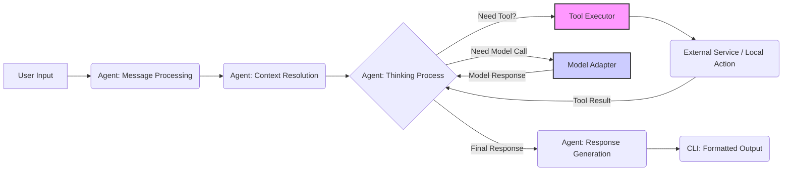
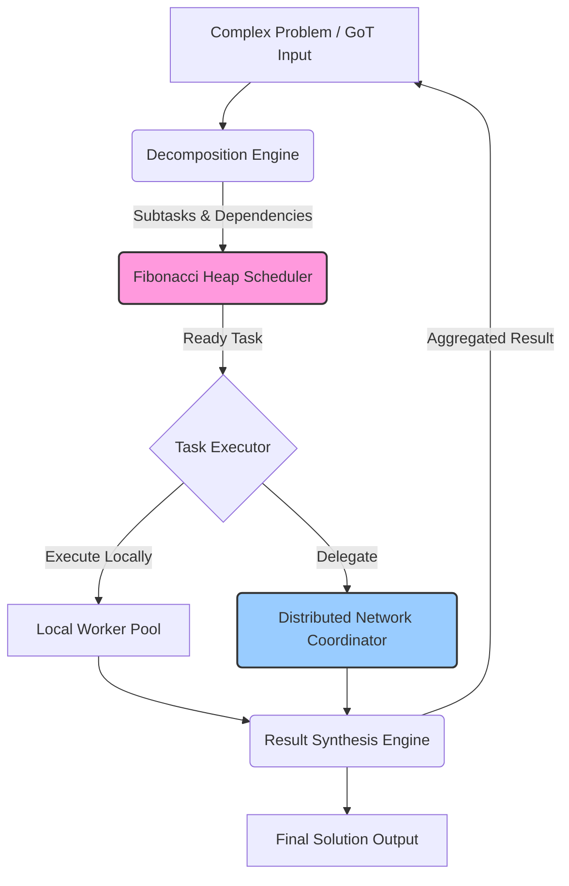

# CLI Architecture for SwissKnife

This document defines the architectural vision for SwissKnife as a CLI-first application with TypeScript implementation of Goose features, integration with IPFS Kit MCP Server, and enhanced task processing capabilities.

## Core Architectural Principles

1.  **Clean Room TypeScript Implementation**: All functionality is independently implemented in TypeScript based on understanding the *requirements* and *behavior* of the original Goose features, not by directly translating Rust code. This ensures a clean, idiomatic TypeScript codebase and avoids licensing or IP contamination issues. See [../CLEAN_ROOM_IMPLEMENTATION.md](../CLEAN_ROOM_IMPLEMENTATION.md).
2.  **Tight Component Coupling (Internal)**: Core components like the Agent, Task System, and ML Engine are designed to work closely together within the SwissKnife process, allowing for efficient in-memory communication and shared state where appropriate.
3.  **Loose Coupling (External - IPFS Kit)**: The IPFS Kit MCP Server is treated as an external dependency, communicated with via its defined API (HTTP, potentially WebSockets). This isolates SwissKnife from the internal implementation details of the IPFS server.
4.  **Enhanced Task Processing**: Moves beyond simple linear task execution by incorporating Graph-of-Thought for complex reasoning and advanced scheduling/decomposition for managing intricate workflows.
5.  **Command-Centric Design**: The primary user interaction model is the CLI. All core functionalities should be accessible and controllable via well-defined commands, subcommands, and options.
6.  **Node.js Native**: The application is built specifically for the Node.js runtime, leveraging its asynchronous nature, filesystem access, worker threads, and ecosystem for server-side/CLI operations. Browser-specific APIs are explicitly excluded.

## System Architecture Overview

### Command Layer

The command layer is the primary entry point for all user interaction, following a consistent pattern:

```
swissknife [command] [subcommand] [options]
```

Commands are structured hierarchically:
- Top-level commands represent major functional areas
- Subcommands provide specific operations within those areas
- Options modify the behavior of commands/subcommands

#### Command Registration

Commands are registered in a centralized `CommandRegistry` that:
1. Stores command definitions (name, description, options, subcommands, handler).
2. Facilitates command discovery (e.g., for help generation, autocompletion).
3. Provides the `CommandExecutor` with the correct handler for a given input.

The `CommandParser` interprets `argv`, validates arguments against the command definition, and handles errors. The `CommandExecutor` then invokes the handler, passing an `ExecutionContext` containing parsed arguments and access to core services.

```typescript
// Command registration pattern
// Defines the structure of a command, including metadata and execution logic.
export interface Command {
  name: string; // e.g., 'agent' or 'chat'
  description: string; // For help text
  aliases?: string[]; // Optional short names
  subcommands?: Command[]; // For nested commands (e.g., 'agent config set')
  options?: CommandOption[]; // Flags and arguments definition
  // Handler receives parsed args and the execution context (providing access to services)
  // Returns a promise resolving to an exit code (0 for success)
  handler: (context: ExecutionContext) => Promise<number>;
}

// Central registry holding all command definitions.
export class CommandRegistry {
  private commands: Map<string, Command> = new Map(); // Top-level commands
  
  registerCommand(command: Command): void {
    // Validate command
    // Register command
  }
  
  // Finds a command (potentially nested) based on the input path.
  findCommand(commandPath: string[]): Command | null {
    // Implementation to traverse subcommands map
    return null; // Placeholder
  }

  // ... other methods like getAllCommands for help generation
}

// ExecutionContext provides dependencies to command handlers.
export interface ExecutionContext {
    args: ParsedArgs; // Validated arguments and options
    config: ConfigurationManager;
    getService<T>(serviceName: string): T; // Access to Agent, IPFS Client, etc.
    logger: Logger;
    formatter: OutputFormatter;
    // ... other context like cwd, env
}
```

### TypeScript Agent Layer

The TypeScript Agent Layer implements Goose AI agent capabilities natively in TypeScript:

1. **AI Agent Core**: The central orchestrator (`TypeScriptAgent` class) managing the flow of conversation, model interaction, and tool usage.
2. **Tool System**: A framework (`ToolRegistry`, `ToolExecutor`) allowing the agent to invoke predefined capabilities (e.g., file access, web search) based on model requests. Tools are defined with clear interfaces and parameter schemas.
3. **Reasoning Engine**: Implements the logic for how the agent "thinks". This could range from simple prompt chaining to more advanced strategies like ReAct or the integrated Graph-of-Thought layer for complex problem-solving.
4. **Memory Management**: Handles the agent's short-term (conversation history) and potentially long-term memory (e.g., retrieving relevant information from past interactions or external knowledge stored in IPFS).

```typescript
// TypeScript AI Agent
export class TypeScriptAgent {
  private tools: Map<string, Tool> = new Map();
  private memory: MessageMemory;
  private options: AgentOptions;
  
  constructor(options: AgentOptions) {
    this.options = options;
    this.memory = new MessageMemory();
    
    // Register default tools (e.g., file access, shell command)
    this._registerDefaultTools(); // Renamed for clarity
  }
  
  async processMessage(message: string, context?: any): Promise<AgentResponse> {
    // Add message to memory
    this.memory.addMessage({ role: 'user', content: message });
    
    // Generate response
    const response = await this.generateResponse(message, context);
    
    // Add response to memory
    this.memory.addMessage({ role: 'assistant', content: response.content });
    
    return response;
  }
  
  /** Registers a tool for the agent to potentially use. */
  registerTool(tool: Tool): void {
    if (this.tools.has(tool.name)) {
      console.warn(`Tool "${tool.name}" is already registered. Overwriting.`);
    }
    this.tools.set(tool.name, tool);
  }

  /** Retrieves all registered tools. */
  getRegisteredTools(): Tool[] {
    return Array.from(this.tools.values());
  }

  // Internal helper for default tool registration
  private _registerDefaultTools(): void {
    // e.g., this.registerTool(new FileTool());
  }
  
  // Other agent methods
}
```

### IPFS Kit Integration Layer

The IPFS Kit Integration Layer provides communication with the IPFS Kit MCP Server:

1. **API Client (`IPFSKitClient`)**: Abstracts the communication protocol (HTTP, potentially WS) with the external IPFS Kit MCP Server. Handles request formatting, response parsing, and authentication if needed.
2. **Transport Mechanisms**: Primarily uses HTTP(S) for standard request/response operations (`add`, `get`, `pin ls`). May use WebSockets for real-time features like PubSub if required by other layers (e.g., Task System distribution).
3. **Content Addressing**: Uses libraries like `multiformats` to work with CIDs (parsing, validation, generation).
4. **Storage Operations**: Provides methods mirroring standard IPFS commands (`add`, `get`/`cat`, `ls`, `pin add/rm/ls`, `dag get`, etc.).
5. **Error Handling & Retries**: Implements robust error handling for network issues, server errors, and timeouts, potentially including configurable retry mechanisms.

```typescript
// IPFS Kit Client (Illustrative - see cli_integration_strategy.md for fetch example)
export class IPFSKitClient {
  private config: Required<IPFSKitConfig>; // Use Required for defaults
  // Example using Axios
  private httpClient: AxiosInstance;
  private wsConnection: WebSocket | null = null; // For potential real-time features
  
  constructor(config: IPFSKitConfig) {
    this.config = {
      apiKey: '', // Default empty API key
      timeout: 30000, // 30 seconds default
      ...config, // User config overrides defaults
    };
    if (!this.config.baseUrl) {
      throw new Error("IPFSKitClient: baseUrl is required.");
    }
    
    this.httpClient = this._createHttpClient();
  }

  // Creates an Axios instance configured with base URL, timeout, and auth.
  private _createHttpClient(): AxiosInstance {
    const headers: Record<string, string> = {};
    if (this.config.apiKey) {
      headers['Authorization'] = `Bearer ${this.config.apiKey}`; // Example Auth
    }
    return axios.create({
      baseURL: this.config.baseUrl,
      timeout: this.config.timeout,
      headers: headers,
    });
  }
  
  // Example addContent using Axios and FormData
  async addContent(content: string | Buffer | Blob): Promise<{ cid: string }> {
    const formData = new FormData();
    const blob = content instanceof Blob ? content : new Blob([content]);
    formData.append('file', blob);

    try {
      const response = await this.httpClient.post('/api/v0/add', formData, {
        headers: { 'Content-Type': 'multipart/form-data' },
      });
      // Assuming standard Kubo API response format
      if (response.data && response.data.Hash) {
        return { cid: response.data.Hash };
      } else {
        throw new Error('IPFS add failed: Invalid response format.');
      }
    } catch (error) {
      // Enhance error reporting
      throw new Error(`IPFS add failed: ${error.message}`);
    }
  }
  
  // Example getContent using Axios
  async getContent(cid: string): Promise<Buffer> {
    try {
      // Note: IPFS cat API often uses POST
      const response = await this.httpClient.post(`/api/v0/cat?arg=${cid}`, null, {
        responseType: 'arraybuffer',
      });
      return Buffer.from(response.data);
    } catch (error) {
      // Enhance error reporting
      throw new Error(`IPFS cat failed for ${cid}: ${error.message}`);
    }
  }

  // Example listPins using Axios
  async listPins(): Promise<string[]> {
     try {
       // Note: IPFS pin/ls API often uses POST
       const response = await this.httpClient.post('/api/v0/pin/ls?type=recursive');
       // Assuming standard Kubo API response format
       return Object.keys(response.data.Keys || {});
     } catch (error) {
       throw new Error(`IPFS pin ls failed: ${error.message}`);
     }
   }
  
  // Other IPFS Kit operations
}
```

### Graph-of-Thought Layer

The Graph-of-Thought Layer implements advanced reasoning capabilities:

1. **Graph Representation**: Implements a Directed Acyclic Graph (DAG) specifically designed to model reasoning processes, where nodes represent states of thought (questions, hypotheses, facts) and edges represent dependencies or relationships.
2. **Node Management**: Allows for dynamic creation, updating, and status tracking of different types of `ThoughtNode`s within the graph. Node content and results are often stored immutably (e.g., via IPFS CIDs).
3. **Traversal & Reasoning Algorithms**: Provides methods for traversing the graph (DFS, BFS) and implements reasoning strategies that guide the expansion and processing of the graph to solve a problem.
4. **Result Synthesis**: Includes mechanisms to aggregate information or results from different branches or nodes within the graph to form intermediate or final conclusions.
5. **Persistence**: Integrates with IPFS/IPLD for content-addressable storage and retrieval of graph nodes and structure, enabling persistence, sharing, and verification.

```typescript
// Graph-of-Thought implementation (Illustrative - see got.md for more detail)
export class GraphOfThought {
  readonly id: string; // Unique ID for this graph instance
  private nodes: Map<string, GraphNode> = new Map(); // Nodes keyed by ID
  private edges: GraphEdge[] = []; // List of edges
  // Adjacency lists can be added for faster traversal if needed
  
  constructor(id?: string) { // Assumes generateUUID exists
    this.id = id || generateUUID();
  }
  
  addNode(node: GraphNode): string {
    this.nodes.set(node.id, node);
    return node.id;
  }
  
  /** Adds or updates a node in the graph. */
  addNode(node: GraphNode): string {
    this.nodes.set(node.id, node);
    return node.id;
  }

  /** Adds a directed edge between two existing nodes. */
  addEdge(source: string, target: string, type: string, weight: number = 1): void {
    if (!this.nodes.has(source) || !this.nodes.has(target)) {
      throw new Error(`Cannot add edge: Source or target node not found.`);
    }
    this.edges.push({ source, target, type, weight });
  }

  /** Retrieves a node by its ID. */
  getNode(id: string): GraphNode | undefined {
    return this.nodes.get(id);
  }
  
  // Graph traversal and manipulation methods
}
```

### Task System Layer

The Task System Layer manages complex task processing:

1. **Priority Scheduling**: Uses a `FibonacciHeap` (`TaskScheduler`) for efficient O(log n) extraction of the highest-priority task and O(1) insertion/priority decrease, suitable for dynamic task environments. Priority considers factors like user input, dependencies, and wait time.
2. **Task Decomposition**: Provides strategies (`DecompositionEngine`) to break complex problems defined in GoT or directly into smaller, manageable subtasks with defined dependencies.
3. **Task Execution & Delegation**: An executor (`TaskExecutor`) retrieves tasks from the scheduler. It decides whether to execute locally (potentially using a pool of Node.js `worker_threads`) or delegate to the distributed network (using Merkle Clocks and Hamming distance for coordination).
4. **Result Aggregation & Synthesis**: A `SynthesisEngine` combines results from completed subtasks, handling potential conflicts and feeding the aggregated result back to the parent task or GoT node.
5. **Dependency Management**: Tracks dependencies between tasks (`DependencyManager`), ensuring tasks only become ready for scheduling when their inputs are available.

```typescript
// Task scheduler using Fibonacci heap (Illustrative - see scheduler.md for more detail)
export class TaskScheduler {
  // Assumes FibonacciHeap is correctly implemented and Task has an 'id' property
  private heap: FibonacciHeap<Task & { id: string }>;
  // Map to store full task info and potentially reference heap nodes for decreaseKey
  private tasks: Map<string, TaskInfo> = new Map();
  
  constructor() {
    // Initialize the heap; comparator might not be needed if using numerical keys directly
    this.heap = new FibonacciHeap<Task & { id: string }>();
  }

  /** Adds a task to the scheduler with a calculated initial priority. */
  
  scheduleTask(task: Task & { id: string }): string {
    // 1. Calculate initial priority based on task properties
    const initialPriority = this._calculatePriority(task); // Internal helper

    // 2. Store task info
    const taskInfo: TaskInfo = { // Assumes TaskInfo type exists
      id: task.id,
      task,
      status: 'Scheduled',
      createdAt: Date.now(),
      priority: initialPriority,
      // Potentially store heap node reference here after insertion
    };
    
    this.tasks.set(task.id, taskInfo);

    // 3. Insert into the Fibonacci heap
    const heapNode = this.heap.insert(initialPriority, task);
    // taskInfo.heapNode = heapNode; // Store reference if needed for decreaseKey

    return task.id;
  }

  /** Retrieves the highest priority task from the scheduler. */
    
    return taskInfo.id;
  }
  
  getNextTask(): (Task & { id: string }) | null {
    const task = this.heap.extractMin();
    if (task) {
      // Update status in the tasks map
      const taskInfo = this.tasks.get(task.id);
      if (taskInfo) {
        taskInfo.status = 'Running'; // Or similar status
      }
    }
    return task;
  }

  /** Updates the priority of an existing task. */
  updateTaskPriority(taskId: string, newPriority: number): boolean {
    const taskInfo = this.tasks.get(taskId);
    if (!taskInfo || !taskInfo.task) return false; // Task not found

    // Use decreaseKey (or potentially remove/re-insert if increasing priority)
    const success = this.heap.decreaseKey(taskInfo.task, newPriority);
    if (success) {
        taskInfo.priority = newPriority;
    }
    return success;
  }

  // Internal helper to calculate priority
  private _calculatePriority(task: Task): number {
      // Implementation using factors like base priority, dependencies, etc.
      return task.priority || 100; // Placeholder
  }
  
  // Other scheduling methods
}
```

### ML Engine Layer

The ML Engine Layer provides machine learning capabilities:

1. **Model Management**: A registry (`ModelRegistry`) for discovering, loading, and managing ML models compatible with the Node.js environment.
2. **Tensor Operations**: Utilizes libraries (e.g., `ndarray`, TFJS Node, ONNX Runtime Node) for efficient manipulation of tensors, the core data structure for ML.
3. **Hardware Acceleration**: Aims to leverage available hardware (CPU vector instructions, potentially GPU via Node.js bindings like ONNX Runtime Node with CUDA/DirectML providers) for accelerating inference. This differs significantly from browser-based WebGPU/WebNN.
4. **Inference Execution**: Provides a consistent interface to run inference on loaded models, handling input preprocessing and output postprocessing.
5. **Optimization**: May include utilities or integrations for model optimization techniques like quantization or pruning, adapted for server-side/CLI use cases.

```typescript
// ML Engine (Illustrative)
export class MLEngine {
  // Registry to hold loaded models (e.g., ONNX sessions, TFJS models)
  private models: Map<string, LoadedModel> = new Map();
  // Information about detected hardware capabilities
  private hardwareInfo: HardwareInfo | null = null;
  
  constructor() {
    this._detectHardware();
  }

  // Detects available hardware acceleration (CPU features, GPU via bindings)
  private async _detectHardware(): Promise<void> {
      // Use libraries like systeminformation or specific binding checks
      this.hardwareInfo = { cpu: 'AVX2', gpu: 'CUDA' }; // Placeholder
      console.log("Detected Hardware:", this.hardwareInfo);
  }

  /** Loads an ML model into memory, potentially configuring acceleration. */
  
  async loadModel(modelId: string, modelPath: string, config?: LoadConfig): Promise<boolean> {
    // Implementation using ONNX Runtime Node, TFJS Node, etc.
    // Select execution providers based on detected hardware and config
    console.log(`Loading model ${modelId} from ${modelPath}`);
    // const session = await Ort.InferenceSession.create(modelPath, config?.onnxOptions);
    // this.models.set(modelId, { session, type: 'onnx' }); // Placeholder
    this.models.set(modelId, { id: modelId, type: 'placeholder' });
    return true;
  }

  /** Runs inference using a loaded model. */
  
  async runInference(modelId: string, inputTensors: InputTensors): Promise<OutputTensors> {
    const model = this.models.get(modelId);
    if (!model) {
      throw new Error(`Model ${modelId} not loaded.`);
    }

    // Implementation depends on the model type (ONNX, TFJS)
    // const results = await model.session.run(inputTensors);
    console.log(`Running inference on model ${modelId}`);
    return { output: 'example inference output' }; // Placeholder
  }

  /** Unloads a model to free resources. */
  unloadModel(modelId: string): void {
      // Dispose ONNX session or TFJS model
      this.models.delete(modelId);
      console.log(`Unloaded model ${modelId}`);
  }
  
  // Other ML methods
}
```

### Service Layer

The Service Layer provides background processing capabilities:

1. **Background Processes**: Manages long-running background operations within the CLI application, such as monitoring file changes, managing network connections (like Libp2p), or running the TaskNet execution loop.
2. **Resource Management**: Can be used to manage shared resources used by background services.
3. **Lifecycle Management**: Provides a standardized way (`start`, `stop`, `getStatus`) to control the lifecycle of these background services, ensuring graceful startup and shutdown. Useful for complex CLI applications that need more than simple request/response commands.

```typescript
// Service interface defining the lifecycle methods.
export interface Service {
  readonly name: string; // Unique name for the service
  start(): Promise<void>; // Asynchronous start operation
  stop(): Promise<void>; // Asynchronous stop operation
  isRunning(): boolean; // Synchronous check for current status
  getStatus(): ServiceStatus; // Get detailed status information
}

// Example Status type
export type ServiceStatus = { state: 'stopped' | 'running' | 'error'; message?: string };

// Registry to manage multiple services.
export class ServiceRegistry {
  private services: Map<string, Service> = new Map(); // Services keyed by name
  
  /** Registers a service instance. */
  registerService(service: Service): void {
    if (this.services.has(service.name)) {
      console.warn(`Service "${service.name}" already registered. Overwriting.`);
    }
    this.services.set(service.name, service);
  }

  /** Starts a specific registered service. */
  
  async startService(name: string): Promise<void> {
    const service = this.services.get(name);
    if (!service) throw new Error(`Service "${name}" not found.`);
    if (!service.isRunning()) {
      await service.start();
    }
  }

  /** Stops a specific registered service. */
  
  async stopService(name: string): Promise<void> {
    const service = this.services.get(name);
    if (!service) throw new Error(`Service "${name}" not found.`);
    if (service.isRunning()) {
      await service.stop();
    }
  }

  /** Starts all registered services. */
  async startAll(): Promise<void> {
      for (const name of this.services.keys()) {
          await this.startService(name);
      }
  }

  /** Stops all registered services. */
  async stopAll(): Promise<void> {
      // Stop in reverse order of registration or based on dependencies if needed
      const names = Array.from(this.services.keys()).reverse();
      for (const name of names) {
          await this.stopService(name);
      }
  }
}
```

### Configuration System

The Configuration System manages application settings:

1. **Hierarchical Loading**: Loads configuration from multiple sources (e.g., default config, system-wide config, user config file `~/.config/swissknife/config.json`, project-specific `.swisskniferc`) and merges them with defined precedence.
2. **Schema Validation**: Optionally validates the loaded configuration against a predefined JSON Schema to ensure correctness and provide better error messages for invalid settings.
3. **Typed Access**: Provides type-safe access to configuration values using generics (`get<T>`).
4. **Persistence**: Handles saving configuration changes back to the appropriate file (usually the user config file).
5. **Dot Notation Access**: Allows accessing nested configuration values using dot notation (e.g., `agent.defaultModel`).

```typescript
// Configuration system (Illustrative)
export class ConfigurationManager {
  private mergedConfig: Record<string, any> = {};
  private userConfigPath: string = 'path/to/user/config.json'; // Determined at runtime
  private schema?: ConfigSchema; // Optional JSON Schema for validation
  
  constructor(schema?: ConfigSchema) {
    this.schema = schema;
    // Load configuration on initialization
    this.load();
  }

  /** Loads and merges configuration from different sources. */
  load(): void {
      // 1. Load default config
      // 2. Load system config (if applicable)
      // 3. Load user config (e.g., from ~/.config/swissknife/config.json)
      // 4. Load project config (e.g., .swisskniferc in cwd)
      // 5. Merge loaded configs respecting precedence
      // 6. Validate mergedConfig against schema if provided
      this.mergedConfig = { /* ... merged values ... */ };
      this._validate(); // Internal validation helper
      console.log("Configuration loaded.");
  }

  /** Validates the current configuration against the schema. */
  private _validate(): void {
      if (!this.schema) return;
      // Use a JSON Schema validator library (e.g., ajv)
      // const ajv = new Ajv();
      // const validate = ajv.compile(this.schema);
      // if (!validate(this.mergedConfig)) {
      //   throw new Error(`Configuration validation failed: ${ajv.errorsText(validate.errors)}`);
      // }
      console.log("Configuration validated successfully.");
  }

  /** Gets a configuration value using dot notation. */
  
  get<T>(key: string, defaultValue?: T): T | undefined {
    // Implementation using lodash.get or similar for dot notation
    // return _.get(this.mergedConfig, key, defaultValue);
    let current: any = this.mergedConfig;
    for (const part of key.split('.')) {
        if (current === null || typeof current !== 'object' || !(part in current)) {
            return defaultValue;
        }
        current = current[part];
    }
    return current as T ?? defaultValue;
  }

  /** Sets a configuration value in the user configuration scope. */
  
  set<T>(key: string, value: T): void {
    // 1. Optionally validate the value against the schema fragment for the key.
    // 2. Update the value in an in-memory representation of the user config.
    //    Use lodash.set or similar for dot notation.
    //    _.set(this.userConfig, key, value);
    // 3. Update the mergedConfig as well.
    //    _.set(this.mergedConfig, key, value);
    console.log(`Configuration key "${key}" set.`);
    // Note: Actual saving happens in the save() method.
  }

  /** Persists the current user configuration settings to disk. */
  
  async save(): Promise<void> {
    // 1. Read the current user config file (to preserve comments/formatting if possible, or just overwrite).
    // 2. Merge the in-memory user config changes.
    // 3. Write the updated user config back to userConfigPath using fs.writeFile.
    console.log(`Saving configuration to ${this.userConfigPath}`);
    // await fs.writeFile(this.userConfigPath, JSON.stringify(this.userConfig, null, 2));
    console.log("Configuration saved.");
  }
}

// --- Placeholder Types ---
type ParsedArgs = Record<string, any>;
interface Logger { info(m: string): void; error(m: string): void; warn(m: string): void; }
interface OutputFormatter { error(e: Error | string): void; /* ... other methods */ }
interface Tool { name: string; /* ... */ }
interface AgentOptions { /* ... */ }
interface AgentResponse { /* ... */ }
interface MessageMemory { addMessage(m: any): void; /* ... */ }
interface IPFSKitConfig { baseUrl: string; apiKey?: string; timeout?: number; }
interface GraphNode { id: string; /* ... */ }
interface GraphEdge { source: string; target: string; /* ... */ }
interface Task { id: string; priority?: number; /* ... */ }
interface TaskInfo { id: string; task: Task & { id: string }; status: string; createdAt: number; priority: number; /* ... */ }
interface FibonacciHeap<T> { insert(k: number, v: T): any; extractMin(): T | null; decreaseKey(v: T, k: number): boolean; /* ... */ }
interface LoadedModel { id: string; type: string; /* ... */ }
interface HardwareInfo { /* ... */ }
interface LoadConfig { /* ... */ }
interface InputTensors { /* ... */ }
interface OutputTensors { /* ... */ }
interface ConfigSchema { /* ... */ }
declare function generateUUID(): string;
declare var axios: any; // Placeholder for Axios import
type AxiosInstance = any; // Placeholder
declare var FormData: any; // Placeholder
declare var Blob: any; // Placeholder
```

## Process Flow Architecture

### Agent Processing Flow

This flow describes how the AI Agent handles a typical user message:

1.  **Input:** User provides a message via the CLI.
2.  **Message Processing:** The `TypeScriptAgent` receives the message, adds it to memory.
3.  **Context Resolution:** Relevant context (conversation history, potentially retrieved long-term memory) is gathered.
4.  **Thinking Process:** The agent's reasoning engine (simple prompt chaining or GoT) determines the next step. This might involve deciding if a tool is needed.
5.  **Tool Execution:** If a tool is required, the `ToolExecutor` validates parameters and runs the tool. Results are fed back into the thinking process.
6.  **Response Generation:** The AI model is called (potentially multiple times if tools are used) to generate the final response content.
7.  **Formatted Output:** The `OutputFormatter` presents the response to the user via the CLI.



### Task Processing Flow

This flow illustrates how the enhanced TaskNet system handles complex problems:

1.  **Input:** A complex problem is submitted, potentially initiating a GoT graph.
2.  **Decomposition:** The `DecompositionEngine` breaks the problem into subtasks based on a chosen strategy (potentially guided by GoT). Dependencies are registered.
3.  **Scheduling:** Subtasks are added to the `FibonacciHeap` scheduler, prioritized dynamically.
4.  **Execution/Delegation:** The `TaskExecutor` extracts the highest-priority ready task. It decides to execute locally (using worker pool) or delegate to the distributed network (via Merkle Clock/Hamming Distance).
5.  **Result Synthesis:** As subtasks complete, the `SynthesisEngine` aggregates their results.
6.  **Feedback Loop:** Synthesized results may feed back into the GoT graph or enable further decomposition/scheduling until a final solution is reached.
7.  **Output:** The final solution is formatted and presented.



## System Component Diagram

This diagram shows the high-level relationship between the core internal components of SwissKnife and the external IPFS Kit MCP Server.

```mermaid
graph TD
    subgraph SwissKnife CLI Core Process
        A[Command Layer] --> B(TypeScript Agent);
        A --> C(Task System);
        A --> D(IPFS Kit Client);
        A --> E(ML Engine);
        A --> F(Service Layer);
        A --> G(Config Manager);
        A --> H(CLI UI / Formatter);

        B --> E; # Agent uses ML Engine
        B --> C; # Agent can create Tasks
        B --> D; # Agent tools can use IPFS
        C --> B; # Tasks can use Agent (e.g., GoT nodes)
        C --> D; # Tasks store data in IPFS
        C --> F; # Task execution loop might be a Service
        E --> D; # ML Engine might load models from IPFS
    end

    D -- API Calls (HTTP/WS) --> I((IPFS Kit MCP Server));

    style I fill:#ddd,stroke:#333,stroke-width:2px
```

## Integration Approach

The architecture integrates components following these patterns:

1.  **Clean Room TypeScript Implementation**: As described in the principles, ensures an independent, idiomatic codebase.
2.  **API-Based Integration (IPFS Kit)**: The `IPFSKitClient` acts as an abstraction layer, decoupling SwissKnife from the specific implementation details or potential future changes of the IPFS Kit MCP Server. Communication relies solely on the server's defined API contract.
3.  **Tight Coupling (Internal Components)**: Core services like the Agent, Task Manager, and ML Engine are designed to be directly accessible within the same Node.js process (typically via the `ExecutionContext`), allowing for efficient function calls and data sharing (where appropriate) without network overhead.
4.  **Service-Oriented Design (Internal)**: Although tightly coupled, components are designed as distinct services with clear responsibilities and interfaces, promoting modularity and testability. Access is typically managed through a central mechanism like `ExecutionContext.getService()`.

### TypeScript Implementation Strategy

The TypeScript implementation follows these principles:

1. **Strong Typing**: Leverage TypeScript's static typing for interfaces, classes, and functions to catch errors early and improve code maintainability. Use `strict` mode in `tsconfig.json`.
2. **Modularity**: Organize code into distinct modules/directories based on functionality (e.g., `agent/`, `tasks/`, `ipfs/`, `cli/`). Use ES Modules (`import`/`export`).
3. **Class-Based Components**: Implement core services and entities as classes to encapsulate state and behavior (e.g., `TypeScriptAgent`, `IPFSKitClient`, `TaskScheduler`).
4. **Dependency Injection (Implicit via Context)**: Use the `ExecutionContext` passed to command handlers to provide access to necessary services, rather than using global singletons directly.
5. **Asynchronous Operations**: Embrace `async/await` for all I/O operations (network requests, file system access, model inference) to keep the application responsive.
6. **Error Handling**: Implement consistent error handling using custom error classes and centralized reporting via the `OutputFormatter`.
7. **Configuration Management**: Centralize configuration access through the `ConfigurationManager`.
8. **Logging**: Implement structured logging (e.g., using `pino` or `winston`) for debugging and monitoring.

### IPFS Kit MCP Server Integration Strategy

The IPFS Kit MCP Server integration follows these principles:

1. **Client Implementation**: Develop the `IPFSKitClient` class in TypeScript.
2. **Transport Focus**: Prioritize robust HTTP transport for core API calls. Implement WebSocket transport only if specific real-time features (like PubSub for task coordination) are confirmed requirements. WebRTC is likely out of scope for CLI.
3. **CID Handling**: Use `multiformats` library for reliable CID processing.
4. **Streaming**: Implement request/response streaming for `add` and `get` operations involving large files to manage memory usage effectively.
5. **Error Handling**: Implement specific error types for IPFS operations and include retry logic for transient network issues.
6. **Configuration**: Ensure client configuration (server URL, API keys) is managed via the `ConfigurationManager`.

### Enhanced Task Processing Strategy

The enhanced task processing follows these principles:

1. **GoT Integration**: The `GraphOfThought` class provides the structure. The `ReasoningEngine` (part of the Agent layer or Task System) drives the graph processing, potentially creating tasks for node execution.
2. **Scheduler Integration**: The `TaskScheduler` (using Fibonacci Heap) manages all tasks, including those generated by GoT node processors or decomposition.
3. **Decomposition/Synthesis**: The `DecompositionEngine` and `SynthesisEngine` provide strategies for breaking down and combining tasks/results, often triggered by specific GoT nodes (`DecompositionNode`, `SynthesisNode`).
4. **Distributed Coordination (Phase 3)**: Merkle Clocks and Hamming distance logic integrate with the `TaskExecutor` to handle delegation of tasks selected by the scheduler.

## Terminal UI (TUI) Architecture

The CLI aims for a rich and interactive user experience where appropriate, leveraging Node.js TUI libraries.

1.  **Core Rendering**: Use libraries like **Ink** (React for CLIs) or potentially lower-level libraries like `blessed` for building interactive components and managing terminal rendering.
2.  **Styling & Formatting**: Use libraries like **Chalk** for consistent colored output, respecting `NO_COLOR` conventions. Use libraries like **cli-table3** for formatted tables.
3.  **Interactive Elements**:
    *   **Prompts:** Use libraries like **Inquirer.js** for complex interactive prompts (lists, confirmations).
    *   **Spinners/Progress:** Use libraries like **Ora** for spinners and **cli-progress** for progress bars, integrated via the `OutputFormatter`.
    *   **REPL:** Use Node.js `readline` or libraries like **Vorpal** for the interactive shell (`swissknife shell`).
4.  **Visualization**: Output formats suitable for external tools (e.g., DOT for Graphviz, Mermaid syntax) or use TUI chart libraries if complex in-terminal charting is needed.
5.  **Accessibility**: Ensure good color contrast in default themes. Minimize reliance on complex TUI interactions that might be difficult for screen readers. Provide non-interactive alternatives for core functionality.

## Testing Architecture

The testing architecture includes:

1. **Unit Tests**: Use frameworks like **Jest** or **Mocha/Chai** to test individual functions, classes, and modules in isolation. Focus on business logic and edge cases. Use spies and stubs (e.g., via `sinon`) for internal dependencies.
2. **Integration Tests**: Test the interaction between tightly coupled components (e.g., Agent calling Task System, Command handler using IPFS Client). Can run against local instances of dependencies (like a test IPFS server) or use more sophisticated mocks.
3. **End-to-End (E2E) Tests**: Test complete user workflows by executing the compiled CLI application as a child process and asserting on its stdout, stderr, and exit codes. These are crucial for validating the final user experience.
4. **Mocking**: Use mocking libraries (Jest's built-in mocking, `sinon`) to isolate components during unit tests and simulate external services (like the IPFS Kit MCP Server or AI model APIs) during integration tests.
5. **Type Checking**: Rely on the TypeScript compiler (`tsc --noEmit`) as part of the CI process to catch type errors.

## Performance Considerations

The architecture prioritizes performance through:

1. **Asynchronous Operations**: Prioritize non-blocking I/O using `async/await` and Promises throughout the codebase.
2. **Efficient Data Structures**: Use appropriate data structures (Maps, Sets, potentially specialized structures like the Fibonacci Heap) for performance-critical operations.
3. **Streaming**: Utilize Node.js streams for handling large file I/O (e.g., `ipfs add`, `ipfs get`) to minimize memory usage.
4. **Caching**: Implement multi-level caching (in-memory, potentially disk) for frequently accessed, expensive-to-compute data (e.g., IPFS blocks, AI responses, task results). See Phase 5 plan.
5. **Lazy Loading**: Load modules and initialize services only when needed by a specific command, reducing CLI startup time.
6. **Profiling**: Regularly profile the application during development (using Node.js profiler) to identify and address bottlenecks early. See Phase 5 plan.

## Security Considerations

Security is addressed through:

1. **Input Validation**: Rigorously validate all user inputs (CLI arguments, configuration values, API payloads) using libraries like `zod` or schema validation within command parsing and service layers. Sanitize inputs to prevent injection attacks (e.g., shell command injection in tools).
2. **Secure Storage**: Store sensitive configuration (API keys, auth tokens) securely using OS keychain integration (`keytar`) or appropriately permissioned encrypted files, not plaintext config files.
3. **API Security**: Use HTTPS for communication with external APIs (IPFS Kit Server, AI models). Validate server certificates. Handle API keys/tokens securely (e.g., via Authorization headers, not query parameters).
4. **Filesystem Access**: Be cautious when tools or commands interact with the filesystem. Avoid exposing arbitrary file access. Use path joining and validation carefully to prevent path traversal vulnerabilities.
5. **Dependency Management**: Regularly audit dependencies for known vulnerabilities using tools like `npm audit` or Snyk. Keep dependencies updated.
6. **Resource Limits**: Implement safeguards against excessive resource consumption (e.g., limiting concurrent tasks, setting timeouts for operations).

## Conclusion

This CLI architecture provides a comprehensive framework for implementing Goose features in TypeScript, integrating with IPFS Kit MCP Server, and enhancing task processing capabilities. The architecture emphasizes TypeScript-native implementation, tight coupling of components, and advanced problem-solving through Graph-of-Thought and sophisticated scheduling.

By following these architectural principles, SwissKnife will emerge as a powerful AI toolkit with enhanced agent capabilities, sophisticated storage integration, and advanced task processing, all wrapped in a consistent and intuitive command-line interface.
