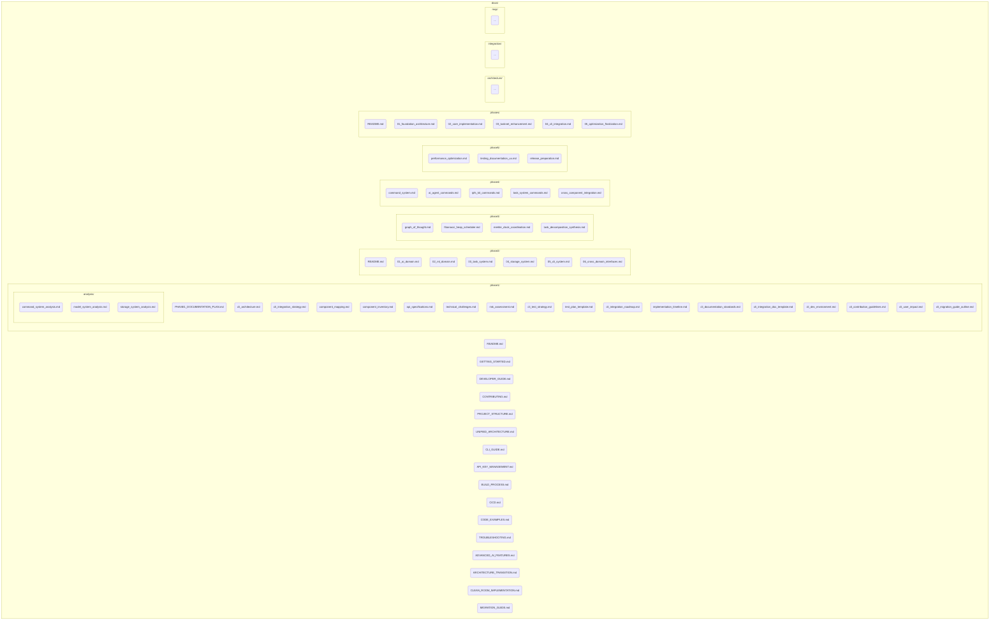
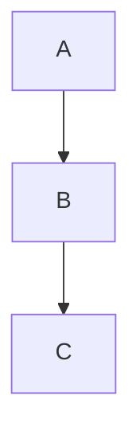

# CLI Documentation Standards

This document establishes standards for creating and maintaining documentation related to the SwissKnife CLI application, including analysis documents, API specifications, command references, and user guides. Adhering to these standards ensures consistency, completeness, and clarity across all project documentation.

## Documentation File Structure

All documentation should be organized within the main `/docs` directory, following a structure similar to this:


*   Top-level documents cover overall project aspects (README, Getting Started, Architecture, Guides).
*   Phase-specific documents reside in `phaseX/` directories.
*   Detailed analysis documents go into `phase1/analysis/`.
*   Future command-specific documentation could go into `docs/commands/`.
*   Specific architectural deep-dives can go into `docs/architecture/`.

## Document Templates

The following templates should be used as a starting point for common documentation types to ensure consistency.

### 1. Component Analysis Template (`docs/phase1/analysis/`)

*Purpose: To provide an in-depth analysis of a specific component being considered for integration.*

```markdown
# [Component Name] Analysis

## 1. Component Overview
### 1.1 Purpose and Functionality
[Brief description of the component's purpose and key functionalities.]
### 1.2 Source Repository Information
[Table with Source Repo, Path, Key Files, LOC, Last Update]
### 1.3 Current Usage
[How the component is used in its original context.]

## 2. Technical Architecture
### 2.1 Component Structure
[Diagram (Mermaid preferred) or file tree showing internal structure.]
### 2.2 Key Classes and Interfaces
[Code snippets (TypeScript interfaces/class signatures) with explanations.]
### 2.3 Workflow and Control Flow
[Numbered list or diagram explaining the typical execution flow.]
### 2.4 Data Flow Diagram
[Diagram (Mermaid preferred) showing data movement.]

## 3. Dependencies Analysis
### 3.1 Internal Dependencies
[Table listing dependencies on other *internal* components within the source project.]
### 3.2 External Dependencies
[Table listing external libraries/packages used, including version, purpose, Node.js compatibility, and potential alternatives.]
### 3.3 Dependency Graph
[Diagram (Mermaid preferred) showing dependencies.]

## 4. Node.js Compatibility Assessment
### 4.1 Compatibility Overview
[Table summarizing compatibility aspects (Runtime APIs, Dependencies, Filesystem, Async, Platform Specifics).]
### 4.2 Compatibility Issues
[List specific issues (e.g., reliance on browser APIs, path handling) and proposed solutions for Node.js.]
### 4.3 Performance Considerations
[Table listing key operations, their expected performance characteristics, and potential optimization opportunities in Node.js.]

## 5. CLI Adaptation Requirements
### 5.1 Interface Modifications
[Table comparing current interfaces to required changes for CLI integration.]
### 5.2 New CLI Commands (If Applicable)
[List any new CLI commands needed specifically related to this component.]
### 5.3 Terminal UI Considerations
[Describe necessary TUI enhancements (progress, tables, prompts) with examples.]

## 6. Integration Challenges
### 6.1 Identified Challenges
[List specific challenges (technical, architectural) for integrating this component, including impact and proposed solutions.]
### 6.2 Technical Debt (In Source)
[Identify existing technical debt in the source component that might affect integration.]
### 6.3 Integration Risks
[Assess risks related to integrating this specific component (Probability, Impact, Mitigation).]

## 7. Testing Requirements
### 7.1 Test Coverage Needs
[Table outlining target test coverage for this component.]
### 7.2 Test Implementation Strategy
[Describe specific unit, integration, E2E tests needed. Include code snippets.]
### 7.3 Test Environment Needs
[List specific environment requirements for testing this component.]

## 8. Documentation Requirements
### 8.1 User Documentation
[Outline necessary updates or additions to user guides related to this component.]
### 8.2 Developer Documentation
[Outline necessary internal documentation (API docs, architecture updates).]

## 9. Integration Recommendations
### 9.1 Integration Approach
[Summarize the recommended step-by-step approach for integrating this component.]
### 9.2 Recommended Modifications
[Highlight key code modifications or patterns needed during integration.]
### 9.3 Integration Sequence
[Place this component within the overall project integration sequence.]

## 10. Conclusion
### 10.1 Key Findings
[Summarize the main conclusions from the analysis.]
### 10.2 Recommendations Summary
[Bulleted list of key recommendations for integration.]
### 10.3 Next Steps
[List immediate next actions based on this analysis.]
```

### 2. Command Documentation Template (`docs/commands/` or Auto-Generated)

*Purpose: To document the usage, options, and examples for a specific user-facing CLI command. Note: Parts of this may be auto-generated from code definitions using the CLI framework.*

```markdown
# `swissknife [command-name]`

[Brief, user-focused description of what the command does.]

## Usage

```bash
# Basic syntax
swissknife [command-name] [subcommand?] [arguments...] [options...]
```

## Description

[More detailed explanation of the command's functionality, purpose, and key concepts involved.]

## Arguments (If Applicable)

| Argument | Description | Required |
|----------|-------------|----------|
| `<arg1>` | [Description of required positional argument] | Yes |
| `[arg2]` | [Description of optional positional argument] | No |

## Options

| Option | Alias | Type | Description | Default |
|--------|-------|------|-------------|---------|
| `--option1` | `-o` | `[string|number|boolean]` | [Description] | `[Default value]` |
| `--required-option` | `-r` | `[string|number|boolean]` | [Description] (Required) | `N/A` |
| `--flag` | `-f` | `boolean` | [Description of boolean flag] | `false` |

## Subcommands (If Applicable)

*   **`[subcommand1] [args...] [options...]`**: [Brief description]. See `swissknife [command-name] [subcommand1] --help`.
*   **`[subcommand2] [args...] [options...]`**: [Brief description]. See `swissknife [command-name] [subcommand2] --help`.

*(Use separate files or sections for detailed subcommand documentation if complex)*

## Examples

```bash
# Example 1: Basic usage
$ swissknife [command-name] <required-arg> --option1 value

# Example 2: Using a flag
$ swissknife [command-name] <required-arg> --flag

# Example 3: Using a subcommand
$ swissknife [command-name] [subcommand1] --sub-option value
```

## Notes

[Additional information, caveats, common pitfalls, or important notes for users.]

## Related Commands

- [`swissknife [related-command1]`](./[related-command1].md): [Brief description of relation]
- [`swissknife [related-command2]`](./[related-command2].md): [Brief description of relation]
```

### 3. Implementation Document Template (`docs/architecture/` or similar)

*Purpose: To document the internal design, architecture, and API of a specific implemented component or service.*

```markdown
# [Component/Service Name] Implementation Details

## 1. Overview
[Brief description of the component's role and responsibilities within the SwissKnife architecture.]

## 2. Architecture
[High-level description of the internal architecture. Use Mermaid diagrams (sequence, class, state) where helpful to illustrate structure and flow.]



## 3. API Reference (Key Interfaces/Classes)

[Use TSDoc comments in the source code (`*.ts`) as the primary source for detailed API documentation. This section provides a high-level overview of the most important public interfaces.]

### Interfaces

#### `[InterfaceName]`
[Brief description of the interface's purpose.]
```typescript
// Key methods or properties (refer to source for full details)
interface [InterfaceName] {
  /** Description of method1 */
  method1(param: Type): Promise<ResultType>;
  /** Description of property1 */
  readonly property1: string;
}
```

### Classes

#### `[ClassName]`
[Brief description of the class's purpose and key responsibilities.]
```typescript
// Key public methods (refer to source for full details)
class [ClassName] {
  constructor(deps: Dependencies);
  /** Description of publicMethod1 */
  public async publicMethod1(input: Input): Promise<Output>;
}
```
*(**Note:** Detailed method/parameter documentation should be in TSDoc comments in the source code.)*

## 4. Configuration
[Describe any configuration options specific to this component, how they are accessed (e.g., via `ConfigManager`), and their effect. Reference the main configuration schema if applicable.]

## 5. Error Handling
[Describe specific error types (`SwissKnifeError` subclasses) thrown by this component and common failure scenarios.]

## 6. Key Implementation Details / Logic Flow
[Explain any particularly complex algorithms, state management, or interaction patterns within the component.]

## 7. Testing Strategy
[Briefly mention the primary testing approaches used for this component (unit, integration) and link to the relevant test files (`test/unit/...`, `test/integration/...`).]

## 8. Future Considerations / TODOs
[List any known limitations, planned improvements, or areas needing future refactoring related to this component.]
```

## Documentation Style Guidelines

### 1. General Style

- Use clear, concise language suitable for the target audience (users or developers).
- Write in present tense (e.g., "The command returns" not "The command will return").
- Use active voice where possible.
- Define acronyms and technical terms on first use (or link to the Glossary).
- Use consistent terminology as defined in the Project Glossary (see below).
- Format code snippets, commands, and file paths appropriately.

### 2. Markdown Formatting

- Use ATX-style headings with a space after the `#` characters (e.g., `## Heading 2`).
- Use fenced code blocks with language specifiers (e.g., ```typescript, ```bash, ```json).
- Use unordered lists with `-` or `*` for list items.
- Use ordered lists with `1.`, `2.`, etc. for sequential steps.
- Use standard Markdown tables for structured data.
- Use *italics* for emphasis and **bold** for strong emphasis or UI elements.
- Use `code` formatting for code elements (variables, functions, types), commands, file paths, keys, and literal values.

### 3. Command Documentation

- Begin with a clear, concise description of the command's purpose.
- Document all options, including type, default value, and whether required. Use the standard table format.
- Document all subcommands with their options, either inline or linking to separate files/sections.
- Provide practical, realistic examples in `bash` format.
- Document common exit codes and error messages.
- Include links to related commands when appropriate.

### 4. API Documentation (TSDoc)

- **Primary Source:** Use TSDoc comments (`/** ... */`) directly in the TypeScript source code (`.ts` files) for all exported classes, interfaces, functions, types, and significant properties/methods.
- **Content:** TSDoc comments should include:
    - Clear description of the element's purpose.
    - `@param` tags for all parameters with descriptions.
    - `@returns` tag describing the return value.
    - `@throws` tag for documented exceptions.
    - `@example` tags with usage snippets where helpful.
    - `@see` tags to link to related elements or documentation.
    - `@deprecated` tag if applicable, with migration notes.
- **Generation:** Use tools like TypeDoc to automatically generate HTML or Markdown API reference documentation from TSDoc comments. Link this generated documentation from relevant places (e.g., `DEVELOPER_GUIDE.md`).
- **Markdown Overviews:** High-level implementation documents (Template #3) should provide architectural context and link to the generated API reference for full details, rather than duplicating extensive API descriptions.

### 5. Code Examples

- Provide complete, working examples where possible.
- Include necessary imports and setup context.
- Add comments within examples to explain key steps or concepts.
- Ensure examples follow project coding standards (linting, formatting).
- Test examples periodically to ensure they remain accurate.

## CLI Command Output Examples

Include standardized examples of CLI command output:

### Success Output (Informative)

```
✅ Operation completed successfully.
   - Files processed: 10
   - Output saved to: /path/to/output.json
```

### Error Output (User-Friendly)

```
❌ Error: Failed to connect to IPFS server.
   Code: NETWORK_ERROR
   Details: Connection refused at http://127.0.0.1:5001.
   Suggestion: Ensure the IPFS daemon or IPFS Kit MCP Server is running and accessible at the configured URL. Check configuration using 'swissknife config get storage.ipfs.apiUrl'.
```

### Progress Output (Spinner)

```
⠋ Processing item 5...
```
*(Uses libraries like `ora`)*

### Progress Output (Bar)

```
Processing: [████████████████████████--------------------] 60% | ETA: 15s | 60/100
```
*(Uses libraries like `cli-progress`)*

## Command Syntax Notation

Use standard command-line syntax notation:

- `command`: Required literal command or subcommand.
- `<parameter>`: Required parameter value (user-supplied). Use descriptive names (e.g., `<file-path>`, `<model-id>`).
- `[parameter]`: Optional parameter value.
- `--option`: A named option/flag with a double hyphen prefix.
- `-o`: A short, single-character option/flag alias with a single hyphen prefix.
- `--option=<value>` or `--option <value>`: An option that requires a value.
- `--option[=<value>]` or `--option [value]`: An option with an optional value.
- `item1 | item2`: Mutually exclusive choices (choose one).
- `...`: Indicates that the preceding item can be repeated.

## Term Glossary

Maintain a consistent glossary of key terms used throughout the project documentation.

- **Agent (AI Agent)**: The core component (`src/ai/agent/`) responsible for processing user requests, interacting with models, and using tools.
- **API Key Manager**: Service (`src/auth/api-key-manager.ts`) responsible for securely storing and retrieving API keys.
- **Backend (Storage)**: A specific implementation providing storage capabilities (e.g., `FilesystemBackend`, `IPFSBackend`) within the Storage Service.
- **CLI**: Command-Line Interface; the primary user interaction method for SwissKnife (`src/cli/`, `src/commands/`).
- **Command**: A user-invokable action in the CLI (e.g., `swissknife agent chat`). Can have subcommands. Defined in `src/commands/`.
- **Component**: A logical unit of functionality within the architecture (e.g., Storage System, Model System). Often maps to a top-level directory in `src/`.
- **Configuration Manager**: Service (`src/config/manager.ts`) that loads, manages, and provides access to application settings.
- **Context (Execution Context)**: An object (`src/cli/context.ts`) passed to command handlers providing access to arguments, configuration, and services.
- **GoT (Graph-of-Thought)**: A reasoning structure (`src/graph/`) used by the Task System for complex problem-solving.
- **IPFS (InterPlanetary File System)**: Content-addressable, peer-to-peer storage network. Accessed via `IPFSClient`.
- **IPFS Client**: Internal client (`src/storage/ipfs/ipfs-client.ts`) used by the `IPFSBackend` to communicate with an external IPFS HTTP API (like the IPFS Kit MCP Server or Kubo).
- **Mapping Store (IPFS)**: Internal mechanism used by the `IPFSBackend` to map virtual paths to CIDs. Needs a persistent Node.js implementation.
- **MCP (Model Context Protocol)**: A protocol for communication between AI models/agents and external tools/resources. Managed via `src/mcp/` and potentially the `@modelcontextprotocol/sdk`.
- **Milestone**: A significant point or deliverable in the project timeline.
- **Model**: An AI model (e.g., LLM, embedding model) used for generation or analysis. Managed by the Model Service.
- **Model Provider**: An implementation (`src/ai/models/providers/`) that interacts with a specific source of AI models (e.g., OpenAI API, local runtime).
- **Model Registry**: Service (`src/ai/models/registry.ts`) for discovering and managing available models and providers.
- **Mount Point (Storage)**: A virtual path prefix (e.g., `/ipfs`) mapped to a specific storage backend in the `StorageRegistry`.
- **Option / Flag**: A modifier specified on the command line (e.g., `--verbose`, `-f <file>`) to alter command behavior.
- **Output Formatter**: Service (`src/cli/formatter.ts`) responsible for presenting output to the user in various formats (text, JSON, table, errors, progress).
- **Parameter / Argument**: A value required by or passed to a command, option, or tool.
- **Service**: A distinct functional unit within the architecture, often implemented as a class and accessible via the Execution Context (e.g., `AgentService`, `StorageOperations`). Can also refer to long-running background processes managed by `src/services/`.
- **Storage Operations / VFS**: The high-level API (`src/storage/operations.ts`) providing a unified interface over different storage backends.
- **Task**: A unit of work managed by the Task System (`src/tasks/`), potentially executed by workers.
- **TaskNet**: The enhanced task processing system including GoT, scheduling, decomposition, etc. (`src/tasks/`, `src/graph/`).
- **Tool**: A capability (`src/ai/tools/`) invokable by the AI Agent (or directly) to interact with external systems or perform specific actions.
- **Worker (Worker Thread)**: A Node.js `worker_thread` used for parallel execution of tasks locally, managed by `src/tasks/workers/`.

## Documentation Testing

All documentation should be tested for:

1. **Accuracy**: Verify all commands, options, and examples work as described. Check API signatures match code.
2. **Completeness**: Ensure all user-facing commands, options, configuration settings, and key behaviors are documented.
3. **Clarity**: Ensure documentation is clear, unambiguous, and understandable for the target audience.
4. **Consistency**: Ensure terminology, formatting, and style are consistent across all documents.
5. **Links**: Verify all internal (`./*.md`) and external (`http://...`) links work correctly.

## Command Reference Standards

The command reference documentation (whether manually written in `docs/commands/` or auto-generated) should follow these standards:

1. **Completeness**: Document all commands, subcommands, arguments, and options.
2. **Consistency**: Use consistent formatting (Usage, Description, Arguments, Options, Examples sections).
3. **Examples**: Include practical, copy-pasteable examples for common use cases.
4. **Organization**: Organize commands logically (e.g., by noun: `agent`, `config`, `storage`).
5. **Index/Discoverability**: Provide an easy way to find commands (e.g., a top-level index, clear help messages).

## Version Information

Documentation should ideally include version information, especially for user-facing guides:

1. **Document Version (Optional):** Version of the documentation itself if tracked separately.
2. **Compatible Software Version:** Indicate the version(s) of SwissKnife the documentation applies to (e.g., in the README or main index).
3. **Last Updated:** Use Git history to track updates. Consider adding a "Last Reviewed" date for key documents.
4. **Contributors:** Managed via Git history.

## Translation Guidelines

*(Future Consideration)* For future internationalization:

1. **String Extraction**: Mark all user-facing strings for translation (consider i18n libraries).
2. **Cultural Considerations**: Be aware of cultural differences and avoid idioms.
3. **Text Expansion**: Allow for text expansion in translated versions in UI layouts.
4. **Date and Time Formats**: Use locale-aware formatting or ISO standards.
5. **Directional Text**: Consider right-to-left language support if needed.

## Documentation Review Process

All significant documentation changes should go through a review process:

1. **Self-Review**: Author reviews for completeness, clarity, and accuracy against the code/feature.
2. **Peer Review:** Another developer or team member reviews for technical accuracy and clarity.
3. **(Optional) QA Review:** QA reviews user-facing documentation for usability and correctness against tested behavior.
4. **(Optional) Editorial Review:** Review for style, grammar, and consistency (can be part of peer review).
5. **Approval:** Merge PR upon satisfactory review.

## Documentation Maintenance

Documentation maintenance responsibilities:

1. **Ownership**: The developer implementing or changing a feature is primarily responsible for updating the relevant documentation in the same PR.
2. **Update Frequency**: Documentation should be updated alongside code changes affecting user behavior, APIs, or architecture.
3. **Review Cycle**: Periodically review key documents (e.g., Getting Started, Architecture) to ensure they remain accurate and relevant (e.g., quarterly or before major releases).
4. **Deprecation**: Clearly mark deprecated features/commands/options in documentation using `@deprecated` tags (TSDoc) or specific sections, providing migration paths.
5. **Archiving**: Use Git tags/branches to preserve documentation corresponding to previous releases.

## Conclusion

These documentation standards ensure that all SwissKnife CLI documentation is consistent, complete, and clear. By following these standards, we create a professional, usable documentation set that enhances the value of the SwissKnife CLI tool for both users and developers.

All documentation should be committed to version control alongside code, and documentation changes should be included in the same pull requests as code changes when practical.
