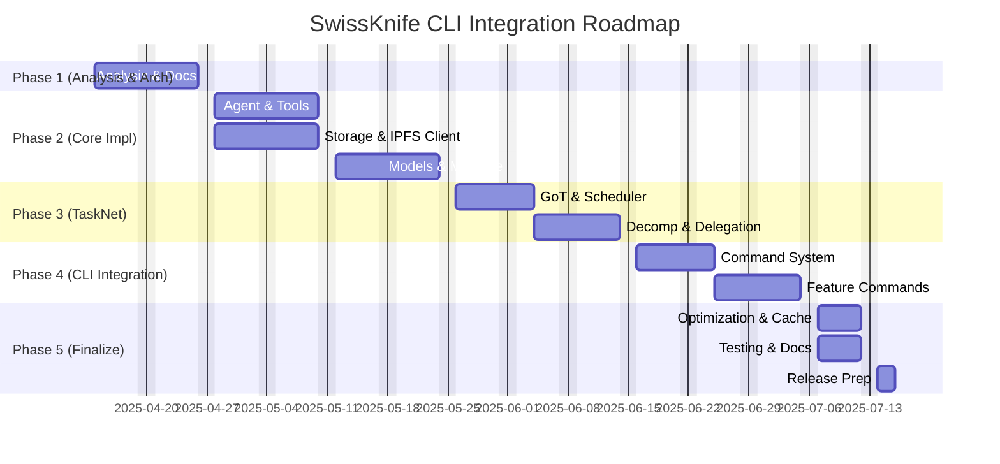

# CLI Integration Roadmap

This document provides a high-level strategic overview and timeline for the entire SwissKnife integration project, encompassing the reimplementation of Goose features in TypeScript, integration with the IPFS Kit MCP Server, and the incorporation of TaskNet enhancements into a unified CLI architecture. It outlines the major phases, key milestones, and guiding principles for the development effort.

## Strategic Objectives

The CLI integration effort is guided by the following strategic objectives:

1. **Clean Room TypeScript Implementation**: Independently implement required functionality in TypeScript, based on understanding the *behavior* of source components, not direct code translation. Ensures an idiomatic, maintainable codebase free from source code licensing constraints. (See [../CLEAN_ROOM_IMPLEMENTATION.md](../CLEAN_ROOM_IMPLEMENTATION.md)).
2. **Tight Internal Coupling**: Design core SwissKnife components (Agent, Task System, etc.) to integrate closely within the Node.js process for efficiency.
3. **Loose External Coupling (IPFS Kit)**: Integrate with the IPFS Kit MCP Server via its defined API, treating it as an external dependency accessed through `IPFSClient`.
4. **Enhanced Task Processing**: Implement advanced TaskNet features (GoT, scheduling, decomposition, delegation) for sophisticated workflow management.
5. **CLI-First & Node.js Native**: Prioritize the command-line user experience and leverage Node.js runtime capabilities, excluding browser-specific APIs.
6. **Performance & Optimization**: Build an efficient, responsive CLI, optimizing critical paths and resource usage (memory, startup time).

## Integration Phases Overview

The integration will proceed through five major phases, each building on the previous ones to create a cohesive, powerful CLI application.

### Phase 1: Analysis and TypeScript Architecture Design (Weeks 1-2)

**Focus**: Analyze source components, define the target TypeScript architecture, and plan the integration.

**Key Activities**:
- Analyze source features (`swissknife_old`, `ipfs_accelerate_js/py`) for CLI relevance and reimplementation requirements.
- Design the core TypeScript architecture (services, layers, modules - see `../UNIFIED_ARCHITECTURE.md`).
- Define key TypeScript interfaces (`api_specifications.md`) for major components (Agent, Storage, Task, ModelProvider, etc.).
- Define the interface/client strategy for IPFS Kit MCP Server communication (`IPFSClient`).
- Develop the overall CLI Test Strategy (`cli_test_strategy.md`) and plan template (`test_plan_template.md`).
- Establish coding standards, documentation structure, and project setup (`../CONTRIBUTING.md`, `../PROJECT_STRUCTURE.md`).
- Perform initial risk assessment (`risk_assessment.md`) and technical challenge analysis (`technical_challenges.md`).
- Create component inventory (`component_inventory.md`) and mapping (`component_mapping.md`).

**Major Milestones**:
- Completion of Phase 1 Documentation (Analysis, Architecture, APIs, Strategy, Plan, Risks, Mapping).
- Agreed-upon TypeScript architecture and core interfaces.
- Established project standards and testing framework outline.

**Strategic Value**: This phase establishes the foundation for TypeScript implementation, ensuring a clear path for reimplementing Goose functionality.

### Phase 2: Core Implementation (Weeks 3-6)

**Focus**: Building the foundational TypeScript implementations for core services based on Phase 1 designs. (See `../phases/02_core_implementation.md`)

**Key Activities**:
- Implement the core `Agent` service, including basic reasoning, memory, and tool execution (`ToolExecutor`, `ToolRegistry`).
- Implement essential Tools (e.g., File I/O, Shell execution) using Node.js APIs.
- Implement the `IPFSClient` for interacting with the IPFS Kit MCP Server API.
- Implement the `StorageOperations` service (VFS) with `FilesystemBackend` and basic `IPFSBackend` (using `IPFSClient` and a simple `MappingStore`).
- Implement the `ModelRegistry`, `ModelSelector`, and initial `ModelProvider` adapters (e.g., for OpenAI, Lilypad).
- Implement basic `MLEngine` structure and Node.js runtime integration (e.g., `onnxruntime-node` setup).
- Develop unit and integration tests for these core components.

**Major Milestones**:
- Functional `Agent` capable of basic interaction and tool use.
- Functional `IPFSClient` connecting to the server.
- Functional `StorageOperations` with local and basic IPFS backends.
- Functional `ModelRegistry` and initial provider integration.
- Basic `MLEngine` setup.
- Core component tests passing.

**Strategic Value**: These core components provide the essential functionality in TypeScript that will power the enhanced CLI capabilities.

### Phase 3: TaskNet Enhancement Integration (Weeks 7-9)

**Focus**: Implementing the advanced TaskNet features for complex workflow management. (See `../phases/03_tasknet_enhancement.md`)

**Key Activities**:
- Implement the `GraphOfThought` engine, including node types, processors, and reasoning strategies (`../phase3/graph_of_thought.md`).
- Implement the `FibonacciHeap` scheduler (`TaskScheduler`) and dynamic priority calculation (`../phase3/fibonacci_heap_scheduler.md`).
- Implement the `DecompositionEngine` and `SynthesisEngine` with various strategies (`../phase3/task_decomposition_synthesis.md`).
- Implement the `DependencyManager` for tracking task relationships.
- Implement the local `WorkerPool` using Node.js `worker_threads`.
- Implement the distributed coordination layer (`MerkleClock`, Hamming distance, Libp2p integration via a `NetworkService`) (`../phase3/merkle_clock_coordination.md`).
- Integrate GoT, Decomposition, Scheduling, and Execution/Delegation components.
- Develop unit and integration tests for TaskNet components.

**Major Milestones**:
- Functional Graph-of-Thought engine integrated with Agent/Tasks.
- Functional Task Scheduling and local parallel execution via Worker Pool.
- Functional Task Decomposition and Result Synthesis.
- Initial implementation of distributed task coordination (Merkle Clock, Hamming Distance).
- TaskNet component tests passing.

**Strategic Value**: These enhancements enable sophisticated problem-solving through advanced task decomposition and processing.

### Phase 4: CLI Integration and Command System (Weeks 10-12)

**Focus**: Exposing all implemented backend functionality through a polished and consistent CLI interface. (See `../phases/04_cli_integration.md`)

**Key Activities**:
- Finalize and implement the enhanced Command System (`CommandRegistry`, `CommandParser` using `yargs`/`commander`, `CommandExecutor`, `ExecutionContext`, `HelpGenerator`, `OutputFormatter`) (`../phase4/command_system.md`).
- Implement specific CLI commands for all major features:
    - Agent interaction (`agent chat`, `agent execute`) (`../phase4/ai_agent_commands.md`).
    - Tool management (`tool list`, `tool run`).
    - Storage/VFS operations (`storage mount`, `file list/copy/read/write`, `ipfs add/get/pin`) (`../phase4/ipfs_kit_commands.md`).
    - Task management (`task create/status/list`, `task graph visualize`) (`../phase4/task_system_commands.md`).
    - Model management (`model list/info`).
    - Configuration (`config get/set/list`).
    - Authentication (`auth login/keys` - if implemented).
    - MCP management (`mcp server list/start`).
- Implement interactive features (REPL shell, confirmation prompts).
- Develop E2E tests for CLI commands and workflows.
- Document cross-component integration patterns (`../phase4/cross_component_integration.md`).

**Major Milestones**:
- Fully functional Command System with parsing, help, and output formatting.
- Comprehensive suite of CLI commands covering Agent, Storage, Task, Model, Config features.
- Functional interactive shell (`swissknife shell`).
- E2E tests for key CLI workflows passing.

**Strategic Value**: The command system provides a consistent, intuitive interface for users to access all the system's capabilities.

### Phase 5: Optimization and Finalization (Weeks 13-14)

**Focus**: Performance tuning, comprehensive testing, documentation completion, and release preparation. (See `../phases/05_optimization_finalization.md`)

**Key Activities**:
- Profile application performance (startup, key commands, resource usage) (`../phase5/performance_optimization.md`).
- Optimize critical code paths identified during profiling.
- Implement and refine caching strategies (model responses, storage reads, task results).
- Optimize memory usage.
- Conduct thorough cross-platform testing (Linux, macOS, Windows) for functionality and installation (`../phase5/testing_documentation_ux.md`).
- Complete all user guides, tutorials, command references, and developer documentation.
- Perform final E2E testing and manual QA/exploratory testing.
- Address remaining high-priority bugs.
- Prepare release packaging, installation scripts, and release notes (`../phase5/release_preparation.md`).

**Major Milestones**:
- Performance targets met for key operations.
- Caching mechanisms implemented and validated.
- Successful test execution across all target platforms.
- Complete and reviewed user and developer documentation set.
- Stable Release Candidate build.
- Release artifacts (binaries/installers) and release notes published.

**Strategic Value**: This phase ensures that the TypeScript implementation performs well and meets quality standards before release.

## Capability Evolution

As the integration progresses, SwissKnife's capabilities will evolve as follows:

### Current Capabilities
- Basic command-line interface
- Model selection and execution
- Simple configuration management
- Basic integration capabilities

### Phase 2 Capabilities (Week 6)
- TypeScript AI agent functionality
- Tool execution framework
- IPFS Kit MCP Server communication via `IPFSClient`
- Basic VFS with Local & IPFS backends
- Basic ML acceleration components (`MLEngine`)

### Phase 3 Capabilities (Week 9)
- Graph-of-Thought problem solving
- Sophisticated task scheduling (Fibonacci Heap)
- Dynamic problem decomposition & synthesis
- Local parallel task execution (Worker Pool)
- Initial distributed task delegation (Merkle Clock)

### Phase 4 Capabilities (Week 12)
- Enhanced command interface (`yargs`/`commander`)
- Unified CLI experience with rich output formatting
- Comprehensive Task management commands
- Comprehensive Storage and retrieval commands (VFS/IPFS)
- Configuration and potentially Auth commands

### Final Capabilities (Week 14)
- Optimized TypeScript performance
- Efficient caching mechanisms
- Comprehensive documentation (User, Dev, API)
- Cross-platform compatibility & installers
- Stable, release-ready application

## Integration Strategy Summary

The integration will follow these key strategic principles:

1. **TypeScript-First Development**: Implement all components in TypeScript for tight integration
2. **Interface-Driven Design**: Define clear interfaces before implementation to ensure coherence
3. **Test-Driven Development**: Implement comprehensive tests for each component
4. **Documentation Alongside Code**: Create documentation as components are developed
5. **Performance-Conscious Implementation**: Optimize TypeScript code for performance where critical

## Component Dependencies (Simplified)

The integration sequence is driven by key dependencies:

```mermaid
graph LR
    Config --> CmdSys(Command System);
    Config --> Storage;
    Config --> Models;

    Storage --> IPFSClient((IPFS Client));

    CmdSys --> Agent;
    CmdSys --> Tools;

    Agent --> Tools;
    Agent --> Models;
    Agent --> Tasks;

    Models --> Storage; # Local models
    Models --> ML;

    Tasks --> Agent; # GoT nodes
    Tasks --> Storage;
    Tasks --> Workers;

    subgraph Phase 1
        Config; CmdSys(Core); Storage(Core); Models(Registry);
    end
    subgraph Phase 2
        Agent; Tools; IPFSClient; ML(Core); Storage(Backends);
    end
    subgraph Phase 3
        Tasks; Workers;
    end
    subgraph Phase 4
        CmdSys(Full CLI);
    end
```
*This simplified view highlights major dependencies influencing the phase order.*

## Technical Architecture Overview

The target architecture emphasizes modular services accessed via a central execution context, driven by the command layer.

```mermaid
graph TD
    subgraph SwissKnife CLI Application Process
        A[CLI Interface (Commands, Parser, Help)] --> B(Execution Context);

        subgraph Core Services accessible via Context
            C[Agent Service]
            D[Tool Service]
            E[Storage Service (VFS)]
            F[Task Service (Scheduler, Executor, GoT)]
            G[Model Service (Registry, Selector)]
            H[ML Service (Engine)]
            I[Auth Service]
            J[MCP Service (Client/Server Mgmt)]
            K[Config Service (Manager)]
            L[Logging Service / Output Formatter]
        end

        B --> C; B --> D; B --> E; B --> F; B --> G;
        B --> H; B --> I; B --> J; B --> K; B --> L;

        C -- Uses --> D; C -- Uses --> G; C -- Uses --> F;
        E -- Uses --> ExtIPFS((IPFS Kit Client));
        F -- Uses --> E; F -- Uses --> C; F -- Uses --> Workers((Worker Pool)); F -- Uses --> Network((Network Service));
        G -- Uses --> H; G -- Uses --> E;
        H -- Uses --> E;
        I -- Uses --> K;
        J -- Uses --> K;
    end

    style ExtIPFS fill:#ddd, stroke:#333
    style Workers fill:#eee, stroke:#333
    style Network fill:#eee, stroke:#333
```
*The `Execution Context` provides command handlers access to all necessary services.*

## TypeScript Implementation Strategy

The TypeScript implementation will focus on:

1. **Modern TypeScript Patterns**:
   - Type-safe interfaces and generics (`src/types/`)
   - Asynchronous programming with Promises/async-await
   - Functional programming where appropriate (`src/utils/`)
   - Class-based components for core functionality/services

2. **Performance Optimization**:
   - Efficient data structures (Maps, Sets, Fibonacci Heap)
   - Memory management best practices (streaming, avoiding leaks)
   - Lazy loading and computation (dynamic `import()`, lazy service init)
   - Strategic caching (in-memory, filesystem)

3. **Testing Approach**:
   - Unit tests for TypeScript components (Jest)
   - Integration tests for service interaction (Jest, mocks)
   - E2E tests for CLI behavior (`child_process`)
   - Type validation (`tsc --noEmit`)
   - Performance benchmarking (`hyperfine`, custom scripts)

## Success Criteria

The integration will be considered successful when:

1. All required features (based on analysis of sources and new requirements) are implemented in TypeScript.
2. The system adheres to the defined unified architecture and interfaces.
3. IPFS Kit MCP Server is successfully integrated via the `IPFSClient`.
4. TaskNet enhancements (GoT, Scheduler, etc.) provide improved workflow capabilities.
5. Performance (startup, execution time, memory) meets defined targets.
6. Documentation is complete, accurate, and consistent.
7. All automated tests pass across all supported platforms.
8. A stable release candidate is produced.

## Roadmap Visualization (Gantt Chart - Conceptual)


*Note: Durations are indicative based on the plan (14 weeks total); actual dates depend on start date and progress.*

## Risk Management Summary

Key risks identified in `risk_assessment.md` include Node.js compatibility, dependency conflicts, performance, cross-platform issues, incomplete source documentation, and maintaining backward compatibility.

**Primary Mitigation Strategies**:
- **Proactive Analysis:** Thoroughly analyze source components and dependencies *before* integration/reimplementation.
- **Standardized Architecture:** Adhere strictly to the defined TypeScript architecture, interfaces, and coding standards.
- **Comprehensive Testing:** Implement robust unit, integration, E2E, and cross-platform testing throughout the lifecycle.
- **Incremental Integration:** Follow the phased approach, building and testing components incrementally.
- **Clear Documentation:** Maintain up-to-date documentation for architecture, APIs, and user guides.
- **Secure Practices:** Prioritize secure credential handling and input validation.

## Conclusion

This CLI Integration Roadmap provides a strategic overview of the effort to reimplement Goose features in TypeScript, integrate with IPFS Kit MCP Server, and enhance the system with advanced task processing capabilities. By following this roadmap, we will systematically build a powerful, tightly integrated SwissKnife system with sophisticated AI agent functionality.

The phased approach ensures that we build a solid foundation in TypeScript before adding more sophisticated capabilities, resulting in a coherent, high-quality product. Regular assessments will help us stay on track and adapt as needed to changing circumstances or discoveries during the implementation process.
