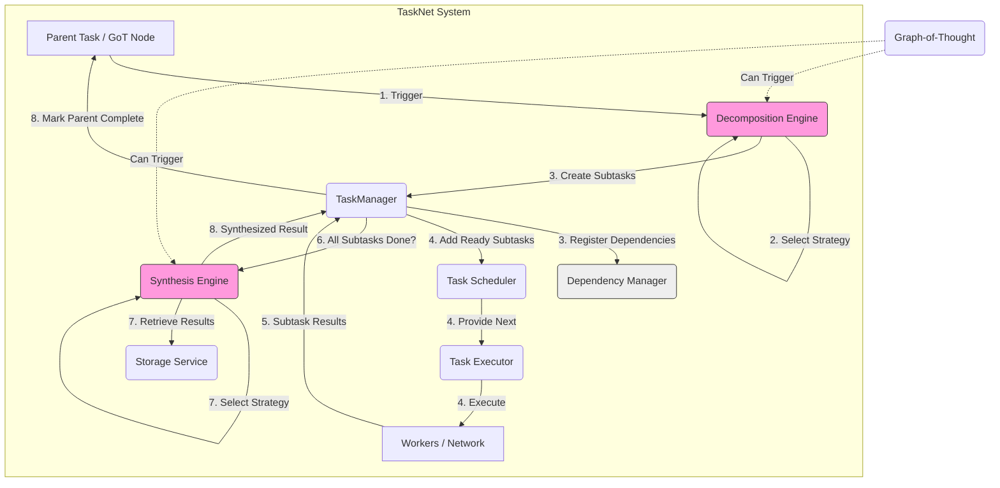

# Phase 3: Task Decomposition & Result Synthesis

**Timeline:** Week 9 of Phase 3

This document outlines the implementation plan and architecture for the Task Decomposition and Result Synthesis components of the enhanced TaskNet system, developed in Phase 3. These capabilities allow SwissKnife to break down complex problems into smaller, executable subtasks and then intelligently combine their results, often working in conjunction with the Graph-of-Thought (GoT) engine.

## Goals

-   Implement a `DecompositionEngine` service capable of applying various strategies to break down a parent `Task` into multiple child `Task` definitions.
-   Implement a `DependencyManager` service to explicitly track dependencies between parent tasks and their generated subtasks.
-   Integrate the `DecompositionEngine` with the `TaskManager` and potentially specific `ThoughtNode` processors (like `DecompositionNodeProcessor`) within the GoT system.
-   Implement a `SynthesisEngine` service capable of applying various strategies to aggregate results from completed subtasks into a single result for the parent task or GoT node.
-   Integrate the `SynthesisEngine` with the `TaskManager` (triggered upon completion of all subtasks) and potentially specific `ThoughtNode` processors (like `SynthesisNodeProcessor`).
-   Define and implement several core decomposition and synthesis strategies (e.g., sequential, parallel, model-based, merge, concatenate).

## Architecture

Decomposition and Synthesis are key parts of the TaskNet workflow, enabling divide-and-conquer approaches.

1.  **Trigger:** A complex `Task` (or a specific `ThoughtNode` like `DecompositionNode`) triggers the `DecompositionEngine`.
2.  **Decomposition:** The `DecompositionEngine` selects a strategy (e.g., based on `task.type` or metadata) and generates definitions for one or more subtasks (`TaskCreationOptions`).
3.  **Registration & Dependencies:** The engine registers these subtasks with the `TaskManager`, explicitly linking them as dependencies of the original parent task via the `DependencyManager`.
4.  **Scheduling & Execution:** The `TaskManager` marks the subtasks as `Pending`. Once their own dependencies (if any) are met, they become `Ready` and are added to the `TaskScheduler`. The `TaskExecutor` eventually runs them (locally or distributed).
5.  **Result Collection:** The `TaskManager` (via `DependencyManager`) tracks the completion of the subtasks associated with the parent task.
6.  **Synthesis Trigger:** Once all required subtasks for the parent task are successfully completed, the `TaskManager` triggers the `SynthesisEngine`.
7.  **Synthesis:** The `SynthesisEngine` retrieves the results of the subtasks (potentially from storage via `StorageOperations`), selects a synthesis strategy, and aggregates them into a final result.
8.  **Completion:** The `SynthesisEngine` reports the final synthesized result back to the `TaskManager`, which then marks the original parent task as `Succeeded`.

## Implementation Details

### 1. Advanced Task Decomposition (`src/tasks/decomposition/`)

-   **`DecompositionEngine` Service (`src/tasks/decomposition/engine.ts`):**
    -   Provides a primary method: `decompose(task: Task, context: ExecutionContext): Promise<{ subtaskOptions: TaskCreationOptions[], parentTaskId: string }>`.
    -   Internally selects a `DecompositionStrategy` based on `task.type` or `task.metadata`.
    -   Calls the selected strategy's `decompose` method.
    -   Returns the list of `TaskCreationOptions` for the subtasks, along with the original parent task ID. The caller (e.g., `TaskManager` or `DecompositionNodeProcessor`) is responsible for actually creating these tasks via `TaskManager.createTask` and linking dependencies via `DependencyManager`.
-   **Decomposition Strategies (`src/tasks/decomposition/strategies/`):**
    -   **Interface:** `interface DecompositionStrategy { decompose(task: Task, context: ExecutionContext): Promise<TaskCreationOptions[]>; }`
    -   **Implementations (Examples):**
        -   `SequentialStrategy`: Takes a predefined list of task types. Creates subtasks where each depends on the previous one. Input for step N+1 might be the output (result CID) of step N.
        -   `ParallelMapStrategy`: Takes an input list (e.g., list of file paths) and a task type. Creates one subtask of that type for each item in the input list. All subtasks can run concurrently.
        -   `RecursiveStrategy`: If the task input meets certain criteria, it creates one or more subtasks of the *same* type with smaller inputs. Requires a base case to stop recursion.
        -   `ModelBasedStrategy`: Calls an LLM (via `AgentService`) with the parent task description, asking it to generate a plan (list of subtasks with descriptions and inputs). Parses the LLM response to create `TaskCreationOptions`.
        -   `GoTBasedStrategy`: (Used within GoT) Creates subtasks corresponding to processing specific `Ready` child nodes in the `ThoughtGraph`.
-   **Subtask Options (`TaskCreationOptions`):** The output of a strategy. Includes `type`, `input`, `priority` (optional, might inherit or be adjusted), and crucially, `dependencies` (usually just the parent task ID initially, or previous step for sequential).

### 2. Dependency Management (`src/tasks/dependencies/manager.ts`)

-   **`DependencyManager` Service (`src/tasks/dependencies/manager.ts`):**
    -   **Data Structures:** Maintains two key maps:
        -   `taskDependencies: Map<string, Set<string>>`: Maps `taskId -> Set<dependencyTaskId>` (tasks this task depends on).
        -   `taskDependents: Map<string, Set<string>>`: Maps `dependencyTaskId -> Set<taskId>` (tasks waiting for this dependency to complete).
    -   **Registration:** `registerDependencies(taskId: string, dependencyIds: string[])`: Called by `TaskManager.createTask` to record dependencies. Populates both maps. Checks for immediate readiness if `dependencyIds` is empty.
    -   **Check & Update Dependents:** `updateDependents(completedTaskId: string): Promise<string[]>`: Called by `TaskManager` when a task completes successfully.
        1.  Finds all dependent tasks using `taskDependents.get(completedTaskId)`.
        2.  For each dependent, checks if *all* its dependencies (using `taskDependencies`) are now met (by querying `TaskManager.getTaskStatus`).
        3.  If a dependent task is now ready, update its status to `Ready` via `TaskManager.updateTaskStatus` and add it to a list of newly ready tasks.
        4.  Returns the list of newly ready task IDs.
    -   **Circular Dependency Check:** Implement detection during `registerDependencies` by performing a graph traversal (e.g., DFS) from the new task following dependency links. If the starting task ID is encountered again, a cycle exists.
    -   **Status Tracking:** Relies on `TaskManager` for the source of truth regarding task completion statuses.
    -   **Readiness Notification:** Achieved by returning the list of ready task IDs from `updateDependents`, which the `TaskManager` then passes to the `TaskScheduler`.

### 3. Integration with Graph-of-Thought (`src/graph/nodes/decomposition_node.ts`, `src/graph/processors/decomposition_processor.ts`)

-   **`DecompositionNode` (`src/graph/nodes/decomposition_node.ts`):** A `ThoughtNode` whose `content` specifies the problem to be decomposed and potentially hints at the strategy.
-   **`DecompositionNodeProcessor` (`src/graph/processors/decomposition_processor.ts`):**
    -   Executed by the `TaskExecutor` when the `DecompositionNode` becomes `Ready`.
    -   Receives the `ExecutionContext`.
    -   Gets the `DecompositionEngine` service: `context.getService<DecompositionEngine>('decomposition')`.
    -   Gets the `TaskManager` service: `context.getService<TaskManager>('taskManager')`.
    -   Gets the `GraphPersistence` service: `context.getService<GraphPersistence>('graphPersistence')`.
    -   Calls `decompositionEngine.decompose(parentNode, context)` to get `subtaskOptions`.
    -   For each `subtaskOption`:
        -   Creates a new child `ThoughtNode` (e.g., `HypothesisNode`, `AnalysisNode`) representing the sub-problem.
        -   Adds the new node and an edge (`parentNode -> childNode`) to the in-memory `ThoughtGraph` via `GraphPersistence` (which handles saving to IPFS).
        -   Creates the actual sub-task via `taskManager.createTask(subtaskOption.type, subtaskOption.input, { dependencies: [parentNode.id], metadata: { relatedNodeId: childNode.id } })`. Links the subtask back to the GoT node it represents.
    -   Updates the `DecompositionNode` status to `CompletedSuccess`.
-   **Result Propagation:** When a subtask created by the `DecompositionNodeProcessor` completes, the `TaskManager` updates its status. The `SynthesisNodeProcessor` (see below) will later query the status/results of these related nodes/tasks.

### 4. Result Synthesis (`src/tasks/synthesis/`)

-   **`SynthesisEngine` Service (`src/tasks/synthesis/engine.ts`):**
    -   Provides a method: `synthesize(parentTask: Task, completedSubtaskResults: TaskResult[], context: ExecutionContext): Promise<any>`.
    -   Triggered by `TaskManager` when all direct dependencies of a task requiring synthesis are `Succeeded`.
    -   Selects a `SynthesisStrategy` based on `parentTask.type` or `parentTask.metadata`.
    -   Retrieves detailed results if needed (e.g., fetching content from IPFS CIDs listed in `completedSubtaskResults` via `StorageOperations`).
    -   Calls the selected strategy's `synthesize` method.
    -   Returns the final aggregated result to the `TaskManager` to be stored in the `parentTask.result`.
-   **Result Collection:** The `TaskManager` provides the `completedSubtaskResults` to the engine. Handling results from distributed executions relies on the `Coordinator` updating the `TaskManager` upon receiving `TaskCompletion` messages. Causal consistency is maintained by the Merkle Clocks used during distribution.
-   **Synthesis Strategies (`src/tasks/synthesis/strategies/`):**
    -   **Interface:** `interface SynthesisStrategy { synthesize(results: TaskResult[], context: ExecutionContext): Promise<any>; }`
    -   **Implementations (Examples):**
        -   `ConcatenateStrategy`: Joins string results from subtasks.
        -   `MergeObjectsStrategy`: Merges properties of JSON object results from subtasks.
        -   `MajorityVoteStrategy`: Selects the most frequent result among subtasks (useful for redundant computations).
        -   `SummarizeStrategy`: Calls an LLM (via `AgentService`) with all subtask results as context, asking it to synthesize a summary.
        -   `SelectBestStrategy`: Uses heuristics or an LLM call to evaluate and select the "best" result from multiple subtask attempts.
-   **Conflict Resolution:** Simple strategies might just merge or concatenate. More complex ones (`ModelBasedStrategy`, `SelectBestStrategy`) can explicitly handle conflicting information during the synthesis process. Confidence scores from subtasks can inform weighting or selection.
-   **Confidence Scoring:** Strategies can optionally compute a confidence score for the synthesized result based on the input results' scores and the aggregation method.

### 5. Integration with GoT (`src/graph/nodes/synthesis_node.ts`, `src/graph/processors/synthesis_processor.ts`)

-   **`SynthesisNode` (`src/graph/nodes/synthesis_node.ts`):** A `ThoughtNode` whose purpose is to aggregate results from its parent nodes. Its `content` might specify the synthesis strategy or goal.
-   **`SynthesisNodeProcessor` (`src/graph/processors/synthesis_processor.ts`):**
    -   Executed by the `TaskExecutor` when the `SynthesisNode` becomes `Ready` (meaning all its parent nodes are `CompletedSuccess`).
    -   Receives the `ExecutionContext`.
    -   Gets the `SynthesisEngine` service: `context.getService<SynthesisEngine>('synthesis')`.
    -   Gets the `GraphPersistence` service: `context.getService<GraphPersistence>('graphPersistence')`.
    -   Retrieves the parent `ThoughtNode`s from the graph (via `GraphPersistence`).
    -   Extracts the `result` data from the parent nodes (potentially fetching from IPFS if results are CIDs).
    -   Calls `synthesisEngine.synthesize(parentNodeResults, context)` to get the aggregated result.
    -   Updates the `SynthesisNode`'s `result` (potentially storing large results to IPFS and saving the CID) via `GraphPersistence`.
    -   Updates the `SynthesisNode` status to `CompletedSuccess`.

## Deliverables

-   Implemented `DecompositionEngine` service with at least `SequentialStrategy` and `ParallelMapStrategy`.
-   Implemented `DependencyManager` service capable of tracking dependencies and identifying ready tasks.
-   Implemented `SynthesisEngine` service with at least `ConcatenateStrategy` and `MergeObjectsStrategy`.
-   Integration of these engines with `TaskManager` (triggering decomposition/synthesis).
-   Integration with GoT via `DecompositionNodeProcessor` and `SynthesisNodeProcessor`.
-   Unit tests for core engine logic and individual strategies.
-   Integration tests verifying the decomposition -> subtask execution -> synthesis workflow for parent tasks.
-   Integration tests verifying GoT nodes triggering decomposition and synthesis.
-   Updated API documentation.
