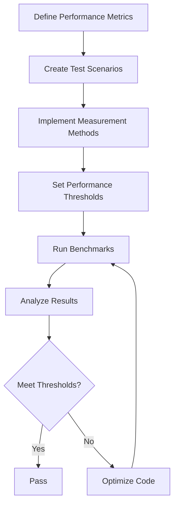

# Performance Benchmarking Framework

This document describes the benchmarking framework implemented for the SwissKnife project, with a particular focus on Phase 5 components. Benchmarking is essential for ensuring the application meets performance requirements and for detecting performance regressions.

## Benchmark Architecture

The benchmark system follows a structured approach to measuring and evaluating performance:



## Performance Metrics

The benchmark system captures several key performance metrics:

1. **Execution Time**: The total time taken to complete an operation
2. **CPU Usage**: The CPU resources consumed during execution
3. **Memory Usage**: The memory footprint during execution
4. **I/O Operations**: The number and duration of file/network operations
5. **Throughput**: The number of operations completed per unit of time

## Benchmark Implementation

### Measurement Utility

The core of the benchmark framework is a simple, accurate measurement utility:

```typescript
async function measureExecutionTime(fn: () => Promise<any>): Promise<number> {
  const startTime = performance.now();
  await fn();
  const endTime = performance.now();
  return endTime - startTime;
}
```

### Benchmark Test Structure

Each benchmark test follows this structure:

```typescript
describe('Component Benchmark', () => {
  beforeEach(() => {
    // Setup test environment, mock dependencies
  });
  
  it('should complete operation within acceptable time threshold', async () => {
    // Act: Measure execution time
    const executionTime = await measureExecutionTime(() => component.operation());
    
    // Assert: Verify performance meets threshold
    expect(executionTime).toBeLessThan(TIME_THRESHOLD);
  });
});
```

## Component Benchmarks

### PerformanceOptimizer Benchmarks

Tests the performance profiling capabilities:

```typescript
describe('PerformanceOptimizer', () => {
  it('should complete optimization within acceptable time threshold', async () => {
    const executionTime = await measureExecutionTime(() => optimizer.optimize());
    expect(executionTime).toBeLessThan(1000); // 1 second threshold
  });
});
```

### ReleasePackager Benchmarks

Tests package generation performance:

```typescript
describe('ReleasePackager', () => {
  it('should complete packaging within acceptable time threshold', async () => {
    const executionTime = await measureExecutionTime(() => packager.createPackages());
    expect(executionTime).toBeLessThan(1000); // 1 second threshold
  });
});
```

### TestRunner Benchmarks

Tests test execution performance:

```typescript
describe('TestRunner', () => {
  it('should complete test execution within acceptable time threshold', async () => {
    const executionTime = await measureExecutionTime(() => testRunner.runAllTests());
    expect(executionTime).toBeLessThan(1000); // 1 second threshold
  });
});
```

### DocumentationGenerator Benchmarks

Tests documentation generation performance:

```typescript
describe('DocumentationGenerator', () => {
  it('should complete documentation generation within acceptable time threshold', async () => {
    const executionTime = await measureExecutionTime(() => docGenerator.generateAllDocs());
    expect(executionTime).toBeLessThan(500); // 500ms threshold
  });
});
```

## Workflow Benchmarks

### End-to-End Release Process

Tests the complete release workflow:

```typescript
describe('End-to-End Release Process', () => {
  it('should complete the full release process within acceptable time threshold', async () => {
    // Define full release process
    const fullReleaseProcess = async () => {
      await optimizer.optimize();
      await testRunner.runAllTests();
      await docGenerator.generateAllDocs();
      await packager.createPackages();
    };
    
    // Measure execution time
    const executionTime = await measureExecutionTime(fullReleaseProcess);
    
    // Assert performance meets threshold
    expect(executionTime).toBeLessThan(2000); // 2 seconds threshold
  });
});
```

## Performance Thresholds

The benchmark system enforces specific performance thresholds:

| Component/Workflow | Operation | Threshold |
|--------------------|-----------|-----------|
| PerformanceOptimizer | optimize() | < 1000ms |
| ReleasePackager | createPackages() | < 1000ms |
| TestRunner | runAllTests() | < 1000ms |
| DocumentationGenerator | generateAllDocs() | < 500ms |
| Release Process | End-to-End | < 2000ms |

## Running Benchmarks

Benchmarks can be executed using:

```bash
# Run all benchmarks
pnpm test:benchmark

# Run specific benchmark file
pnpm jest test/benchmark/phase5.benchmark.ts
```

## Benchmark Environment

For consistent results, benchmarks should be run in:
- A dedicated CI environment with consistent resources
- Multiple times to account for variability
- On the same hardware for comparing results over time

## Performance Regression Detection

The benchmark system can detect performance regressions by:

1. Recording benchmark results in a database or log
2. Comparing current results with historical data
3. Triggering alerts or CI failures when performance degrades

## Best Practices

1. **Isolation**: Ensure benchmarks are isolated from external factors
2. **Mocking**: Mock expensive operations not being measured
3. **Warm-up**: Consider warm-up runs to eliminate cold-start effects
4. **Multiple Runs**: Average multiple runs for more accurate results
5. **Context**: Include system information with benchmark results
6. **Realistic Data**: Use realistic data sizes and operations
7. **Adaptive Thresholds**: Adjust thresholds based on environment capabilities

## Future Enhancements

Potential improvements to the benchmark system:

1. **Historical Data Tracking**: Store benchmark results over time
2. **Visualization**: Create graphs of performance trends
3. **Automated Reports**: Generate performance reports in CI
4. **Profiling Integration**: Include CPU/memory profiling data
5. **Environment Normalization**: Account for different hardware capabilities
