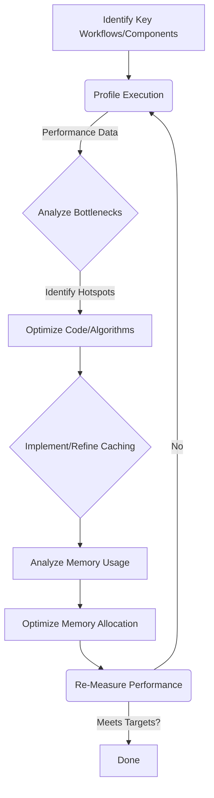

# Phase 5: Performance Optimization

**Timeline:** Week 13 of Phase 5

This document outlines the plan for the performance optimization activities conducted during Phase 5 of the SwissKnife project. The primary goal is to ensure the integrated CLI application is responsive, efficient, and resource-conscious by identifying and addressing performance bottlenecks across critical components and workflows.

## Goals

-   **Identify Bottlenecks:** Systematically profile key user workflows and component interactions (Agent, Storage, Tasks, CLI startup) to pinpoint performance hotspots (CPU, memory, I/O, network latency).
-   **Optimize Critical Paths:** Refactor code, improve algorithms, and apply optimization techniques to the identified bottlenecks to meet defined performance targets.
-   **Implement Caching:** Introduce or refine caching mechanisms (in-memory, disk) at appropriate layers (e.g., IPFS block cache, model response cache, task result cache) to reduce latency and redundant work.
-   **Memory Management:** Analyze heap usage, identify potential leaks, and optimize data structures and processing patterns (e.g., streaming) to minimize memory footprint.
-   **Establish Benchmarks:** Create repeatable performance benchmark tests for key operations to track regressions in CI.

## Architecture & Approach

Performance optimization is an iterative process involving profiling, analysis, code changes, and re-measurement.

## Implementation Details

### 1. Performance Profiling (`Week 13, Day 1-2`)

-   **Tools:**
    -   **CPU Profiling:** Node.js built-in profiler (`node --prof > prof.log && node --prof-process prof.log > prof.txt`) or Chrome DevTools Inspector (`node --inspect-brk src/cli.ts ...`). Focus on identifying functions with high self-time or total-time.
    -   **Memory Profiling:** Chrome DevTools Inspector (Memory tab for heap snapshots, allocation timelines) or standalone tools like `heapdump`. Look for large retained objects, potential leaks (objects not being garbage collected).
    -   **Benchmarking:** Libraries like `benny` or `benchmark.js` for micro-benchmarks of specific functions/algorithms. Custom scripts using `process.hrtime()` for macro-benchmarks of CLI commands or workflows (e.g., the `executeTimedCommand` helper from testing).
    -   **Tracing/Logging:** Use `debug` library namespaces with timing information or dedicated tracing libraries (like OpenTelemetry, though might be overkill) to measure time spent in different services during a request/workflow.
-   **Key Areas & Metrics:**
    -   **CLI Startup:** Time from command invocation to prompt display (REPL) or start of execution (non-interactive). Target: `< 500ms`.
    -   **Command Parsing/Execution Overhead:** Time spent *before* core service logic begins. Target: Minimal (< 50ms).
    -   **Agent `processMessage`:** Total time, time spent in model API calls, time spent in tool execution. Target: Minimize overhead outside API/tool calls.
    -   **IPFS Client Operations:** Latency for `add`, `get`, `pin`, `ls`. Differentiate network time vs. client-side processing time. Target: Minimize client overhead; network time is external.
    -   **Storage Operations (VFS):** Time for `readFile`, `writeFile`, `readdir` on different backends (local vs. IPFS). Target: Local ops should be fast (I/O bound); IPFS ops dominated by network/client latency.
    -   **Task Scheduling:** Amortized time for `insert`, `extractMin`, `decreaseKey` in `FibonacciHeap`. Target: Close to theoretical O(1)/O(log n).
    -   **GoT Processing:** Time per node processing step, IPLD serialization/deserialization overhead. Target: Minimize framework overhead.
    -   **Memory Usage:** Peak heap usage during common workflows (e.g., processing large files, complex GoT graphs, loading large models). Target: Avoid excessive usage; stay within reasonable limits for target environments. Check for memory leaks over repeated operations.
-   **Methodology:**
    -   Define specific, repeatable benchmark scenarios (e.g., "Add 100MB file via `ipfs add`", "Run `agent execute` with 10k token context", "Schedule and execute 1000 simple tasks").
    -   Run profiling tools (CPU, Memory) during these benchmark scenarios.
    -   Analyze profiling results (flame graphs, heap snapshots, allocation timelines) to identify specific functions, code paths, or object allocations causing bottlenecks.
    -   Use timing logs/traces to understand latency distribution across different services in a workflow.

### 2. Critical Path Optimization (`Week 13, Day 2-4`)

-   **Analysis:** Systematically analyze profiling data. Look for:
    -   Functions consuming high % CPU time.
    -   Long delays in asynchronous operations (I/O, network).
    -   Frequent or large memory allocations/GC pauses.
    -   Inefficient loops or data structure operations.
-   **Optimization Techniques (Examples):**
    -   **Algorithmic:**
        -   Replace linear searches with map lookups (O(n) -> O(1)).
        -   Optimize graph traversal algorithms in GoT or Dependency Manager.
        -   Ensure Fibonacci Heap internal operations (`consolidate`, `cut`) are implemented correctly for theoretical efficiency.
    -   **I/O & Network:**
        -   Use streaming APIs (`NodeJS.ReadableStream`, `NodeJS.WritableStream`) for large file I/O (Storage) and network requests (`IPFSKitClient`).
        -   Batch API calls where possible (e.g., `ipfs pin add` multiple CIDs).
        -   Use efficient serialization (CBOR for IPLD/network messages).
    -   **Asynchronous Patterns:**
        -   Avoid `await` inside loops where operations can run concurrently; use `Promise.all` carefully.
        -   Ensure no synchronous I/O or CPU-intensive work blocks the Node.js event loop. Offload CPU work to worker threads if necessary (e.g., complex calculations, potentially token counting).
    -   **Data Structures:** Use `Map` and `Set` where appropriate for faster lookups compared to arrays or plain objects. Choose appropriate cache data structures (LRU).
    -   **Code Tuning:** Reduce redundant computations, memoize expensive function calls, optimize string manipulations.
    -   **Dependencies:** Profile third-party library usage; consider lighter alternatives if a dependency is a bottleneck.
-   **Specific Component Targets:**
    -   **CLI Startup:** Analyze `require`/`import` graph. Defer loading of non-essential modules/services using dynamic `import()`.
    -   **Agent:** Optimize prompt construction, context management, and tool validation logic.
    -   **IPFS Client:** Ensure efficient streaming and request handling. Implement connection pooling if applicable.
    -   **Task System:** Verify Fibonacci Heap performance matches expectations. Optimize `calculatePriority` function. Minimize overhead in `TaskManager` state updates.
    -   **GoT Engine:** Optimize node retrieval (caching), graph traversal, and IPLD serialization/deserialization (potentially using more performant CBOR libraries).

### 3. Caching Implementation & Refinement (`Week 13, Day 3-5`)

-   **Identify Caching Opportunities:** Based on profiling and workflow analysis, identify operations that are slow and whose results are likely to be reused with the same inputs.
    -   **Model Responses:** Caching LLM completions. Key must include model ID, full prompt/messages, key generation parameters (temp, max_tokens). High potential benefit, but requires careful key generation.
    -   **IPFS Blocks/DAGs:** Caching raw blocks retrieved via `getContent` or `dagGet`. Key is the CID. High benefit for frequently accessed data.
    -   **Task Results:** Caching the output of successfully completed tasks. Key could be a hash of `task.type` + `task.input`. Useful for deterministic tasks.
    -   **Configuration:** `ConfigurationManager` should cache the merged configuration after loading.
    -   **Resolved Paths/CIDs:** `PathResolver` or `IPFSBackend` could cache resolved CIDs for virtual paths or IPNS names.
    -   **Token Counts:** Cache results from `tiktoken` or provider APIs.
-   **Cache Implementation Strategies:**
    -   **In-Memory (LRU):** Use `lru-cache` for frequently accessed, small-to-medium sized data within a single process (e.g., token counts, resolved paths, small model responses, recently accessed IPFS blocks). Configure size/age limits via `ConfigurationManager`.
    -   **Disk Cache (Filesystem):** Implement a persistent disk cache for larger items (e.g., IPFS blocks, task results, potentially larger model responses). Store files in a dedicated cache directory (`SWISSKNIFE_CACHE_DIR`). Use content hashes (like the CID itself for IPFS blocks) or hashes of cache keys as filenames for efficient lookup and organization. Implement eviction based on total size or age.
    -   **Negative Caching:** Store temporary markers for failed operations (e.g., "CID not found", "API timeout") for a short TTL (e.g., 30 seconds) to prevent immediate retries hammering a failing resource.
-   **Implementation Location:** Integrate caching within the relevant service:
    -   `IPFSKitClient` or a wrapper service: Implement IPFS block caching (memory + disk).
    -   `ModelExecutor` or `AgentService`: Implement model response caching (memory, potentially disk). Needs careful consideration of context sensitivity.
    -   `TaskManager`: Implement task result caching (disk).
    -   `ConfigurationManager`: Caches loaded config internally.
-   **Cache Invalidation:**
    -   **Immutable Data (IPFS):** Primarily rely on TTL or LRU eviction. Invalidation is generally not needed unless the underlying block becomes unavailable.
    -   **Mutable Data / Config:** Requires explicit invalidation or short TTLs if the underlying source can change. Configuration might be reloaded on signal or specific command.
    -   **Model Responses:** Complex. Depends on whether the same prompt + settings should *always* yield the same result. May need user-configurable cache duration or manual clearing (`swissknife cache clear --model`).
    -   **Task Results:** Generally safe to cache based on input hash for deterministic tasks. Non-deterministic tasks should not be cached.

### 4. Memory Management (`Week 13, Day 4-5`)

-   **Analysis Tools:**
    -   **Heap Snapshots:** Use Chrome DevTools Inspector (`--inspect`) connected to the Node.js process. Take snapshots before, during, and after key workflows. Compare snapshots to identify detached objects (potential leaks) or objects consuming large amounts of memory. Analyze retainer paths.
    -   **Allocation Timelines/Profiling:** Use DevTools Memory tab to record allocation timelines and identify functions allocating excessive memory.
    -   **`process.memoryUsage()`:** Programmatically log `heapUsed`, `heapTotal`, `rss` at different points to track overall usage.
-   **Optimization Techniques:**
    -   **Streaming:** **Crucial.** Ensure all large file I/O (local FS, IPFS add/get) and potentially large network responses use Node.js streams (`ReadableStream`, `WritableStream`, `pipeline`). Avoid reading entire large files/responses into memory (`Buffer`).
    -   **Data Structure Choice:** Use memory-efficient structures where applicable (e.g., TypedArrays instead of regular Arrays for numerical data, Sets/Maps for lookups). Be mindful of the overhead of complex objects.
    -   **Object Pooling (Use Sparingly):** Consider pooling for very frequently created/destroyed objects in performance-critical loops, but often modern JS engines handle object allocation efficiently. Profile first.
    -   **Closure Scope:** Be mindful of closures retaining large objects unnecessarily, preventing garbage collection.
    -   **Explicit `null`:** Set references to large objects (e.g., large buffers, complex data structures) to `null` when they are definitively no longer needed, especially in long-running processes or loops, to potentially help the garbage collector.
    -   **Buffer Handling:** Slice buffers (`Buffer.slice()`) without copying when possible if only parts are needed temporarily. Be aware that slices share memory with the original buffer until the original is GC'd. Use `Buffer.from(otherBuffer)` for explicit copies.
    -   **Dependency Size:** Analyze bundle size (if bundling for distribution) or `node_modules` size. Large dependencies increase startup time and memory footprint. Consider lighter alternatives if feasible.

## Performance Targets (Examples - To be refined)

*These are initial targets and should be validated and refined based on profiling and user expectations.*

-   **CLI Startup Time:** Time from invocation to readiness (e.g., prompt display). Target: **< 500ms** (ideally < 300ms).
-   **`agent execute` (Simple Prompt, Cached/Fast Model):** End-to-end time excluding model inference/API latency. Target: **< 150ms**.
-   **`ipfs add` (10MB local file):** Time to return CID (excluding network transfer time if possible to isolate). Target: **< 1s** (highly dependent on disk speed).
-   **`ipfs get` (10MB file, cached block):** Time from command start to first byte received (if streaming) or file written. Target: **< 100ms** (primarily disk/cache speed).
-   **`storage list /local/...` (100 entries):** Time to display list. Target: **< 100ms**.
-   **Task Scheduling (`FibonacciHeap` ops):** Average time per `insert`, `extractMin`, `decreaseKey`. Target: **< 1ms** (amortized).
-   **Peak Memory Usage (Idle):** Memory footprint after startup, before running commands. Target: **< 100MB** RSS.
-   **Peak Memory Usage (Large File Op):** Peak memory during `ipfs add/get` of 1GB file. Target: Should not grow proportionally to file size (indicates successful streaming); stay within reasonable limits (e.g., **< 500MB** RSS above idle).

## Deliverables

-   Profiling reports (CPU, memory) identifying key bottlenecks in targeted workflows.
-   Code modifications addressing the identified bottlenecks in critical paths (e.g., optimized algorithms, improved async handling, efficient data structures).
-   Implemented and configured caching mechanisms (in-memory LRU, potentially disk cache) for relevant services (IPFS, Models, Tasks).
-   Refactored code to use streaming for large data handling where applicable (e.g., Storage operations).
-   Analysis report on memory usage, including identification and fixing of any significant leaks.
-   A suite of automated performance benchmark tests integrated into the CI process for key operations.
-   Documentation summarizing the performance targets, optimizations applied, benchmark results, and recommendations for users regarding performance tuning (e.g., cache configuration, resource limits).
